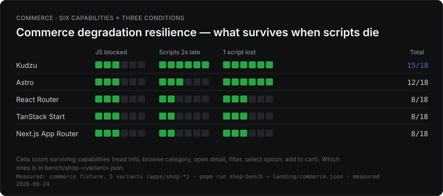
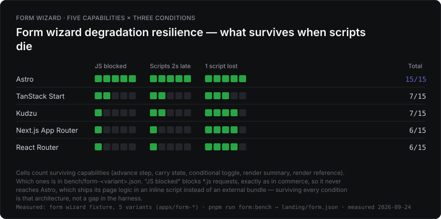

# kudzu-based-bench

**English** · [한국어](./README.md)

<!-- landing:start -->

A pnpm workspace monorepo that statically builds the same site with several frameworks to measure **what actually differs**. Synthetic operations (a 1,000-row reverse, ops/sec) are not measured — real sessions are replayed instead, and only what a user can observe counts as the verdict.

There are four fixtures.

| Fixture | Variants | What it reveals | Build · measure |
| --- | --- | --- | --- |
| [Newsletter](#newsletter-build-benchmark) | 10 | Build cost, output size | `build:variants` · `build:stats` |
| [Commerce](#commerce-benchmark) | 5 | Hydration, session interaction, degradation resilience | `build:shop` · `shop:bench` |
| [Form Wizard](#form-wizard-benchmark) | 5 | Progressive enhancement, cross-step state transport, degradation resilience | `build:form` · `form:bench` |
| [Docs + Search](#docs--search-benchmark) | 5 | Client-side search latency, index cost | `build:docs` · `docs:bench` |

## At a glance

A summary of the 2026-09-24 measurements (Apple M4 · Node 26.10.0). The evidence and method behind every number are in the sections below.

- **Visible content is a tie; time to operable spreads up to 2.2x.** All five commerce variants ship complete HTML, so entry lands at 175–235 ms. The difference is when the controls come alive: hydration frameworks need a 69–135 KB (gzip) runtime per route to arrive and execute (first listing interaction 2.4–3.5 s, first reliable click +1.5–3.0 s), while Kudzu ships only the capability modules a route uses, 3.4–9.1 KB, so clicks land from first paint +300 ms.
- **Degradation resilience inverts between fixtures.** Kudzu leads commerce at 15/18; Astro leads the form wizard at 15/15 (Kudzu 7/15). The form's Astro variant carries its page logic as inline scripts, which `*.js` request blocking cannot reach.
- **Template SSGs build 1.8–8.2x faster.** Hugo 550 · Eleventy 566 · Kudzu 717 ms against 1.3–4.5 s for the seven that run a bundler. Only Docusaurus (cold 4,485 → warm 1,392 ms) and Next.js get real work out of their caches.
- **LCP cannot separate frameworks where the LCP element is an image.** Commerce LCP is how long an md5-identical photo waits on the link (block every script and all five collapse to 7,084–7,108 ms on the 1.4 MB photo); only the docs fixture, where LCP is text, splits 5.5x (Eleventy 352 ms vs VitePress 1,936 ms) — from the render-blocking resource chain and re-rendering after hydration.
- **Search cost belongs to the search tool.** The three Pagefind variants cost the same regardless of framework (44.7 KB · 1.75 s); Docusaurus search-local, which bundles its index into the initial JS, costs 748 KB · 6.8 s.

What changed since the 2026-08-20 measurements: React 19.3 grew the React-based commerce bundles by 7–8 KB each (Next.js is unchanged — it ships its own vendored React), and the React Router apps build 28–39% faster alongside their move to Vite 8. Kudzu's first listing interaction going from 450 to 1,601 ms is not a runtime regression but a module-discovery race that 0.9.0 has too ([commerce](#session-replay-median-of-5-sessions-4x-cpu--slow-4g)), and Astro's newsletter cold build going from 5,081 to 1,313 ms is not a faster build but Notion network time taken out of the measurement ([newsletter](#newsletter-build-benchmark)).






Resilience is per fixture, never pooled: commerce scores six capabilities out of 18, the form wizard five out of 15, and the ranking inverts (commerce: Kudzu 15/18 first; form wizard: Astro 15/15 first, Kudzu 7/15).

LCP has its own two-condition section under [LCP](#lcp). Every chart is generated by `pnpm run charts` from the committed measurements (`landing/benchmark.json`, `commerce.json`, `form.json`, `lcp.json`), so the same picture comes out without re-running a single benchmark. Each card's bottom line says which fixture it measured, with which command, and when.

<details>
<summary>Name and measurement philosophy</summary>

The name is kudzu because this project started from [kudzu](https://github.com/kudzujs/kudzu), not because it's built with kudzu. All 25 variants are benchmarked, and the axes where kudzu loses (catalog-scale builds, form state transport, etc.) are published unchanged.

- **Newsletter** — the Notion content behind [Ones to Watch for FE](https://ones-to-watch.ethansup.net). No interaction, so only build cost and output are measured.
- **Commerce** — a Next.js Commerce-sized storefront. Six routes — home · search (filter/sort) · collection · product detail (options, add to cart) · policy · checkout — implemented under one shared DOM and behavior contract.
- **Form Wizard** — a three-step workshop application. State travels through a native GET form chain plus query-string state transport. Its reason for existing is what survives when scripts arrive late or not at all.
- **Docs + Search** — a documentation site over a deterministic corpus (120 pages by default) plus client-side search. The real cost of "a search index on top of static content."

Every data package (`@otw/commerce-data`, `@otw/docs-data`) is a seed-fixed deterministic generator, so nothing varies except the framework.
</details>

## Newsletter Build Benchmark

Same Notion content, built ten ways. Running `pnpm run build:stats` locally refreshes the table below automatically.

<!-- build-stats:start -->
| Variant | Based | Type | Cold (ms) | Warm (ms) | Total size | JS size | Files | Origin diff |
| --- | --- | --- | --- | --- | --- | --- | --- | --- |
| Hugo 0.163.0 | Go (templates) | SSG-focused | 550 | 602 | 2.6 MB | 14.8 KB | 142 | 0.395% |
| Eleventy 3.1.6 | Node (Nunjucks) | SSG-focused | 566 | 543 | 2.7 MB | 15.0 KB | 142 | 0.400% |
| Kudzu 0.16.40 | Kudzu (JSX, no vDOM) | SSG-focused | 717 | 786 | 2.6 MB | 15.0 KB | 141 | 0.395% |
| Astro 7.3.4 | Astro islands (vanilla) | SSG-focused | 1313 | 1198 | 4.9 MB | 108.7 KB | 153 | 0.320% |
| React Router 8.4.0 | React | SSG-capable | 1367 | 1301 | 6.8 MB | 354.3 KB | 285 | 0.405% |
| VitePress 1.6.4 | Vue | SSG-focused | 1473 | 1510 | 8.5 MB | 4.6 MB | 416 | 0.402% |
| Next.js Pages Router 16.3.6 | React | SSG-capable | 3461 | 2463 | 6.5 MB | 560.5 KB | 304 | 0.403% |
| Next.js App Router 16.3.6 | React | SSG-capable | 4071 | 2675 | 13.8 MB | 590.5 KB | 698 | 0.401% |
| TanStack Start 1.168.58 | React | SSG-capable | 4312 | 4170 | 6.5 MB | 352.1 KB | 146 | 0.399% |
| Docusaurus 3.10.2 | React | SSG-focused | 4485 | 1392 | 5.0 MB | 2.3 MB | 284 | 0.403% |

_Measured locally via `pnpm run build:stats` (manual refresh). **Cold** deletes the output and every framework build cache (a CI cache miss); **warm** deletes only the output and keeps the caches (a CI cache hit, or your second local build). The gap between them is what that tool's cache actually buys. Each is the median of 3 runs after one discarded warm-up; per-run values are in `coldSamples`/`warmSamples` in `landing/benchmark.json`. Sorted by cold asc. Astro is the one variant that queries Notion from inside its build, so it replays the Notion API responses recorded by its warm-up build (the other nine read the prefetched content file — either way the measured builds exclude network). "Total size"/"Files" exclude image files (image handling differs per variant, so counting them would be an unfair comparison). "Origin diff" is the home-page pixel delta vs the live origin from `pnpm run origin:diff` (images/analytics blocked), or `-` if not run. Machine: Apple M4 · 10 cores · 16 GB RAM · darwin/arm64 · Node v26.10.0. Measured at: 2026-09-24T09:26:53.612Z_
<!-- build-stats:end -->

The three that fill templates and write HTML (Hugo 550 · Eleventy 566 · Kudzu 717 ms) build 1.8–8.2x faster than the seven that run a bundler (1,313–4,485 ms), and ship ~15 KB of JS — in all three the only script on the page is search (`search.js` + `munja.js`). Cold and warm only split far apart for Docusaurus (4,485 → 1,392 ms — the `.docusaurus` generated cache is most of it, measured in the comment in `scripts/lib/build-cache.mjs`) and Next.js (Pages 3,461 → 2,463 · App 4,071 → 2,675 ms); the other seven stay within ±10%, so their caches do little. React Router's cold build went from 2,229 to 1,367 ms alongside its move from Vite 7 to 8 (Rolldown). Astro's cold build dropped from the previously published 5,081 ms to 1,313 ms, and that is a measurement fix, not a faster build. Astro is the one variant that queries Notion from inside its build, so each of three back-to-back cold runs re-fetched every page; in this session that tripped Notion's rate limit and the cold median became 58 s of retry-after backoff. The loader now records the warm-up build's Notion responses and replays them (`packages/notion-loader/src/http-cache.ts`), the same no-network footing the other nine get from the prefetched file — a little over 3 of the 5 seconds of an unreplayed cold build were Notion network.

<details>
<summary>Variant → directory mapping</summary>

| App | Tool | Deploy path |
| --- | --- | --- |
| `apps/web` | Astro (islands) | `/astro/` |
| `apps/react-router` | React Router v8 (framework mode, prerender) | `/react-router/` |
| `apps/tanstack-router` | TanStack Start (static prerender) | `/tanstack/` |
| `apps/kudzu` | [kudzu](https://github.com/kudzujs/kudzu) | `/kudzu/` |
| `apps/hugo` | Hugo (Go binary, hugo-bin) | `/hugo/` |
| `apps/vitepress` | VitePress custom theme | `/vitepress/` |
| `apps/docusaurus` | Docusaurus custom plugin | `/docusaurus/` |
| `apps/eleventy` | Eleventy (11ty) v3 | `/eleventy/` |
| `apps/next-app` | Next.js App Router (`output: "export"`) | `/next-app/` |
| `apps/next-pages` | Next.js Pages Router (`output: "export"`) | `/next-pages/` |

Automated CI measurement was removed — shared-runner performance variance made the numbers unreliable, and bot commits polluted branches.
</details>

## Commerce Benchmark

The same storefront built five ways (`apps/shop-*`, deploy path `/shop-*/`): Kudzu 0.16.40 · Astro 7 + React islands · React Router v8 · TanStack Start · Next.js App Router. All of them ship complete HTML, so "time to visible content" is a tie — every difference concentrates in **time to operable**.

```bash
pnpm run build:shop     # OTW_CATALOG_SIZE=100|1000|10000
pnpm run shop:bench     # session replay + click loss + back button + session transfer + degradation
pnpm run shop:assets    # per-route JS weight (measured in a browser)
pnpm run shop:scale     # build time by catalog size
```

### Session replay (median of 5 sessions, 4x CPU · Slow 4G)

| Variant | Entry contentReady | First listing actReady | Sort stepLatency | Add stepLatency | First reliable click |
| --- | ---: | ---: | ---: | ---: | ---: |
| Kudzu | 175 ms | **1,601 ms** | 2.2 ms | 1.0 ms | **first paint +300 ms** |
| Astro (islands) | 235 ms | 2,376 ms | 10.7 ms | 2.0 ms | +1,500 ms |
| TanStack Start | 181 ms | 2,998 ms | 12.0 ms | 1.2 ms | +2,000 ms |
| React Router v8 | 182 ms | 3,109 ms | 28.5 ms | 1.5 ms | +2,000 ms |
| Next.js App Router | 177 ms | 3,549 ms | 31.7 ms | 1.8 ms | +3,000 ms |

Entry lands at 175–235 ms for all five — each ships HTML with the product name and price already in it. What separates them is **when that HTML starts accepting input**. The four hydration frameworks need a 69–135 KB (gzip) runtime per route to arrive and execute before any control comes alive, and an add-to-cart press before that is lost (first reliable click +1,500 to +3,000 ms). Kudzu ships only the capability modules the route uses, 3.4–9.1 KB, and clicks land from first paint +300 ms.

Kudzu's first listing interaction went from the published 450 ms to 1,601 ms. To tell whether the runtime regressed, 0.9.0 was rebuilt the same day and measured with the same harness (A/B): one session gave 0.9.0 451 ms against 0.16.40 1,351 ms, but a rerun with resource timing attached split **0.9.0 into two modes as well: 350 · 1,300 · 1,701 ms** (0.16.40: 1,351 · 1,401 · 1,411 ms). What decides the value is module discovery order, not the version. The search route's `<link rel="modulepreload">` covers only its five `<script type="module">` entries; `kudzu-collection-selector.js` (2.4 KB), which `kudzu-list.js` imports statically, is only requested once the 14 KB `kudzu-list.js` has fully arrived (~525 ms). If the viewport's lazy tiles (21 KB, up to 12) were requested first, that module queues behind the photos on the 200 KB/s link and arrives at ~1.85 s — and since an ES module graph is evaluated only once every import has arrived, the sort control stays dead until then. Runs where the tiles are requested late land at ~350–450 ms. Both versions share the structure (only entries are preloaded), so the race existed in 0.9.0 too — see [defects & constraints](#real-world-defects--constraints-found) no. 11. Variant-select actReady (300 ms) and the first reliable click (+300 ms) are identical in both versions.

### Navigation contract — click transitions · back button · session transfer

A session doesn't only move forward. Products are opened from the listing with a **real anchor click** (routers intercept it; document sites load a new document), added to the cart, then the grid is returned to via **back button**. The clock is a single wall clock (sessionStorage) that survives document swaps, so MPA and SPA are measured with the same ruler.

| Variant | Listing→detail (click) | Back button | Filter survives | Sort survives | Total session transfer | Of which scripts |
| --- | ---: | ---: | ---: | ---: | ---: | ---: |
| Kudzu | 198 ms | 36 ms | 0/5 | 5/5 | **361.6 KB** | **42.6 KB** |
| Astro (islands) | 225 ms | 37 ms | 0/5 | 5/5 | 569.5 KB | 221.7 KB |
| React Router v8 | 189 ms | 17 ms | 0/5 | 0/5 | 647.5 KB | 352.9 KB |
| TanStack Start | **186 ms** | 14 ms | 0/5 | 0/5 | 642.5 KB | 343.4 KB |
| Next.js App Router | 360 ms | 48 ms | 0/5 | 5/5 | 793.9 KB | 456.9 KB |

Client-side transitions are the axis where SPA routers win (TanStack 186 ms · React Router 189 ms), but only by 12–39 ms over Kudzu (198 ms) and Astro (225 ms), which load a new document; only Next.js falls behind, at 360 ms. In exchange, the two SPAs drop sort state on back navigation — the component remounts and the select resets, whereas the document-navigation variants keep it because Chrome's form restoration carries it over. Session transfer is CDP-measured across the whole session, so it includes prefetch waste, and the script gap between Kudzu and Next is 10.7x over the full session. Kudzu's total session transfer grew from 0.9.0's 302.1 KB to 361.6 KB while its scripts shrank from 47.3 to 42.6 KB (the `kudzu-style.js` runtime module is gone and the binding runtime went from 5.6 to 4.6 KB) — the extra 59 KB came from outside the scripts (59 → 68 requests).

<details>
<summary>Measurement detail: metric definitions, why this fixture isn't split into cold/warm, back-button footnote</summary>

| Metric | Definition |
| --- | --- |
| contentReady | navigationStart → that step's key text (product name, price) exists in the DOM |
| actReady | until the control **actually works**. Measured by retrying every 50 ms; framework-internal signals are not consulted |
| stepLatency | successful dispatch → next paint. Same definition as INP |
| nav (click · back) | gesture → target content shown. Measured with a single sessionStorage wall clock so document swaps and router transitions use the same ruler |
| Click loss rate | share of "add to cart" clicks at first paint + Δ that get ignored |
| Session transfer | CDP `Network` bytes measured across the whole session (the local server serves uncompressed — same condition for every variant) |
| LCP | The browser's own definition — the final `PerformanceObserver('largest-contentful-paint')` candidate. Measured by a separate harness (`pnpm run lcp:bench`) and reported in the [LCP](#lcp) section |

People don't have a "cold visit" and a "warm visit." Within one session, the first page opens with an empty cache, and every following page inherits it. Splitting that into two buckets erases how the cost is distributed across a session. LCP is absent from this table for a different reason: the LCP element here is a product photo that is byte-identical across all five variants, so its ranking cannot separate frameworks — the measurements and the argument are in the [LCP](#lcp) section.

Click loss is measured in a **separate session** from the journey. Sweeping the Δ grid out to 5 seconds warms the module cache enough that the following journey's actReady looks far better than it really is (Next once collapsed from 3,768 ms to 0.1 ms this way).

Back-button state is sampled 300 ms after arrival. The filter (search input value + collapsed-grid state) is lost on all five variants — it's component state that isn't carried in the URL. Scroll restoration was measured unrestored on all five variants in the same window and was dropped from the table (under CDP throttling, restoration timing can land outside the window, so it can't distinguish between variants).
</details>

### LCP

"Did you measure bundle size or LCP?" is the question this repo gets most. Bundle size was always measured (the `JS size` column above, initial JS per route below, total session transfer); LCP was **argued about but never measured**. So it is measured now — `pnpm run lcp:bench`.


The data confirms why LCP was never the headline. In the default fixture (21 KB tiles) product-detail LCP clusters between 320 and 608 ms (1.9x), while the same five builds become usable between 1,601 and 3,549 ms. By spread alone 1.9x and 2.2x look alike, but **the order differs**: LCP runs Astro 320 < Next.js and TanStack 360 < Kudzu 364 < React Router 608 ms, actReady runs Kudzu < Astro < TanStack < React Router < Next.js. LCP measures when the photograph arrives, and that photograph is the same file down to its md5 in all five variants (`9af37064`, 20,963 B).

So the photo was raised to a real storefront weight (1.4 MB, md5 `584e3d7f`, 1,483,575 B) and measured again (`OTW_IMAGE_WEIGHT=heavy`). LCP jumps to 7.2–10.9 s, but what orders the variants is not rendering — it is **bandwidth contention**, and that is measured two ways rather than asserted.

First, the photo lands when the total bytes downloaded before it, divided by the link rate, say it will. `bytesBeforeLcp` in `landing/lcp.json` checks the arithmetic: Kudzu 1,465 KB / 7,160 ms, Astro 1,668 KB / 8,148 ms, TanStack 1,793 KB / 8,764 ms and React Router 1,802 KB / 8,804 ms all come out at **205 KB/s** against the server's 200 KB/s budget. Only Next.js sits about a second above the line at 2,021 KB / 10,912 ms = 185 KB/s (it makes 7 script requests, so more round trips, but that second was not isolated further). Every load in which the photo arrived measures CV 0%: one 1.4 MB file owns the link, so there is no arrival order left to shuffle. One of React Router's five loads (620 ms) is the browser symptom described after (3) below, a load that emitted no image candidate — it shows only in that row's range and CV.

Second, abort every script request and the five collapse to **7,084–7,108 ms, a 1.00x spread** (same builds, same pacing, blocked by URL pathname — `pnpm run lcp:bench --block-scripts` writes them to `landing/lcp-blocked.json`). Scripts aborted: Kudzu 4, Astro 6 (13 on Astro 7.2 with `@astrojs/react` 6), React Router 8, TanStack 4, Next.js 7. If rendering were the cause, deleting the scripts would not bring five different architectures within 24 ms of each other. LCP here is an indirect measure of how much JavaScript you ship, and the direct measure is already in the table below.

The heavy photograph is not applied to the listing grid. Measured, one home load pulls 9 photographs and 12.7 MB and reaches its `load` event at **63.7 s** — no real store ships originals into a grid, so the heavy condition covers the product detail route only.


Where LCP does separate frameworks is the fixtures whose **LCP element is text**. On a docs deep link the browser picks a body `p` (`article.doc-body` for Eleventy), and Eleventy's 352 ms against VitePress's 1,936 ms is a 5.5x gap. Two different things produce that gap, and blocking every script separates them (same builds, same pacing, same bandwidth model, `--block-scripts`, median of 3).

The first is when the render-blocking chain finishes. Counting only resources whose `renderBlockingStatus === "blocking"`, plus the document, that chain is 3 requests for Eleventy (2 css), 2 for Kudzu (1 css), 2 for Docusaurus (1 css) and 3 for VitePress (2 css) — and in the 2026-08-19 session its last byte landed at 312 ms, 312 ms, 608 ms and 1,824 ms respectively. LCP follows 40–85 ms later every time. What makes the number is not the request **count** but how long a blocking resource waits its turn on a 200 KB/s link. Kudzu 0.16.40 still has the same two blocking resources — the document plus `style.css` (since 0.8.53 a stylesheet is linked only where a route's source graph imports it: `apps/docs-kudzu/src/components/Shell.tsx`) — and its LCP is 372 ms.

The second is the scripts. All five variants ship the article text in static HTML and still paint it with every script blocked, but blocking pulls LCP in for exactly the hydrating ones: Astro 680 → 356 ms, Docusaurus 704 → 504 ms, VitePress 1,936 → 1,168 ms — a post-hydration re-render pushing the candidate out by that much. Eleventy (352 → 360 ms) and Kudzu (372 → 388 ms) barely move. That is also why Astro reads 680 ms with only one blocking resource (its CSS is inlined).

The newsletter fixture is excluded from this bench. Its largest element is a Notion image and every variant runs a different image pipeline (sharp / unoptimized / raw copy), so LCP there would compare image tooling rather than frameworks. Its Lighthouse LCP comes from `pnpm run perf:bench`.

One measurement trap is worth recording: **while CDP `Network.emulateNetworkConditions` is active, this Chromium reports no image LCP candidate at all.** Not "it misses a late one" — with emulation set to 50 Mbps and zero latency, an image that finishes in 20 ms is still absent and the only candidate is the title from the first frame. Turn emulation off, or produce the same delay in the server, and `IMG` is reported normally (identical in headless_shell and `channel: "chromium"`, Chromium 151). That is why this bench alone models bandwidth in the server (one shared token bucket) rather than through CDP — the per-condition measurements are in the `scripts/lcp-bench.mjs` header. The trade is that absolute LCP here is not comparable with the CDP-throttled figures from the sibling benches.

Three more harness defects turned up in the same place. All three are the kind that a lone published median hides, which is why every row now carries **runs · range · CV**.

**(1) Bandwidth was handed out by timer lottery.** Let each response poll the token bucket on its own timer and whichever one wakes first takes the link. On a listing route, where several tiles and a client bundle are in flight together, that was the noise floor of the whole bench: React Router's home route wandered 716–1900 ms (CV 40%) on one unchanged build, and the published median flipped 732 → 1680 ms between two sessions. A single queue served in arrival order (a chunk joins the queue only after the previous one is written — exactly what a serial link does) brought that row to CV 5%.

**(2) The 16 KB chunk made the link bursty.** Chunk size is the link's quantisation step. Kudzu's home route came out in 80 ms stairs (508, 548, 612, 688 ms), and 80 ms is exactly 16 KB at 200 KB/s — one tile was grabbing a burst and crossing the line ahead of the responses it was supposed to be sharing with. Same row, everything else held: 16384 B → CV 12%, 4096 B → CV 17%, **1460 B (one MTU) → CV 4%**. Six transfers sharing 200 KB/s cannot deliver 126 KB before ~630 ms, so those 508 ms samples were the model's artefact, not the fixture's speed.

**(3) The probe closed its window at `load` and missed the hero.** Lazy images do not block `load`, and the commerce hero is lazy in all five variants. On the heavy condition `load` fired around 1 s with six seconds of photograph still to come, the 1.5 s quiet window expired in between, and **the product title at 352 ms was published as that variant's LCP**. It happened in one load out of three, so it left no trace in the median — only a CV of 80%. The window now stays open while any image that declares a source has not completed — even one that has not started, so `currentSrc` is still empty.

The same symptom returns on the heavy rows, and this time it is the browser, not the window: the image completed 1.5 s before the window closed (`complete: true`, displayed 800×800 = 640,000 px²) and yet that load emitted no image LCP candidate at all, leaving a text candidate as the last one. On 0.9.0 it hit Kudzu in 3 loads out of 7, then 0 out of 4 in the following session; in the 2026-09-24 session it hit React Router in 2 of 3 and TanStack in 1 of 3, so both rows were re-measured over 5 loads with `LCP_DIAG=1` (React Router 1 of 5, TanStack 0). Per-load evidence comes from `LCP_DIAG=1 pnpm run lcp:bench --fixture shop --routes product` (candidate list, when the window closed, `visibilityState` transitions, image completion). Those two published rows are the re-measurement; the other three are 3-load runs in which the symptom never appeared.

With all three fixed, the home route runs Kudzu 764, Astro 944, Next.js 1,092, TanStack 1,112, React Router 1,368 ms, and apart from Astro that is exactly the order of bytes downloaded before LCP (`bytesBeforeLcp`: 32, 68, 71, 79 KB). Astro gets to 944 ms having downloaded only 22 KB; that gap was not isolated. Not one line of fixture markup changed (giving the first tile `fetchpriority="high"` was measured too: it pins which tile wins, but the hero then queues ahead of CSS and JS and the spread grows to CV 13%, so it was not adopted). What is left is Kudzu's search row (CV 18%, 528–808 ms), and its cause is browser request ordering, not the model: the same tiles and the same total bytes every load, but whether Chrome asks for scripts or images first flips per load. It is the same kind of race that splits Kudzu's listing actReady in the session replay above.

<details>
<summary>LCP across every fixture and route</summary>


<!-- lcp:start -->
| Fixture | Route | Image | Variant | FCP | LCP | Runs · range | LCP−FCP | LCP element | LCP resource |
| --- | --- | --- | --- | ---: | ---: | ---: | ---: | --- | ---: |
| Commerce | Home | 21 KB tile | Kudzu | 360 ms | 764 ms | 5 · 684–784 ms · CV 5% | 404 ms | image `img` | 20.5 KB |
| Commerce | Home | 21 KB tile | Astro | 220 ms | 944 ms | 5 · 932–956 ms · CV 1% | 724 ms | image `img` | 20.5 KB |
| Commerce | Home | 21 KB tile | Next.js | 360 ms | 1092 ms | 5 · 1088–1100 ms · CV 0% | 732 ms | image `img` | 20.5 KB |
| Commerce | Home | 21 KB tile | TanStack | 364 ms | 1112 ms | 5 · 1104–1116 ms · CV 0% | 744 ms | image `img` | 20.5 KB |
| Commerce | Home | 21 KB tile | React Router | 616 ms | 1368 ms | 5 · 1244–1376 ms · CV 4% | 752 ms | image `img` | 21.3 KB |
| Commerce | Product detail | 21 KB tile | Astro | 212 ms | 320 ms | 5 · 316–320 ms · CV 1% | 108 ms | image `img` | 20.5 KB |
| Commerce | Product detail | 21 KB tile | TanStack | 356 ms | 360 ms | 5 · 356–364 ms · CV 1% | 0 ms | image `img` | 20.5 KB |
| Commerce | Product detail | 21 KB tile | Next.js | 360 ms | 360 ms | 5 · 356–364 ms · CV 1% | 0 ms | image `img` | 20.5 KB |
| Commerce | Product detail | 21 KB tile | Kudzu | 360 ms | 364 ms | 5 · 360–384 ms · CV 3% | 0 ms | image `img` | 20.5 KB |
| Commerce | Product detail | 21 KB tile | React Router | 608 ms | 608 ms | 5 · 596–640 ms · CV 3% | 0 ms | image `img` | 20.5 KB |
| Commerce | Search listing | 21 KB tile | Kudzu | 360 ms | 784 ms | 5 · 528–808 ms · CV 18% | 428 ms | image `img` | 22.0 KB |
| Commerce | Search listing | 21 KB tile | Astro | 220 ms | 920 ms | 5 · 912–948 ms · CV 2% | 700 ms | image `img` | 20.5 KB |
| Commerce | Search listing | 21 KB tile | Next.js | 360 ms | 1096 ms | 5 · 1096–1104 ms · CV 0% | 736 ms | image `img` | 21.7 KB |
| Commerce | Search listing | 21 KB tile | TanStack | 364 ms | 1132 ms | 5 · 1112–1152 ms · CV 1% | 768 ms | image `img` | 20.5 KB |
| Commerce | Search listing | 21 KB tile | React Router | 616 ms | 1380 ms | 5 · 1372–1392 ms · CV 1% | 768 ms | image `img` | 20.5 KB |
| Commerce | Product detail | 1.4 MB photo | Kudzu | 364 ms | 7160 ms | 3 · 7160–7160 ms · CV 0% | 6796 ms | image `img` | 1448.8 KB |
| Commerce | Product detail | 1.4 MB photo | Astro | 212 ms | 8148 ms | 3 · 8148–8148 ms · CV 0% | 7936 ms | image `img` | 1448.8 KB |
| Commerce | Product detail | 1.4 MB photo | TanStack | 356 ms | 8764 ms | 5 · 8760–8772 ms · CV 0% | 8408 ms | image `img` | 1448.8 KB |
| Commerce | Product detail | 1.4 MB photo | React Router | 628 ms | 8804 ms | 5 · 620–8804 ms · CV 51% | 8116 ms | image `img` | 1448.8 KB |
| Commerce | Product detail | 1.4 MB photo | Next.js | 352 ms | 10912 ms | 3 · 10912–10912 ms · CV 0% | 10560 ms | image `img` | 1448.8 KB |
| Docs | Doc deep link | — | Eleventy | 352 ms | 352 ms | 5 · 352–376 ms · CV 3% | 0 ms | text `article.doc-body` | — |
| Docs | Doc deep link | — | Kudzu | 372 ms | 372 ms | 5 · 372–376 ms · CV 1% | 0 ms | text `p` | — |
| Docs | Doc deep link | — | Astro | 192 ms | 680 ms | 5 · 676–700 ms · CV 1% | 488 ms | text `p` | — |
| Docs | Doc deep link | — | Docusaurus | 704 ms | 704 ms | 5 · 700–864 ms · CV 10% | 0 ms | text `p` | — |
| Docs | Doc deep link | — | VitePress | 1932 ms | 1936 ms | 5 · 1924–1960 ms · CV 1% | 0 ms | text `p` | — |
| Form wizard | Step 1 | — | Astro | 200 ms | 200 ms | 5 · 196–216 ms · CV 4% | 0 ms | text `h1` | — |
| Form wizard | Step 1 | — | Kudzu | 348 ms | 348 ms | 5 · 344–352 ms · CV 1% | 0 ms | text `h1` | — |
| Form wizard | Step 1 | — | React Router | 348 ms | 348 ms | 5 · 348–372 ms · CV 3% | 0 ms | text `h1` | — |
| Form wizard | Step 1 | — | TanStack | 348 ms | 348 ms | 5 · 344–364 ms · CV 3% | 0 ms | text `h1` | — |
| Form wizard | Step 1 | — | Next.js | 348 ms | 348 ms | 5 · 344–352 ms · CV 1% | 0 ms | text `h1` | — |

_Measured locally via `pnpm run lcp:bench` (manual refresh). Each row is the median of the loads counted in its "Runs · range" cell after one discarded warm-up; per-run values are in `lcpSamples` and the element the browser picked on each run is in `lcpSampleElements`, both in `landing/lcp.json`. **Read the range and CV together with the median.** On the commerce home and search routes the viewport holds several equally sized 21 KB tiles, so LCP is "the first tile that arrived" and the element behind it is whichever tile won that load (`lcpSampleElements`). What made this table move between sessions until 2026-08-19 was the harness, not the fixture: the token bucket was polled per response, so bandwidth went to whichever response woke first (React Router's home route 716–1900 ms, CV 40%, its published median flipping 732 -> 1680 ms between two sessions); the 16 KB chunk let the link run in bursts (Kudzu's home route stepped in 16 KB = 80 ms stairs: 508, 548, 612, 688 ms); and the probe closed its window at `load`, missing the lazy hero (on the heavy condition one load in three published the title at 352 ms). With arrival-order queueing, MTU-sized (1460 B) pacing and a window that stays open while an image is still arriving, that same React Router row measures 1252–1368 ms (CV 4%). The double-digit CV rows that remain — Kudzu's commerce home and search — come from Chrome flipping its request order per load, which is why they are measured at 15 loads. A large LCP−FCP is where bandwidth contention shows: a variant that spends the 200 KB/s link on its own client bundle before the first tile finishes paints exactly that much later (see `bytesBeforeLcp` and `scriptBytesBeforeLcp`). The link, not the CPU, is the bottleneck here — on the CDP trace the LCP entry lands ~10 ms after the winning image's `Network.loadingFinished` in every run, with no long task before it. Uses the browser's own definition — the **final** `PerformanceObserver('largest-contentful-paint')` candidate, so a hydration re-render that pushes the candidate later shows up here. The "LCP element" and "LCP resource" columns come from the run that produced the published median, not from the last run. The harness never clicks or scrolls (the first input freezes LCP). The "Image" column is the commerce fixture's image-weight condition (`OTW_IMAGE_WEIGHT`): the default is a 21 KB tile, `heavy` is a 1.4 MB photograph, and in both conditions all five variants serve a file identical down to its md5. The docs and form fixtures have no images. Bandwidth is modelled in the server rather than through CDP (with `Network.emulateNetworkConditions` on, this Chromium never reports a late-arriving image as an LCP candidate — the measurement table is in `scripts/lcp-bench.mjs`). 4x CPU · slow4g (server-paced) · 1280×900. Machine: Apple M4 · 10 cores · 16 GB RAM · darwin/arm64 · Node v26.10.0. Measured at 2026-09-24T09:29:12.715Z_
<!-- lcp:end -->

</details>

### Initial JavaScript per route (KB gzip)

Bytes the browser actually downloaded. Static import-graph analysis gives a different answer per framework — Astro pulls its island runtime through a dynamic `import()` inside an inline bootstrap, so a static crawler miscounts a 60 KB payload as 1.8 KB.

| Variant | Home | Search | Product | Checkout | Total output (images excluded) |
| --- | ---: | ---: | ---: | ---: | ---: |
| Kudzu | **3.4** | 9.1 | 4.2 | **3.4** | 1.06 MB |
| Astro | 68.9 | 69.4 | 69.5 | 68.9 | 1.75 MB |
| React Router | 111.4 | 111.4 | 111.8 | 111.1 | 1.12 MB |
| TanStack | 109.6 | 109.6 | 109.7 | 109.3 | 1.72 MB |
| Next.js | 134.6 | 135.3 | 134.2 | 133.4 | 4.25 MB |

Only Kudzu varies by route (the search page's keyed-list runtime, +5.7 KB; the product page's native handler, +0.8 KB). From 0.9.0 to 0.16.40 home and checkout went 4.2 → 3.4 KB, search 9.8 → 9.1 KB and product 5.1 → 4.2 KB: the binding runtime baked per route family now keeps only the attributes that family actually binds (just `value` for the search family, where 0.9.0 carried `class`, `disabled`, `value`, `checked` and `style`), which took it from 5.6 to 4.6 KB, and the style-serialization module (`kudzu-style.js`) is gone (29 → 26 JS files for a 100-product catalog). Astro's island split is real, but as long as the cart badge lives in the global header, every route pays for the react-dom runtime.

The three React-based variants grew by the same amount this time — Astro 60.6 → 68.9 KB, React Router 104.3 → 111.4 KB, TanStack 101.7 → 109.6 KB. What those three frameworks have in common is react/react-dom 19.2.8 → 19.3.0 (the react-dom client production build alone went 93.5 → 109.0 KB gzip), and only Next.js stays put at 134.1 → 134.6 KB: Next ships its own vendored React (`19.3.0-canary-cbb046ab-20260731`), so the app's react upgrade never reaches it.

### Degradation resilience (read info · browse category · open detail · filter · select option · add to cart)

How many of six capabilities survive three conditions. These are the states an ad blocker, a captive portal, a partial CDN outage, or a subway tunnel actually produce. Out of 18 here; the [form wizard's resilience](#degradation-resilience-step-navigation--state-transport--conditional-toggle--summary-render--reference-render) counts a different five capabilities out of 15, and the ranking inverts — the two tables never substitute for each other.

| Variant | JS blocked | Scripts 2s late | 1 script lost | Total |
| --- | ---: | ---: | ---: | ---: |
| Kudzu | 3/6 | 6/6 | 6/6 | **15/18** |
| Astro | 3/6 | 3/6 | 6/6 | 12/18 |
| TanStack | 3/6 | 2/6 | 3/6 | 8/18 |
| Next.js | 3/6 | 2/6 | 3/6 | 8/18 |
| React Router | 3/6 | 2/6 | 3/6 | 8/18 |

TanStack's "1 script lost" cell wobbles ±1 between runs (3–4/6) depending on which chunk gets dropped — its chunk graph is sensitive to content-hash ordering. Raw JSON: `bench/shop-<variant>.json`; the published copy the charts read is `landing/commerce.json`.

### Catalog scaling (cold / warm, median)

| Variant | 100 items | 1,000 items | Per page (1,000) |
| --- | ---: | ---: | ---: |
| Kudzu | **1,156 / 1,083 ms** | 2,307 / 2,257 ms | 2.31 ms |
| Astro | 1,241 / 1,233 ms | **1,690 / 1,740 ms** | 1.69 ms |
| React Router | 1,280 / 1,208 ms | 2,405 / 2,461 ms | 2.41 ms |
| TanStack | 1,333 / 1,330 ms | 1,994 / 2,259 ms | 1.99 ms |
| Next.js | 4,232 / 2,857 ms | 5,096 / 4,336 ms | 5.10 ms |

Kudzu is the fastest at 100 items and third at 1,000 (2,307 ms), behind Astro (1,690 ms) and TanStack (1,994 ms). The 100 → 1,000 slopes are Next.js 1.20x · Astro 1.36x · TanStack 1.50x · React Router 1.88x · Kudzu 2.00x — Next.js has the flattest slope but such a large fixed cost (4.2 s at 100 items) that it is still last in absolute terms. React Router moved the most: 1,919 → 1,280 ms at 100 items and 3,350 → 2,405 ms at 1,000. That coincides with its three apps moving from Vite 7 to 8 (Rolldown) in this update (TanStack sped up the same way when it moved to Vite 8 in August), and the newsletter fixture shows the same, cold 2,229 → 1,367 ms. Kudzu's slope, flattened to 1.77x by 0.9.0, crept back to 2.00x (2,075 → 2,307 ms at 1,000 items); the cause was not isolated. Next 16.3 is the only variant whose commerce cold and warm builds diverge — the only caches doing real work are Docusaurus and Next.js in the newsletter fixture, and Next.js here.

## Form Wizard Benchmark

The same three-step application wizard (`apps/form-*`, deploy path `/form-*/`) built on five frameworks. Participant info → session pick → confirm → done; state travels through the query string of a **native GET form chain**, and JS is only used to prefill hidden inputs. All validation is native HTML5 attributes. The completion reference code (FNV-1a) is supposed to be **byte-identical** across all five variants, and in practice all 5 sessions × 5 variants matched `REF-09D7A58B`.

```bash
pnpm run build:form
pnpm run form:bench     # session replay + ref cross-check + degradation
pnpm run form:report    # publish the measurements to landing/form.json (what the charts read)
```

### Session replay (median of 5 sessions, 4x CPU · Slow 4G)

| Variant | Entry contentReady | Conditional field toggle | Next-step arrival | State transport complete | Summary render |
| --- | ---: | ---: | ---: | ---: | ---: |
| Astro (inline script) | 201 ms | 0.9 ms | **177 ms** | **199 ms** | 211 ms |
| TanStack Start | 174 ms | 2.7 ms | 190 ms | **198 ms** | **177 ms** |
| React Router v8 | 173 ms | 3.7 ms | 181 ms | 407 ms | 377 ms |
| Next.js App Router | 175 ms | 2.4 ms | 190 ms | 371 ms | 374 ms |
| Kudzu | 175 ms | 0.8 ms | **177 ms** | 703 ms | 519 ms |

**This is the axis Kudzu loses.** State transport (submit → the next step's hidden inputs are filled) only starts once the page's effect module arrives, and on Slow 4G that module-chain round trip becomes pure cost (703 ms — last place). 0.9.0 and 0.16.40 tie on this axis (700 → 703 ms; summary render 502 → 519 ms). React Router's and Next.js's 370–410 ms come from the `useEffect` that fills the hidden inputs running only after hydration, while Astro does the same job in an inline script right after parsing (199 ms). TanStack burns 3.0 s on hydration in commerce, but here the router intercepts the submit and transitions within the same document, so the architecture works in its favor (198 ms).

### Degradation resilience (step navigation · state transport · conditional toggle · summary render · reference render)

Out of 15. [Commerce resilience](#degradation-resilience-read-info--browse-category--open-detail--filter--select-option--add-to-cart) counts six capabilities out of 18 and inverts the ranking (Kudzu leads there at 15/18) — neither table stands in for the other.

| Variant | JS blocked | Scripts 2s late | 1 script lost | Total |
| --- | ---: | ---: | ---: | ---: |
| Astro | 5/5 | 5/5 | 5/5 | **15/15** |
| Kudzu | 1/5 | 2/5 | 4/5 | 7/15 |
| TanStack | 2/5 | 2/5 | 3/5 | 7/15 |
| React Router | 1/5 | 1/5 | 4/5 | 6/15 |
| Next.js | 1/5 | 1/5 | 4/5 | 6/15 |

The "JS blocked" condition is the same as commerce — blocking `*.js` **requests**, a model for ad blockers and CDN failures, not disabling `<script>` execution. That's exactly why the Astro variant survives every condition: it ships per-page logic as **inline scripts** rather than external bundles, so request blocking never touches it. It's a real property the architecture produces, and it's reported as-is. Step navigation (native GET submit) survives without JS on all five variants — but state transport, the summary, and the ref, which all have to read the query string, structurally need JS on a static host.

<details>
<summary>Measurement detail</summary>

- Arrival metrics use a wall clock planted in sessionStorage right before submit. React Router and Next don't intercept the form, so a real document navigation happens; TanStack's router does intercept — measuring both by navigationStart would make the two incomparable. URL waiting uses `commit` (so a module script delaying `load` by several seconds doesn't get a successful navigation misjudged as a failure).
- Queries with a repeated key, like the diet checkboxes, are normalized with `URLSearchParams#getAll` semantics. TanStack's default JSON search codec overwrites repeated keys, so it uses a custom `parseSearch`/`stringifySearch`.
- Raw JSON: `bench/form-<variant>.json`; the published copy is `landing/form.json` (written by `pnpm run form:report`, read by `pnpm run charts` — `bench/` is not committed, so the charts only ever see the published file).
</details>

## Docs + Search Benchmark

The same documentation site built on five SSGs (`apps/docs-*`, deploy path `/docs-*/`) over a deterministic corpus (`@otw/docs-data`, 120 pages by default, tunable via `OTW_DOCS_SIZE`). kudzu, astro, and eleventy use **Pagefind**; docusaurus uses `@easyops-cn/docusaurus-search-local`; vitepress uses its built-in local search (minisearch).

```bash
pnpm run build:docs
pnpm run docs:bench     # doc arrival + first search result + index transfer
```

### Results (median of 3, 4x CPU · Slow 4G, query "hydration")

| Variant | Doc contentReady | Initial JS | First search result | Search transfer |
| --- | ---: | ---: | ---: | ---: |
| Kudzu + Pagefind | **242 ms** | 119.1 KB | **1,752 ms** | **44.7 KB** |
| Eleventy + Pagefind | 278 ms | 117.4 KB | 1,754 ms | **44.7 KB** |
| Astro + Pagefind | 991 ms | 117.4 KB | 1,753 ms | **44.7 KB** |
| Docusaurus + search-local | 1,216 ms | 747.9 KB | 6,820 ms | 190.7 KB |
| VitePress + local search | 2,209 ms | 166.4 KB | 2,508 ms | 402.4 KB |

The search architecture shows through directly. Pagefind only downloads the index shard a query actually needs, so all three variants pay exactly the same cost (44.7 KB, 1.75 s) — regardless of framework, search is a property of Pagefind. Docusaurus's search-local ships the entire lunr index bundled into initial JS (a large share of that 747.9 KB — up from 719.6 KB with React 19.3), taking 6.8 s to the first result. VitePress downloads the whole minisearch index when search opens (402.4 KB — the index grows in proportion to corpus size). Doc arrival is fastest for Kudzu and Eleventy (242–278 ms), and Docusaurus and VitePress arrive as late as the render-blocking chain from the [LCP](#lcp) section implies (their FCPs are 704 and 1,932 ms). Why Astro (991 ms) diverges so far from its FCP in the LCP bench (192 ms) was not isolated — the two benches model bandwidth differently to begin with (CDP throttling vs server pacing). Kudzu is unchanged on this fixture from 0.9.0 to 0.16.40 (249 → 242 ms, initial JS 119.1 KB — a docs route's only capability is the search script, so runtime changes do not reach it).

<details>
<summary>Measurement detail</summary>

- Entry is a `/guide/routing/routing-01/` deep link. `contentReady` is navigationStart → `.doc-title` visible.
- "First search result" is search UI activation → typing → first result item rendered, retried every 50 ms if the control isn't wired up yet (same definition as commerce's actReady).
- The query "hydration" is in the corpus generator's TERMS, so a result is guaranteed to exist.
- Raw JSON: `bench/docs-<variant>.json`.
</details>

## Real-world defects & constraints found

Only things worth filing upstream against the framework itself — genuine upstream bugs or undocumented constraints — are kept here. Our own app configuration/history, or constraints the framework intends, are excluded.

1. **TanStack Start — SPA transition hangs forever on subpath deploys (real bug)**
   `@tanstack/start-static-server-functions` fetches the prerendered server-function cache from the origin root (`/__tsr/staticServerFnCache/...`) as an absolute path. Deployed to a `/<repo>/` subpath like GitHub Pages, that request 404s, the route gets stuck pending, and the client transition never completes (deep links are fine since they're prerendered HTML → not reproducible in local dev). This repo works around it by vendoring the middleware base-aware (`apps/tanstack-router/src/lib/staticFunctionMiddleware.ts`, prefixing `import.meta.env.BASE_URL`).
   **Rechecked 2026-08-08: still unfixed** (`1.167.24` — no base-handling strings anywhere in `dist/`). **Rechecked 2026-08-12 (`react-start 1.168.42` / `start-plugin-core 1.171.33` / `start-static-server-functions 1.167.26` = npm `latest`): still unfixed.** The previous note claiming the package "was removed and the static fallback mechanism went away" is retracted as a misreading — it was never a dependency of `react-start` but an opt-in package, and it is still released against current versions (deps `start-client-core 1.170.21`, peer `react-start ^1.168.42`, installs without warnings). The `_serverFn` 404 observed in a build with the vendored copy deleted is the expected consequence of shipping no static middleware at all, not a new upstream defect. The actual defect is unchanged: **within the same client bundle**, the live RPC is base-correct via the `TSS_SERVER_FN_BASE` define (`/kudzu-based-bench/tanstack/_serverFn/<id>`) while the static cache stays root-absolute at `/__tsr/staticServerFnCache/<sha1>.json` and 404s (the symptom moved from infinite pending to `Seroval Error` → error boundary). Upstream issue [#6152](https://github.com/TanStack/router/issues/6152) and fix PR [#5970](https://github.com/TanStack/router/pull/5970) are both open (unmerged, `mergeable_state: clean`), and `2.0.0-alpha.2` does not carry the fix either. Minimal reproduction and verification: [SimYunSup/example-list@`tanstack-start/static-server-fn-basepath`](https://github.com/SimYunSup/example-list/tree/tanstack-start/static-server-fn-basepath) — prefixing `process.env.TSS_ROUTER_BASEPATH` on the fetch path alone restores a 200 (the write path resolves against `TSS_CLIENT_OUTPUT_DIR`, so prefixing it too would nest the cache one level deeper).
2. **Next.js App Router — `output: "export"` build fails when `generateStaticParams()` returns an empty array**
   Pages Router (`getStaticPaths` → `paths: []`, `fallback: false`) accepts an empty collection outright, but App Router kills a static-export build if a dynamic route can't produce at least one path. This repo defends against it with a sentinel path (`_none`) + `dynamicParams = false` + `notFound()` when the collection is empty (`apps/next-app/src/app/news/post/[id]/page.tsx`). A case of the same framework's two routers behaving differently in the same situation.
3. **VitePress — dynamic routes can't produce directory-style pretty URLs**
   `[page].md` dynamic routes always emit flat `<param>.html` files regardless of the `cleanUrls` setting (no `/news/list/1/index.html` form). Because GitHub Pages serves extensionless requests as `.html`, `cleanUrls: true` matches the URL contract of the other variants, but trailing-slash presence still differs. The docs fixture (`apps/docs-vitepress`) works around the same issue by having its gen script emit real `.md` files.
4. **Docusaurus — a custom plugin's `addRoute` paths must be baseUrl-prefixed**
   `<BrowserRouter>` mounts without a basename (core `clientEntry.js`), so the client matches against the full URL including baseUrl. If a plugin registers unprefixed paths (`/`, `/news/list/1`) via `addRoute`, SSG (which drives StaticRouter directly) works fine, but on hydration nothing matches, so it falls back to the catch-all `@theme/NotFound` → React #418. Registration must be prefixed with `normalizeUrl([baseUrl, path])` (same as the core content plugins and `useBaseUrl`).
5. **Docusaurus — SSG dies with `require.resolveWeak is not a function` when the app's package.json has `"type": "module"`**
   The build succeeds through Client/Server compilation and dies at the SSR bundle execution step. The server bundle (webpack CJS, whose route registry uses `require.resolveWeak`) gets loaded in an ESM context, so the webpack `require` shim is missing. Nothing in the error message hints that `type: "module"` is the cause (reproduced and confirmed in `apps/docs-docusaurus`). Removing that field from the app manifest is the workaround.
6. **React Router v8 — `ssr: false` prerender nests output one level below the basename**
   The basename has to be the full deploy path for client-side routing to match the served URL, but the prerender plugin also applies that basename to the output path, so real pages land at `build/client/<basename>/<route>/index.html`. A generic SPA fallback shell takes the `build/client` root instead, so serving that directory as the document root gives you an empty home page. Worked around with a post-build hoist (`apps/shop-react-router/scripts/flatten-build.mjs`, same fix in `apps/form-react-router`).
7. **TanStack Start — static output lands in `dist/client`**
   The default multi-environment build splits into `dist/client` (static) and `dist/server` (an unused server bundle). Uploading it as-is to a static host is off by one directory. Pinned with `environments.client.build.outDir` (`apps/shop-tanstack/vite.config.ts`). As a bonus, the `dist/server` bundle bakes in the build machine's absolute paths.
8. **Kudzu 0.8.39 — seven syntax boundaries hit while compiling commerce, form, and docs**
   All recorded as comments in `apps/shop-kudzu`, `apps/form-kudzu`, and `apps/docs-kudzu` source. In short: (a) package imports outside a JSX event handler are rejected outright, so build-time data has to be code-generated into a relative module; (b) `.map()` over an imported array is claimed by the keyed-list analysis even outside JSX and then rejected, so reshaping falls back to a `for` loop; (c) a row component can't take a whole-object prop, so rows are inlined as intrinsic markup; (d) a selector pipeline's (`filter`/`toSorted`) source can only be a literal-emitted relative import array; (e) `new CustomEvent` is rejected, so components can't notify each other of state changes; (f) a `navigation` group requires enumerating every member route up front, so it doesn't apply to a `getStaticPaths` catalog; (g) free identifiers inside handlers/effects are evaluated as build-time captures — a local helper function is rejected as "not serializable," and a DOM global reference like `instanceof HTMLElement` is rejected with a build-time `ReferenceError`. Handler bodies have to compile down to inline code plus attribute manipulation (`setAttribute`).
9. **Astro — a failed island script is re-requested with a query string, silently defeating measurement harnesses**
   The island loader retries a failed script as `client.<hash>.js?astro-retry=<timestamp>`. That URL does not end in `.js`, so it sails straight through glob blocking of the `page.route("**/*.js")` kind, and a condition meant to model an ad blocker or a CDN outage delivers the full 180 KB island runtime anyway. This repo's own degradation-resilience track in `shop-bench.mjs` and `form-bench.mjs` used that glob; after measuring it (190 KB of script bytes still arriving in a "blocked" run) both were **fixed to match on the URL pathname**. Re-measured, the scores themselves did not move (commerce Astro 12/18, form Astro 15/15, control form TanStack 7/15 — all identical to the published values), because the retry arrives too late to revive a capability inside the 1.5 s observation window. Not a framework bug, but undocumented behaviour that affects any measurement modelling degradation through request blocking.

10. **Kudzu 0.8.53+ — stylesheets became source-graph dependent, and CSS vanished silently (measured on the 0.8.39 → 0.9.0 upgrade)**
    Through 0.8.39 every CSS file under `src/` was linked on every page in path-sorted order. Since 0.8.53's "route-aware CSS closure" a stylesheet is linked only when the route's reachable source graph imports it with `import "./x.css"` (`orderSourceStyles` in `framework/compiler/source-compiler.mjs`, or `kudzu.config.styles`). All four Kudzu apps here relied on the former, so upgrading to 0.9.0 produced builds that succeeded, kept every page and route contract — and **emitted no stylesheet at all**, with no error and no warning. An unstyled build quietly corrupts the benchmarks too: commerce home LCP switched from a 792 ms image to a 196 ms text node (no layout, so the largest element changes), the newsletter output dropped from 141 to 139 files, and the docs deep link "improved" from 380 ms to 196 ms. Fixed by importing the global sheet from each app's shared component (`apps/*/src/components/Header.tsx`, `Shell.tsx`, and the form's four step pages) and the post-body sheet only from the route that renders it (`apps/kudzu/src/pages/news/post/[slug].tsx`). Not a framework bug, but the kind of contract change that alters static output silently across a minor upgrade.

11. **Kudzu 0.9.0–0.16.40 — `modulepreload` covers only a route's entry modules, so transitive imports queue behind lazy images**
    Route HTML adds a `<link rel="modulepreload">` for every `<script type="module">` entry, but the runtime pieces those entries import statically (for the commerce search route: `kudzu-collection-selector.js`, `kudzu-serialization.js`, `kudzu-native.js`, `kudzu-effect.js`, and two handler modules) are not in the preload list. The browser only discovers them once the entries have downloaded and parsed; if the viewport's lazy images were requested in the meantime, those modules queue behind the images on a narrow link, and because an ES module graph is evaluated only once every import has arrived, every capability on the route waits with them. Measured on the commerce listing with resource timing, the 2.4 KB `kudzu-collection-selector.js` is requested at ~525 ms and arrives at ~1.85 s, and the sort control's actReady splits into ~350–450 ms and ~1.3–1.7 s modes (Slow 4G · 4x CPU, on both 0.9.0 and 0.16.40). Preloading the entries' whole static import closure (what Vite does for entry chunks) would remove the discovery delay altogether. Less a bug than an omission in the output, but it is the kind that cancels this framework's advantage — few, small requests — on a slow link.

<!-- landing:end -->

## Verification tools (local only)

- `pnpm run build:stats` — newsletter clean-build time/output size → refreshes the README tables.
- `pnpm run perf:bench` — Lighthouse desktop + routing-transition measurement → `bench/report.md`.
- `pnpm run origin:diff` / `pnpm run visual:diff` — pixel diff (vs. the live origin / across variants).
- `pnpm run test:e2e` — Playwright e2e (newsletter variants × 5 scenarios).
- `pnpm run shop:bench --variant shop-kudzu` — commerce session replay → `bench/<variant>.json`.
- `pnpm run shop:assets` / `pnpm run shop:scale --sizes 100,1000,10000` — per-route JS · scale build.
- `pnpm run form:bench --variant form-kudzu` — form wizard → `bench/form-<variant>.json`.
- `pnpm run docs:bench --variant docs-kudzu` — docs search → `bench/docs-<variant>.json`.
- `pnpm run shop:report` — merges commerce measurements into `landing/commerce.json`.
- `pnpm run form:report` — publishes form-wizard measurements to `landing/form.json` (`bench/` is not committed, so this is what the charts read).
- `pnpm run lcp:bench` — FCP/LCP plus the LCP element the browser chose, at the commerce, docs and form entry routes → `landing/lcp.json` and the README `LCP` table. Narrow it with `--routes product --runs 3`; build with `OTW_IMAGE_WEIGHT=heavy` to measure the 1.4 MB photograph condition. `--block-scripts` measures the control condition with every `*.js` request aborted and writes it to `landing/lcp-blocked.json` without touching the published table; `LCP_DIAG=1` prints, per load, the candidate list, when the probe closed, `visibilityState` transitions and whether images completed. `--readme-only` re-renders the table without measuring.
- `pnpm run charts` — regenerates the README's SVG bar charts from the committed measurements → `assets/charts/{ko,en}/`. Each card is stamped with its fixture, the command that measured it, the file it was read from, and the measurement dates.
- `pnpm run landing` — renders the part of this README between its `landing:start` and `landing:end` comments into the landing page → `landing/en/index.html` (English), and `README.md` into `landing/index.html` (Korean). The charts are deployed alongside under `site/charts/`, and every deploy re-renders the pages.

Pass flags without `--`: pnpm 10 forwards a literal `--` to the script, and the bench scripts reject flags they do not know.

## Development

Node.js is required (fnm recommended, see `.nvmrc`). The Hugo binary is fetched automatically by `hugo-bin` on install.

```bash
npm install -g corepack && corepack enable   # if pnpm is missing (Node 25+ no longer bundles corepack)
pnpm install
pnpm dev          # apps/web
```

`pnpm build:variants` builds the newsletter's nine other variants, `pnpm build:all` builds all ten, and `build:shop`/`build:form`/`build:docs` each build their fixture.

## Deploy

The CI deploy workflow was removed — deploys run locally.

```bash
pnpm run deploy:pages              # prefetch → build:all → render landing → assemble site/ → push gh-pages
pnpm run deploy:pages --skip-build     # assemble & push from already-built output only
```

`scripts/deploy-pages.mjs` builds every variant, renders the landing pages (Korean and English) from the READMEs, assembles `site/` with the `assembleSite()` layout, then force-pushes an orphan commit to `gh-pages`. The commerce, form, and docs fixtures are included automatically if already built, and skipped otherwise.

## Content

Content loading needs the `NOTION_TOKEN` and `NOTION_DATABASE_ID` environment variables (local `.env`). Without them the build still succeeds cleanly, producing an empty collection. For direct content contributions, please reach out to [SimYunSup](https://github.com/SimYunSup) or open an issue!

## License

MIT License
