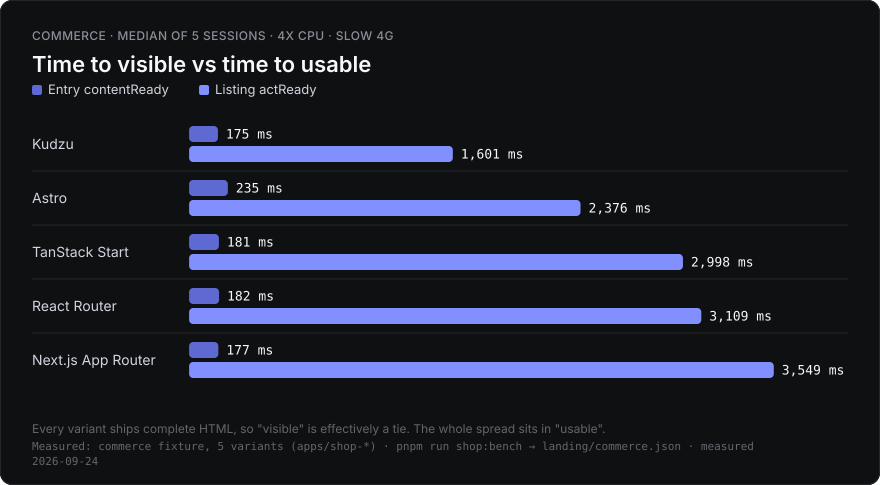
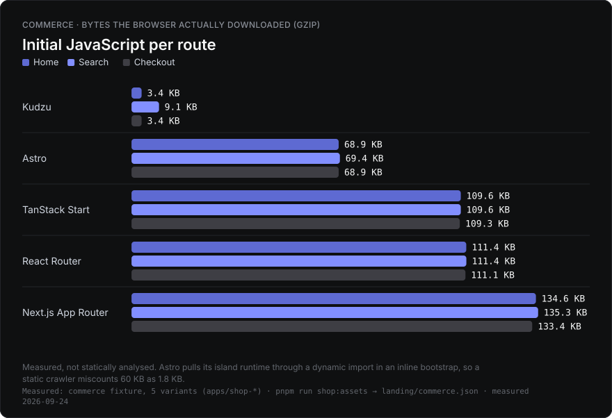
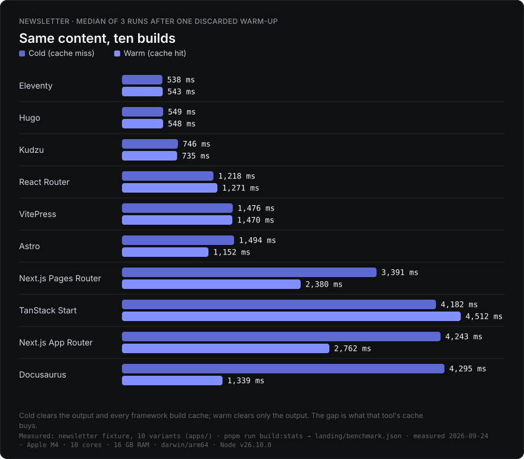
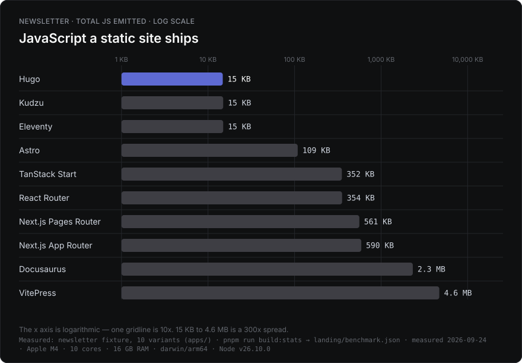
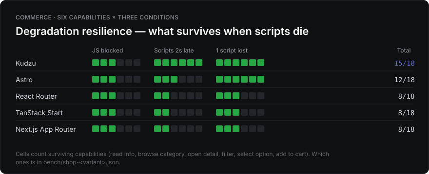
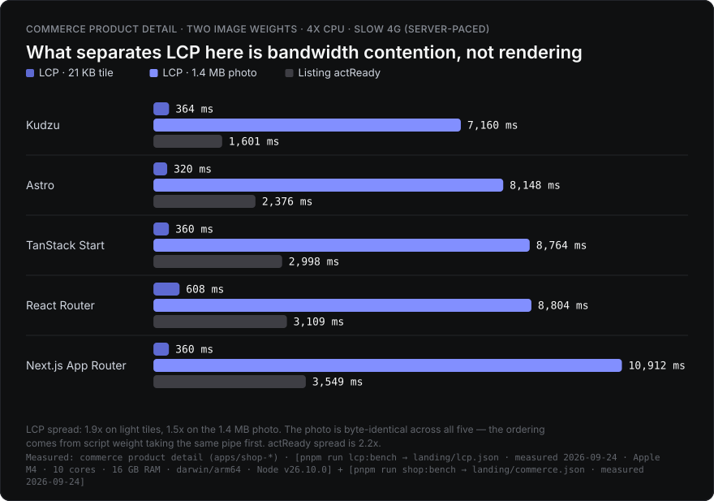
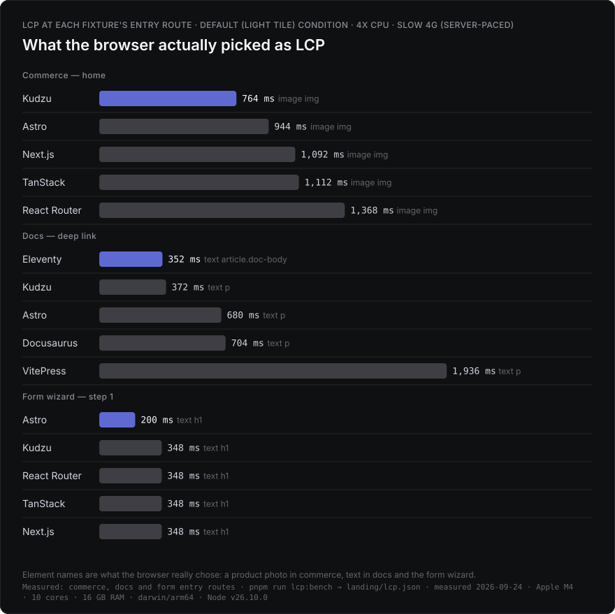

# kudzu-based-bench

**English** · [한국어](./README.md)

A pnpm workspace monorepo that statically builds the same site with several frameworks to measure **what actually differs**. Synthetic operations (a 1,000-row reverse, ops/sec) are not measured — real sessions are replayed instead, and only what a user can observe counts as the verdict.

There are four fixtures.

| Fixture | Variants | What it reveals | Build · measure |
| --- | --- | --- | --- |
| [Newsletter](#newsletter-build-benchmark) | 10 | Build cost, output size | `build:variants` · `build:stats` |
| [Commerce](#commerce-benchmark) | 5 | Hydration, session interaction, degradation resilience | `build:shop` · `shop:bench` |
| [Form Wizard](#form-wizard-benchmark) | 5 | Progressive enhancement, cross-step state transport | `build:form` · `form:bench` |
| [Docs + Search](#docs--search-benchmark) | 5 | Client-side search latency, index cost | `build:docs` · `docs:bench` |

## At a glance











LCP has its own two-condition section under [LCP](#lcp). Every chart is generated by `pnpm run charts` from the committed measurements (`landing/benchmark.json`, `commerce.json`, `lcp.json`), so the same picture comes out without re-running a single benchmark.

<details>
<summary>Name and measurement philosophy</summary>

The name is kudzu because this project started from [kudzu](https://github.com/kudzujs/kudzu), not because it's built with kudzu. All 25 variants are benchmarked, and the axes where kudzu loses (catalog-scale builds, form state transport, etc.) are published unchanged.

- **Newsletter** — the Notion content behind [Ones to Watch for FE](https://ones-to-watch.ethansup.net). No interaction, so only build cost and output are measured.
- **Commerce** — a Next.js Commerce-sized storefront. Six routes — home · search (filter/sort) · collection · product detail (options, add to cart) · policy · checkout — implemented under one shared DOM and behavior contract.
- **Form Wizard** — a three-step workshop application. State travels through a native GET form chain plus query-string state transport. Its reason for existing is what survives when scripts arrive late or not at all.
- **Docs + Search** — a documentation site over a deterministic corpus (120 pages by default) plus client-side search. The real cost of "a search index on top of static content."

Every data package (`@otw/commerce-data`, `@otw/docs-data`) is a seed-fixed deterministic generator, so nothing varies except the framework.
</details>

## Newsletter Build Benchmark

Same Notion content, built ten ways. Running `pnpm run build:stats` locally refreshes the table below automatically.

<!-- build-stats:start -->
| Variant | Based | Type | Cold (ms) | Warm (ms) | Total size | JS size | Files | Origin diff |
| --- | --- | --- | --- | --- | --- | --- | --- | --- |
| Eleventy 3.1.6 | Node (Nunjucks) | SSG-focused | 702 | 691 | 2.7 MB | 15.0 KB | 142 | 0.400% |
| Hugo 0.161.0 | Go (templates) | SSG-focused | 710 | 691 | 2.6 MB | 14.8 KB | 142 | 0.395% |
| Kudzu 0.8.39 | Kudzu (JSX, no vDOM) | SSG-focused | 785 | 789 | 2.6 MB | 15.0 KB | 141 | 0.395% |
| VitePress 1.6.4 | Vue | SSG-focused | 1638 | 1644 | 8.5 MB | 4.6 MB | 416 | 0.402% |
| React Router 8.3.0 | React | SSG-capable | 2161 | 2122 | 6.8 MB | 323.0 KB | 285 | 0.405% |
| Next.js Pages Router 16.3.0 | React | SSG-capable | 3660 | 2687 | 6.4 MB | 529.9 KB | 304 | 0.403% |
| Next.js App Router 16.3.0 | React | SSG-capable | 4491 | 2961 | 13.7 MB | 589.0 KB | 698 | 0.401% |
| TanStack Start 1.168.42 | React | SSG-capable | 4847 | 4898 | 6.5 MB | 326.1 KB | 146 | 0.399% |
| Docusaurus 3.10.2 | React | SSG-focused | 4919 | 1574 | 5.0 MB | 2.2 MB | 284 | 0.403% |
| Astro 7.2.1 | Astro islands (vanilla) | SSG-focused | 6013 | 2483 | 3.1 MB | 99.9 KB | 152 | 0.320% |

_Measured locally via `pnpm run build:stats` (manual refresh). **Cold** deletes the output and every framework build cache (a CI cache miss); **warm** deletes only the output and keeps the caches (a CI cache hit, or your second local build). The gap between them is what that tool's cache actually buys. Each is the median of 3 runs after one discarded warm-up; per-run values are in `coldSamples`/`warmSamples` in `landing/benchmark.json`. Sorted by cold asc. "Total size"/"Files" exclude image files (image handling differs per variant, so counting them would be an unfair comparison). "Origin diff" is the home-page pixel delta vs the live origin from `pnpm run origin:diff` (images/analytics blocked), or `-` if not run. Machine: Apple M4 · 10 cores · 16 GB RAM · darwin/arm64 · Node v24.17.0. Measured at: 2026-08-12T05:03:43.802Z_
<!-- build-stats:end -->

<details>
<summary>Variant → directory mapping</summary>

| App | Tool | Deploy path |
| --- | --- | --- |
| `apps/web` | Astro (islands) | `/astro/` |
| `apps/react-router` | React Router v8 (framework mode, prerender) | `/react-router/` |
| `apps/tanstack-router` | TanStack Start (static prerender) | `/tanstack/` |
| `apps/kudzu` | [kudzu](https://github.com/kudzujs/kudzu) | `/kudzu/` |
| `apps/hugo` | Hugo (Go binary, hugo-bin) | `/hugo/` |
| `apps/vitepress` | VitePress custom theme | `/vitepress/` |
| `apps/docusaurus` | Docusaurus custom plugin | `/docusaurus/` |
| `apps/eleventy` | Eleventy (11ty) v3 | `/eleventy/` |
| `apps/next-app` | Next.js App Router (`output: "export"`) | `/next-app/` |
| `apps/next-pages` | Next.js Pages Router (`output: "export"`) | `/next-pages/` |

Automated CI measurement was removed — shared-runner performance variance made the numbers unreliable, and bot commits polluted branches.
</details>

## Commerce Benchmark

The same storefront built five ways (`apps/shop-*`, deploy path `/shop-*/`): Kudzu 0.8.39 · Astro 7 + React islands · React Router v8 · TanStack Start · Next.js App Router. All of them ship complete HTML, so "time to visible content" is a tie — every difference concentrates in **time to operable**.

```bash
pnpm run build:shop     # OTW_CATALOG_SIZE=100|1000|10000
pnpm run shop:bench     # session replay + click loss + back button + session transfer + degradation
pnpm run shop:assets    # per-route JS weight (measured in a browser)
pnpm run shop:scale     # build time by catalog size
```

### Session replay (median of 5 sessions, 4x CPU · Slow 4G)

| Variant | Entry contentReady | First listing actReady | Sort stepLatency | Add stepLatency | First reliable click |
| --- | ---: | ---: | ---: | ---: | ---: |
| Kudzu | 170 ms | **250 ms** | 2.2 ms | 0.8 ms | **first paint +300 ms** |
| Astro (islands) | 223 ms | 2,229 ms | 9.1 ms | 1.5 ms | +1,500 ms |
| TanStack Start | 170 ms | 2,859 ms | 15.3 ms | 1.0 ms | +2,000 ms |
| React Router v8 | 170 ms | 2,957 ms | 17.6 ms | 1.1 ms | +2,000 ms |
| Next.js App Router | 178 ms | 3,537 ms | 26.8 ms | 0.9 ms | +3,000 ms |

### Navigation contract — click transitions · back button · session transfer

A session doesn't only move forward. Products are opened from the listing with a **real anchor click** (routers intercept it; document sites load a new document), added to the cart, then the grid is returned to via **back button**. The clock is a single wall clock (sessionStorage) that survives document swaps, so MPA and SPA are measured with the same ruler.

| Variant | Listing→detail (click) | Back button | Filter survives | Sort survives | Total session transfer | Of which scripts |
| --- | ---: | ---: | ---: | ---: | ---: | ---: |
| Kudzu | 271 ms | 33 ms | 0/5 | 5/5 | **244.9 KB** | **34.4 KB** |
| Astro (islands) | 222 ms | 34 ms | 0/5 | 5/5 | 529.9 KB | 193.1 KB |
| React Router v8 | **185 ms** | 14 ms | 0/5 | 0/5 | 616.9 KB | 322.3 KB |
| TanStack Start | **182 ms** | 13 ms | 0/5 | 0/5 | 616.3 KB | 317.6 KB |
| Next.js App Router | 360 ms | 46 ms | 0/5 | 5/5 | 792.1 KB | 455.5 KB |

Client-side transitions are the one axis where SPA routers genuinely win (React Router · TanStack at 182–185 ms). In exchange, they drop sort state on back navigation — the component remounts and the select resets, whereas the document-navigation variants keep it because Chrome's form restoration carries it over. Session transfer is CDP-measured across the whole session, so it includes prefetch waste, and the script gap between Kudzu and Next is 13x over the full session.

<details>
<summary>Measurement detail: metric definitions, why this fixture isn't split into cold/warm, back-button footnote</summary>

| Metric | Definition |
| --- | --- |
| contentReady | navigationStart → that step's key text (product name, price) exists in the DOM |
| actReady | until the control **actually works**. Measured by retrying every 50 ms; framework-internal signals are not consulted |
| stepLatency | successful dispatch → next paint. Same definition as INP |
| nav (click · back) | gesture → target content shown. Measured with a single sessionStorage wall clock so document swaps and router transitions use the same ruler |
| Click loss rate | share of "add to cart" clicks at first paint + Δ that get ignored |
| Session transfer | CDP `Network` bytes measured across the whole session (the local server serves uncompressed — same condition for every variant) |
| LCP | The browser's own definition — the final `PerformanceObserver('largest-contentful-paint')` candidate. Measured by a separate harness (`pnpm run lcp:bench`) and reported in the [LCP](#lcp) section |

People don't have a "cold visit" and a "warm visit." Within one session, the first page opens with an empty cache, and every following page inherits it. Splitting that into two buckets erases how the cost is distributed across a session. LCP is absent from this table for a different reason: the LCP element here is a product photo that is byte-identical across all five variants, so its ranking cannot separate frameworks — the measurements and the argument are in the [LCP](#lcp) section.

Click loss is measured in a **separate session** from the journey. Sweeping the Δ grid out to 5 seconds warms the module cache enough that the following journey's actReady looks far better than it really is (Next once collapsed from 3,768 ms to 0.1 ms this way).

Back-button state is sampled 300 ms after arrival. The filter (search input value + collapsed-grid state) is lost on all five variants — it's component state that isn't carried in the URL. Scroll restoration was measured unrestored on all five variants in the same window and was dropped from the table (under CDP throttling, restoration timing can land outside the window, so it can't distinguish between variants).
</details>

### LCP

"Did you measure bundle size or LCP?" is the question this repo gets most. Bundle size was always measured (the `JS size` column above, initial JS per route below, total session transfer); LCP was **argued about but never measured**. So it is measured now — `pnpm run lcp:bench`.



The data confirms why LCP was never the headline. In the default fixture (21 KB tiles) product-detail LCP clusters between 316 and 504 ms — a 1.6x spread — while the same five builds are 250 ms and 3,537 ms apart on "time to usable", a **14.1x** spread. LCP measures when the photograph arrives, and that photograph is the same file down to its md5 in all five variants (`584e3d7f`, 1,483,575 B).

So the photo was raised to a real storefront weight (1.4 MB) and measured again (`OTW_IMAGE_WEIGHT=heavy`). LCP jumps to 7.2–10.9 s, but what orders the variants is not rendering — it is **bandwidth contention**, and that is measured two ways rather than asserted.

First, the photo lands when the total bytes downloaded before it, divided by the link rate, say it will. `bytesBeforeLcp` in `landing/lcp.json` checks the arithmetic: Kudzu 1,466 KB / 7,168 ms, Astro 1,639 KB / 8,008 ms, TanStack 1,767 KB / 8,640 ms and React Router 1,771 KB / 8,656 ms all come out at **204 KB/s** against the server's 200 KB/s budget. Only Next.js sits about a second above the line at 2,020 KB / 10,896 ms = 185 KB/s (it makes 7 script requests, so more round trips, but that second was not isolated further).

Second, abort every script request and the five collapse to **7,092–7,112 ms, a 1.00x spread** (same builds, same pacing, blocked by URL pathname; scripts aborted: Kudzu 3, Astro 13, React Router 8, TanStack 4, Next.js 7). If rendering were the cause, deleting the scripts would not bring five different architectures within 20 ms of each other. LCP here is an indirect measure of how much JavaScript you ship, and the direct measure is already in the table below.

The heavy photograph is not applied to the listing grid. Measured, one home load pulls 9 photographs and 12.7 MB and reaches its `load` event at **63.7 s** — no real store ships originals into a grid, so the heavy condition covers the product detail route only.



Where LCP does separate frameworks is the fixtures whose **LCP element is text**. On a docs deep link the browser picks a body `p` (`article.doc-body` for Eleventy), and Eleventy's 348 ms against VitePress's 1,960 ms is a 5.6x gap. The cause is not hydration: checked directly, **all five variants ship the article text in static HTML, and the text still paints with every script blocked** (Eleventy 352 ms, Kudzu 372 ms, Astro 344 ms, Docusaurus 620 ms, VitePress 1,396 ms). What differs is the render-blocking resource chain: on the same page Eleventy takes 2 requests and has its last byte at 317 ms, while VitePress takes 5 (1 js, 2 css) and finishes at 1,310 ms. On a 150 ms-RTT link those round trips *are* the LCP.

The newsletter fixture is excluded from this bench. Its largest element is a Notion image and every variant runs a different image pipeline (sharp / unoptimized / raw copy), so LCP there would compare image tooling rather than frameworks. Its Lighthouse LCP comes from `pnpm run perf:bench`.

One measurement trap is worth recording: **while CDP `Network.emulateNetworkConditions` is active, this Chromium reports no image LCP candidate at all.** Not "it misses a late one" — with emulation set to 50 Mbps and zero latency, an image that finishes in 20 ms is still absent and the only candidate is the title from the first frame. Turn emulation off, or produce the same delay in the server, and `IMG` is reported normally (identical in headless_shell and `channel: "chromium"`, Chromium 151). That is why this bench alone models bandwidth in the server (one shared token bucket) rather than through CDP — the per-condition measurements are in the `scripts/lcp-bench.mjs` header. The trade is that absolute LCP here is not comparable with the CDP-throttled figures from the sibling benches.

<details>
<summary>LCP across every fixture and route</summary>


<!-- lcp:start -->
| Fixture | Route | Image | Variant | FCP | LCP | LCP−FCP | LCP element | LCP resource |
| --- | --- | --- | --- | ---: | ---: | ---: | --- | ---: |
| Commerce | Home | 21 KB tile | Kudzu | 356 ms | 528 ms | 172 ms | image `img` | 20.5 KB |
| Commerce | Home | 21 KB tile | Astro | 208 ms | 584 ms | 376 ms | image `img` | 21.3 KB |
| Commerce | Home | 21 KB tile | TanStack | 352 ms | 608 ms | 256 ms | image `img` | 21.3 KB |
| Commerce | Home | 21 KB tile | Next.js | 356 ms | 748 ms | 392 ms | image `img` | 22.2 KB |
| Commerce | Home | 21 KB tile | React Router | 504 ms | 1680 ms | 1176 ms | image `img` | 20.5 KB |
| Commerce | Product detail | 21 KB tile | Astro | 208 ms | 316 ms | 112 ms | image `img` | 20.5 KB |
| Commerce | Product detail | 21 KB tile | TanStack | 348 ms | 348 ms | 0 ms | image `img` | 20.5 KB |
| Commerce | Product detail | 21 KB tile | Kudzu | 352 ms | 352 ms | 0 ms | image `img` | 20.5 KB |
| Commerce | Product detail | 21 KB tile | Next.js | 356 ms | 356 ms | 0 ms | image `img` | 20.5 KB |
| Commerce | Product detail | 21 KB tile | React Router | 504 ms | 504 ms | 0 ms | image `img` | 20.5 KB |
| Commerce | Search listing | 21 KB tile | Astro | 216 ms | 524 ms | 304 ms | image `img` | 20.5 KB |
| Commerce | Search listing | 21 KB tile | Kudzu | 356 ms | 548 ms | 192 ms | image `img` | 21.7 KB |
| Commerce | Search listing | 21 KB tile | Next.js | 360 ms | 692 ms | 320 ms | image `img` | 20.5 KB |
| Commerce | Search listing | 21 KB tile | TanStack | 352 ms | 1096 ms | 744 ms | image `img` | 21.7 KB |
| Commerce | Search listing | 21 KB tile | React Router | 500 ms | 1696 ms | 1192 ms | image `img` | 20.5 KB |
| Commerce | Product detail | 1.4 MB photo | Kudzu | 356 ms | 7168 ms | 6816 ms | image `img` | 1448.8 KB |
| Commerce | Product detail | 1.4 MB photo | Astro | 204 ms | 8008 ms | 7804 ms | image `img` | 1448.8 KB |
| Commerce | Product detail | 1.4 MB photo | TanStack | 352 ms | 8640 ms | 8288 ms | image `img` | 1448.8 KB |
| Commerce | Product detail | 1.4 MB photo | React Router | 500 ms | 8656 ms | 8140 ms | image `img` | 1448.8 KB |
| Commerce | Product detail | 1.4 MB photo | Next.js | 376 ms | 10896 ms | 10520 ms | image `img` | 1448.8 KB |
| Docs | Doc deep link | — | Eleventy | 348 ms | 348 ms | 0 ms | text `article.doc-body` | — |
| Docs | Doc deep link | — | Kudzu | 368 ms | 368 ms | 0 ms | text `p` | — |
| Docs | Doc deep link | — | Docusaurus | 540 ms | 540 ms | 0 ms | text `p` | — |
| Docs | Doc deep link | — | Astro | 192 ms | 676 ms | 484 ms | text `p` | — |
| Docs | Doc deep link | — | VitePress | 1960 ms | 1960 ms | 0 ms | text `p` | — |
| Form wizard | Step 1 | — | Astro | 192 ms | 192 ms | 0 ms | text `h1` | — |
| Form wizard | Step 1 | — | Kudzu | 340 ms | 340 ms | 0 ms | text `h1` | — |
| Form wizard | Step 1 | — | TanStack | 340 ms | 340 ms | 0 ms | text `h1` | — |
| Form wizard | Step 1 | — | Next.js | 340 ms | 340 ms | 0 ms | text `h1` | — |
| Form wizard | Step 1 | — | React Router | 344 ms | 344 ms | 0 ms | text `h1` | — |

_Measured locally via `pnpm run lcp:bench` (manual refresh). Median of 5 runs after one discarded warm-up; per-run values are in `lcpSamples` in `landing/lcp.json`. Uses the browser's own definition — the **final** `PerformanceObserver('largest-contentful-paint')` candidate, so a hydration re-render that pushes the candidate later shows up here. The harness never clicks or scrolls (the first input freezes LCP). The "Image" column is the commerce fixture's image-weight condition (`OTW_IMAGE_WEIGHT`): the default is a 21 KB tile, `heavy` is a 1.4 MB photograph, and in both conditions all five variants serve a file identical down to its md5. The docs and form fixtures have no images. Bandwidth is modelled in the server rather than through CDP (with `Network.emulateNetworkConditions` on, this Chromium never reports a late-arriving image as an LCP candidate — the measurement table is in `scripts/lcp-bench.mjs`). 4x CPU · slow4g (server-paced) · 1280×900. Machine: Apple M4 · 10 cores · 16 GB RAM · darwin/arm64 · Node v24.17.0. Measured at 2026-08-18T06:10:38.797Z_
<!-- lcp:end -->

</details>

### Initial JavaScript per route (KB gzip)

Bytes the browser actually downloaded. Static import-graph analysis gives a different answer per framework — Astro pulls its island runtime through a dynamic `import()` inside an inline bootstrap, so a static crawler miscounts a 60 KB payload as 1.8 KB.

| Variant | Home | Search | Product | Checkout | Total output (images excluded) |
| --- | ---: | ---: | ---: | ---: | ---: |
| Kudzu | **4.7** | 9.4 | 4.9 | **4.7** | 1.14 MB |
| Astro | 60.6 | 61.0 | 61.1 | 60.6 | 1.72 MB |
| React Router | 104.3 | 104.2 | 104.4 | 103.9 | 1.09 MB |
| TanStack | 101.7 | 101.7 | 101.9 | 101.3 | 1.66 MB |
| Next.js | 134.2 | 134.8 | 133.8 | 132.8 | 4.24 MB |

Only Kudzu varies by route (the search page's keyed-list runtime, +4.7 KB). Astro's island split is real, but as long as the cart badge lives in the global header, every route pays for the react-dom runtime. Next.js dropped from the 145 KB range to the 134 KB range going 16.2 → 16.3, and TanStack from the 104 KB range to the 101 KB range with vite 7 → 8 + @vitejs/plugin-react 6.

### Degradation resilience

How many of six capabilities (read info · browse category · open detail · filter · select option · add to cart) survive three conditions. These are the states an ad blocker, a captive portal, a partial CDN outage, or a subway tunnel actually produce.

| Variant | JS blocked | Scripts 2s late | 1 script lost | Total |
| --- | ---: | ---: | ---: | ---: |
| Kudzu | 3/6 | 6/6 | 6/6 | **15/18** |
| Astro | 3/6 | 3/6 | 6/6 | 12/18 |
| TanStack | 3/6 | 2/6 | 3/6 | 8/18 |
| Next.js | 3/6 | 2/6 | 3/6 | 8/18 |
| React Router | 3/6 | 2/6 | 3/6 | 8/18 |

TanStack's "1 script lost" cell wobbles ±1 between runs (3–4/6) depending on which chunk gets dropped — its chunk graph is sensitive to content-hash ordering.

### Catalog scaling (cold / warm, median)

| Variant | 100 items | 1,000 items | Per page (1,000) |
| --- | ---: | ---: | ---: |
| Astro | 1,373 / 1,328 ms | **1,818 / 1,875 ms** | 1.82 ms |
| TanStack | 1,582 / 1,552 ms | 2,471 / 2,490 ms | 2.47 ms |
| React Router | 1,820 / 1,860 ms | 3,073 / 2,996 ms | 3.07 ms |
| Kudzu | **1,279 / 1,275 ms** | 3,557 / 3,568 ms | 3.56 ms |
| Next.js | 4,314 / 3,213 ms | 5,624 / 5,000 ms | 5.62 ms |

Kudzu's scaling slope is still the steepest (2.8x from 100 → 1,000 items; Astro grows 1.3x) — it emits a separate effect and native-handler module per product, so build cost is driven by per-route capability ESM emission. But 0.8.15 → 0.8.39 improved the 1,000-item absolute time from 5.8 s to 3.6 s, handing last place to Next.js, and TanStack got roughly 15–20% faster builds from vite 7 → 8, taking second place at 1,000 items. Next 16.3 is the first variant whose commerce cold and warm builds diverge (the other four still tie — the only caches that do real work remain Docusaurus and Astro in the newsletter fixture).

## Form Wizard Benchmark

The same three-step application wizard (`apps/form-*`, deploy path `/form-*/`) built on five frameworks. Participant info → session pick → confirm → done; state travels through the query string of a **native GET form chain**, and JS is only used to prefill hidden inputs. All validation is native HTML5 attributes. The completion reference code (FNV-1a) is supposed to be **byte-identical** across all five variants, and in practice all 5 sessions × 5 variants matched `REF-09D7A58B`.

```bash
pnpm run build:form
pnpm run form:bench     # session replay + ref cross-check + degradation
```

### Session replay (median of 5 sessions, 4x CPU · Slow 4G)

| Variant | Entry contentReady | Conditional field toggle | Next-step arrival | State transport complete | Summary render |
| --- | ---: | ---: | ---: | ---: | ---: |
| Astro (inline script) | 198 ms | 0.8 ms | 180 ms | **200 ms** | 216 ms |
| TanStack Start | 174 ms | 2.4 ms | 183 ms | **189 ms** | **173 ms** |
| React Router v8 | 179 ms | 3.0 ms | **175 ms** | 399 ms | 370 ms |
| Next.js App Router | 182 ms | 1.9 ms | 188 ms | 362 ms | 370 ms |
| Kudzu | 180 ms | 0.7 ms | 179 ms | 702 ms | 520 ms |

**This is the axis Kudzu loses.** State transport (submit → the next step's hidden inputs are filled) only starts once the page's effect module arrives, and on Slow 4G that module-chain round trip becomes pure cost (702 ms — last place). TanStack burns 2.9 s on hydration in commerce, but here the router intercepts the submit and transitions within the same document, so the architecture works in its favor.

### Degradation resilience (step navigation · state transport · conditional toggle · summary render · reference render)

| Variant | JS blocked | Scripts 2s late | 1 script lost | Total |
| --- | ---: | ---: | ---: | ---: |
| Astro | 5/5 | 5/5 | 5/5 | **15/15** |
| Kudzu | 1/5 | 2/5 | 4/5 | 7/15 |
| TanStack | 2/5 | 2/5 | 3/5 | 7/15 |
| React Router | 1/5 | 1/5 | 4/5 | 6/15 |
| Next.js | 1/5 | 1/5 | 4/5 | 6/15 |

The "JS blocked" condition is the same as commerce — blocking `*.js` **requests**, a model for ad blockers and CDN failures, not disabling `<script>` execution. That's exactly why the Astro variant survives every condition: it ships per-page logic as **inline scripts** rather than external bundles, so request blocking never touches it. It's a real property the architecture produces, and it's reported as-is. Step navigation (native GET submit) survives without JS on all five variants — but state transport, the summary, and the ref, which all have to read the query string, structurally need JS on a static host.

<details>
<summary>Measurement detail</summary>

- Arrival metrics use a wall clock planted in sessionStorage right before submit. React Router and Next don't intercept the form, so a real document navigation happens; TanStack's router does intercept — measuring both by navigationStart would make the two incomparable. URL waiting uses `commit` (so a module script delaying `load` by several seconds doesn't get a successful navigation misjudged as a failure).
- Queries with a repeated key, like the diet checkboxes, are normalized with `URLSearchParams#getAll` semantics. TanStack's default JSON search codec overwrites repeated keys, so it uses a custom `parseSearch`/`stringifySearch`.
- Raw JSON: `bench/form-<variant>.json`.
</details>

## Docs + Search Benchmark

The same documentation site built on five SSGs (`apps/docs-*`, deploy path `/docs-*/`) over a deterministic corpus (`@otw/docs-data`, 120 pages by default, tunable via `OTW_DOCS_SIZE`). kudzu, astro, and eleventy use **Pagefind**; docusaurus uses `@easyops-cn/docusaurus-search-local`; vitepress uses its built-in local search (minisearch).

```bash
pnpm run build:docs
pnpm run docs:bench     # doc arrival + first search result + index transfer
```

### Results (median of 3, 4x CPU · Slow 4G, query "hydration")

| Variant | Doc contentReady | Initial JS | First search result | Search transfer |
| --- | ---: | ---: | ---: | ---: |
| Kudzu + Pagefind | **250 ms** | 119.1 KB | **1,800 ms** | **44.7 KB** |
| Eleventy + Pagefind | 278 ms | 117.4 KB | **1,801 ms** | **44.7 KB** |
| Astro + Pagefind | 990 ms | 117.4 KB | **1,801 ms** | **44.7 KB** |
| Docusaurus + search-local | 1,220 ms | 719.6 KB | 6,803 ms | 190.7 KB |
| VitePress + local search | 2,202 ms | 165.4 KB | 2,566 ms | 402.4 KB |

The search architecture shows through directly. Pagefind only downloads the index shard a query actually needs, so all three variants pay exactly the same cost (44.7 KB, 1,800 ms) — regardless of framework, search is a property of Pagefind. Docusaurus's search-local ships the entire lunr index bundled into initial JS (a large share of that 719.6 KB), taking 6.8 s to the first result. VitePress downloads the whole minisearch index when search opens (402.4 KB — the index grows in proportion to corpus size).

<details>
<summary>Measurement detail</summary>

- Entry is a `/guide/routing/routing-01/` deep link. `contentReady` is navigationStart → `.doc-title` visible.
- "First search result" is search UI activation → typing → first result item rendered, retried every 50 ms if the control isn't wired up yet (same definition as commerce's actReady).
- The query "hydration" is in the corpus generator's TERMS, so a result is guaranteed to exist.
- Raw JSON: `bench/docs-<variant>.json`.
</details>

## Real-world defects & constraints found

Only things worth filing upstream against the framework itself — genuine upstream bugs or undocumented constraints — are kept here. Our own app configuration/history, or constraints the framework intends, are excluded.

1. **TanStack Start — SPA transition hangs forever on subpath deploys (real bug)**
   `@tanstack/start-static-server-functions` fetches the prerendered server-function cache from the origin root (`/__tsr/staticServerFnCache/...`) as an absolute path. Deployed to a `/<repo>/` subpath like GitHub Pages, that request 404s, the route gets stuck pending, and the client transition never completes (deep links are fine since they're prerendered HTML → not reproducible in local dev). This repo works around it by vendoring the middleware base-aware (`apps/tanstack-router/src/lib/staticFunctionMiddleware.ts`, prefixing `import.meta.env.BASE_URL`).
   **Rechecked 2026-08-08: still unfixed** (`1.167.24` — no base-handling strings anywhere in `dist/`). **Rechecked 2026-08-12 (`react-start 1.168.42` / `start-plugin-core 1.171.33` / `start-static-server-functions 1.167.26` = npm `latest`): still unfixed.** The previous note claiming the package "was removed and the static fallback mechanism went away" is retracted as a misreading — it was never a dependency of `react-start` but an opt-in package, and it is still released against current versions (deps `start-client-core 1.170.21`, peer `react-start ^1.168.42`, installs without warnings). The `_serverFn` 404 observed in a build with the vendored copy deleted is the expected consequence of shipping no static middleware at all, not a new upstream defect. The actual defect is unchanged: **within the same client bundle**, the live RPC is base-correct via the `TSS_SERVER_FN_BASE` define (`/kudzu-based-bench/tanstack/_serverFn/<id>`) while the static cache stays root-absolute at `/__tsr/staticServerFnCache/<sha1>.json` and 404s (the symptom moved from infinite pending to `Seroval Error` → error boundary). Upstream issue [#6152](https://github.com/TanStack/router/issues/6152) and fix PR [#5970](https://github.com/TanStack/router/pull/5970) are both open (unmerged, `mergeable_state: clean`), and `2.0.0-alpha.2` does not carry the fix either. Minimal reproduction and verification: [SimYunSup/example-list@`tanstack-start/static-server-fn-basepath`](https://github.com/SimYunSup/example-list/tree/tanstack-start/static-server-fn-basepath) — prefixing `process.env.TSS_ROUTER_BASEPATH` on the fetch path alone restores a 200 (the write path resolves against `TSS_CLIENT_OUTPUT_DIR`, so prefixing it too would nest the cache one level deeper).
2. **Next.js App Router — `output: "export"` build fails when `generateStaticParams()` returns an empty array**
   Pages Router (`getStaticPaths` → `paths: []`, `fallback: false`) accepts an empty collection outright, but App Router kills a static-export build if a dynamic route can't produce at least one path. This repo defends against it with a sentinel path (`_none`) + `dynamicParams = false` + `notFound()` when the collection is empty (`apps/next-app/src/app/news/post/[id]/page.tsx`). A case of the same framework's two routers behaving differently in the same situation.
3. **VitePress — dynamic routes can't produce directory-style pretty URLs**
   `[page].md` dynamic routes always emit flat `<param>.html` files regardless of the `cleanUrls` setting (no `/news/list/1/index.html` form). Because GitHub Pages serves extensionless requests as `.html`, `cleanUrls: true` matches the URL contract of the other variants, but trailing-slash presence still differs. The docs fixture (`apps/docs-vitepress`) works around the same issue by having its gen script emit real `.md` files.
4. **Docusaurus — a custom plugin's `addRoute` paths must be baseUrl-prefixed**
   `<BrowserRouter>` mounts without a basename (core `clientEntry.js`), so the client matches against the full URL including baseUrl. If a plugin registers unprefixed paths (`/`, `/news/list/1`) via `addRoute`, SSG (which drives StaticRouter directly) works fine, but on hydration nothing matches, so it falls back to the catch-all `@theme/NotFound` → React #418. Registration must be prefixed with `normalizeUrl([baseUrl, path])` (same as the core content plugins and `useBaseUrl`).
5. **Docusaurus — SSG dies with `require.resolveWeak is not a function` when the app's package.json has `"type": "module"`**
   The build succeeds through Client/Server compilation and dies at the SSR bundle execution step. The server bundle (webpack CJS, whose route registry uses `require.resolveWeak`) gets loaded in an ESM context, so the webpack `require` shim is missing. Nothing in the error message hints that `type: "module"` is the cause (reproduced and confirmed in `apps/docs-docusaurus`). Removing that field from the app manifest is the workaround.
6. **React Router v8 — `ssr: false` prerender nests output one level below the basename**
   The basename has to be the full deploy path for client-side routing to match the served URL, but the prerender plugin also applies that basename to the output path, so real pages land at `build/client/<basename>/<route>/index.html`. A generic SPA fallback shell takes the `build/client` root instead, so serving that directory as the document root gives you an empty home page. Worked around with a post-build hoist (`apps/shop-react-router/scripts/flatten-build.mjs`, same fix in `apps/form-react-router`).
7. **TanStack Start — static output lands in `dist/client`**
   The default multi-environment build splits into `dist/client` (static) and `dist/server` (an unused server bundle). Uploading it as-is to a static host is off by one directory. Pinned with `environments.client.build.outDir` (`apps/shop-tanstack/vite.config.ts`). As a bonus, the `dist/server` bundle bakes in the build machine's absolute paths.
8. **Kudzu 0.8.x — seven syntax boundaries hit while compiling commerce, form, and docs**
   All recorded as comments in `apps/shop-kudzu`, `apps/form-kudzu`, and `apps/docs-kudzu` source. In short: (a) package imports outside a JSX event handler are rejected outright, so build-time data has to be code-generated into a relative module; (b) `.map()` over an imported array is claimed by the keyed-list analysis even outside JSX and then rejected, so reshaping falls back to a `for` loop; (c) a row component can't take a whole-object prop, so rows are inlined as intrinsic markup; (d) a selector pipeline's (`filter`/`toSorted`) source can only be a literal-emitted relative import array; (e) `new CustomEvent` is rejected, so components can't notify each other of state changes; (f) a `navigation` group requires enumerating every member route up front, so it doesn't apply to a `getStaticPaths` catalog; (g) free identifiers inside handlers/effects are evaluated as build-time captures — a local helper function is rejected as "not serializable," and a DOM global reference like `instanceof HTMLElement` is rejected with a build-time `ReferenceError`. Handler bodies have to compile down to inline code plus attribute manipulation (`setAttribute`).
9. **Astro — a failed island script is re-requested with a query string, silently defeating measurement harnesses**
   The island loader retries a failed script as `client.<hash>.js?astro-retry=<timestamp>`. That URL does not end in `.js`, so it sails straight through glob blocking of the `page.route("**/*.js")` kind, and a condition meant to model an ad blocker or a CDN outage delivers the full 180 KB island runtime anyway. This repo's own degradation-resilience track in `shop-bench.mjs` and `form-bench.mjs` used that glob; after measuring it (190 KB of script bytes still arriving in a "blocked" run) both were **fixed to match on the URL pathname**. Re-measured, the scores themselves did not move (commerce Astro 12/18, form Astro 15/15, control form TanStack 7/15 — all identical to the published values), because the retry arrives too late to revive a capability inside the 1.5 s observation window. Not a framework bug, but undocumented behaviour that affects any measurement modelling degradation through request blocking.

## Verification tools (local only)

- `pnpm run build:stats` — newsletter clean-build time/output size → refreshes the README tables.
- `pnpm run perf:bench` — Lighthouse desktop + routing-transition measurement → `bench/report.md`.
- `pnpm run origin:diff` / `pnpm run visual:diff` — pixel diff (vs. the live origin / across variants).
- `pnpm run test:e2e` — Playwright e2e (newsletter variants × 5 scenarios).
- `pnpm run shop:bench -- --variant shop-kudzu` — commerce session replay → `bench/<variant>.json`.
- `pnpm run shop:assets` / `pnpm run shop:scale -- --sizes 100,1000,10000` — per-route JS · scale build.
- `pnpm run form:bench -- --variant form-kudzu` — form wizard → `bench/form-<variant>.json`.
- `pnpm run docs:bench -- --variant docs-kudzu` — docs search → `bench/docs-<variant>.json`.
- `pnpm run shop:report` — merges commerce measurements into `landing/commerce.json`.
- `pnpm run lcp:bench` — FCP/LCP plus the LCP element the browser chose, at the commerce, docs and form entry routes → `landing/lcp.json` and the README `LCP` table. Narrow it with `--routes product --runs 3`; build with `OTW_IMAGE_WEIGHT=heavy` to measure the 1.4 MB photograph condition. `--readme-only` re-renders the table without measuring.
- `pnpm run charts` — regenerates the README's SVG bar charts from the committed measurements → `assets/charts/{ko,en}/`.

## Development

Node.js is required (fnm recommended, see `.nvmrc`). The Hugo binary is fetched automatically by `hugo-bin` on install.

```bash
corepack enable   # if pnpm is missing
pnpm install
pnpm dev          # apps/web
```

`pnpm build:variants` builds the newsletter's nine other variants, `pnpm build:all` builds all ten, and `build:shop`/`build:form`/`build:docs` each build their fixture.

## Deploy

The CI deploy workflow was removed — deploys run locally.

```bash
pnpm run deploy:pages              # prefetch → build:all → assemble site/ → push gh-pages
pnpm run deploy:pages -- --skip-build  # assemble & push from already-built output only
```

`scripts/deploy-pages.mjs` builds every variant, assembles `site/` with the `assembleSite()` layout, then force-pushes an orphan commit to `gh-pages`. The commerce, form, and docs fixtures are included automatically if already built, and skipped otherwise.

## Content

Content loading needs the `NOTION_TOKEN` and `NOTION_DATABASE_ID` environment variables (local `.env`). Without them the build still succeeds cleanly, producing an empty collection. For direct content contributions, please reach out to [SimYunSup](https://github.com/SimYunSup) or open an issue!

## License

MIT License
