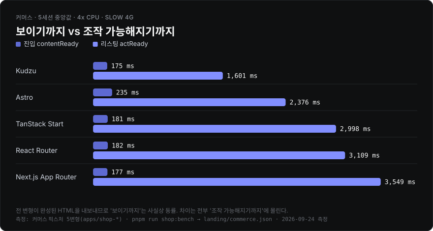
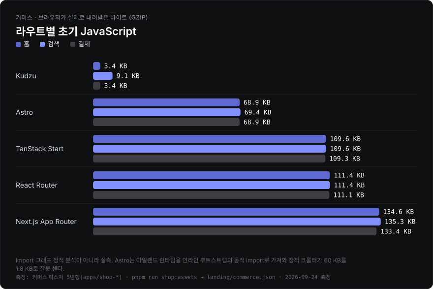
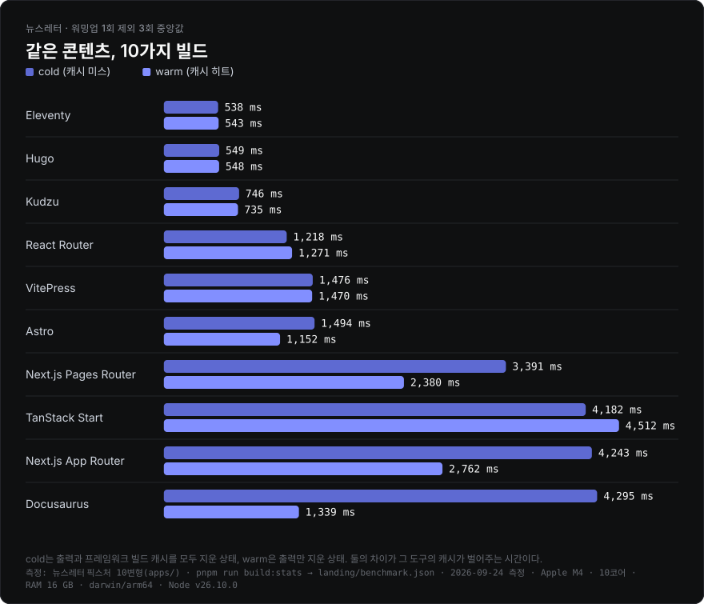
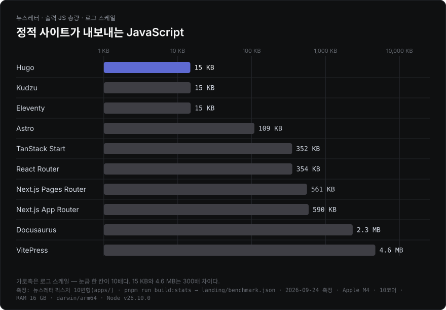
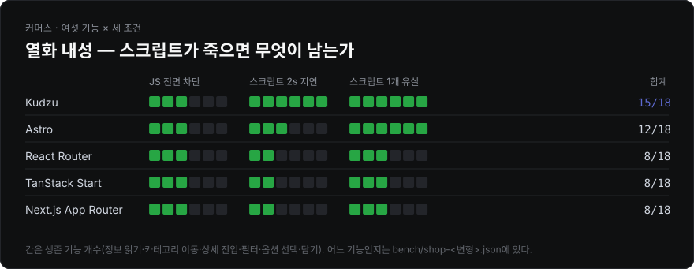
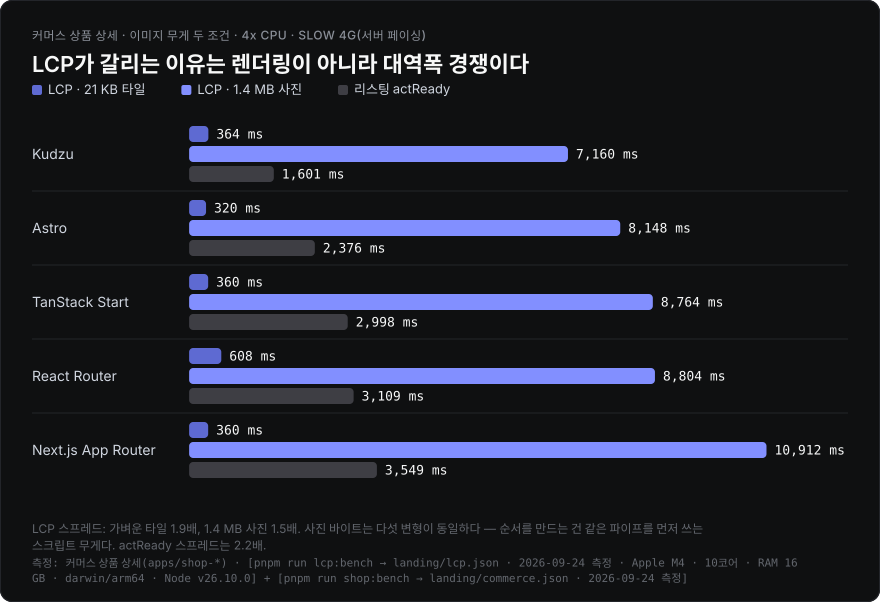
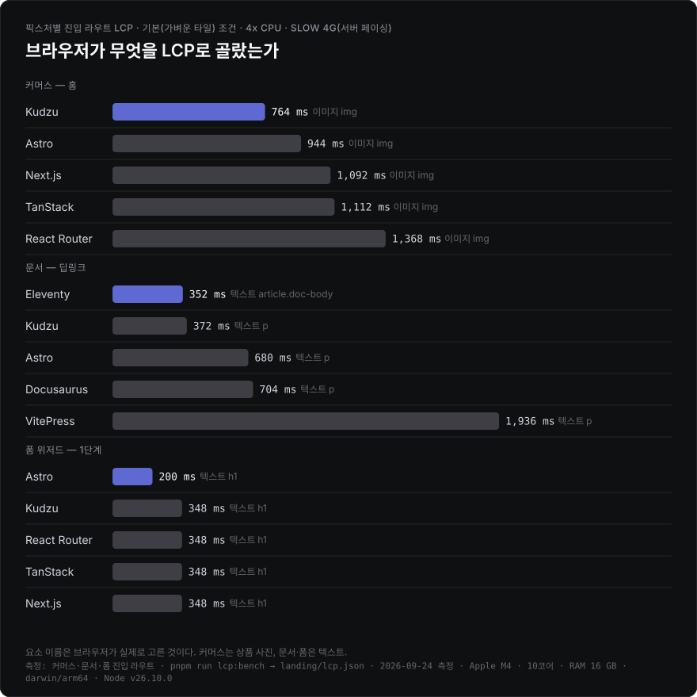

# kudzu-based-bench

[English](./README.en.md) · **한국어**

같은 사이트를 여러 프레임워크로 정적 빌드해 **무엇이 실제로 달라지는지** 재는 pnpm 워크스페이스 모노레포입니다. 합성 조작(1,000행 reverse, ops/sec)은 재지 않습니다 — 실제 세션을 재생하고, 사용자가 관측할 수 있는 것만 판정 기준으로 씁니다.

픽스처는 네 종류입니다.

| 픽스처 | 변형 | 드러나는 것 | 빌드 · 측정 |
| --- | --- | --- | --- |
| [뉴스레터](#뉴스레터-빌드-벤치마크) | 10 | 빌드 비용, 출력 크기 | `build:variants` · `build:stats` |
| [커머스](#커머스-벤치마크) | 5 | 하이드레이션, 세션 상호작용, 열화 내성 | `build:shop` · `shop:bench` |
| [폼 위저드](#폼-위저드-벤치마크) | 5 | 점진적 향상, 스텝 간 상태 운반 | `build:form` · `form:bench` |
| [문서 + 검색](#문서--검색-벤치마크) | 5 | 클라이언트 검색 지연, 인덱스 비용 | `build:docs` · `docs:bench` |

## 한눈에 보기











LCP는 [LCP](#lcp) 절에 두 조건으로 따로 있습니다. 전부 커밋된 측정치(`landing/benchmark.json`·`commerce.json`·`lcp.json`)에서 `pnpm run charts`가 생성하므로, 벤치를 다시 돌리지 않아도 같은 그림이 나옵니다.

<details>
<summary>이름과 측정 철학</summary>

이름이 kudzu인 이유는 [kudzu](https://github.com/kudzujs/kudzu)에서 출발했기 때문이지, kudzu로 만들어서가 아닙니다. 벤치 대상은 25개 변형 전부이고, kudzu가 지는 축(카탈로그 스케일 빌드, 폼 상태 운반 등)도 그대로 싣습니다.

- **뉴스레터** — [Ones to Watch for FE](https://ones-to-watch.ethansup.net)의 Notion 콘텐츠. 상호작용이 없어 빌드 비용과 출력만 봅니다.
- **커머스** — Next.js Commerce 수준의 상점. 홈 · 검색(필터·정렬) · 컬렉션 · 상품 상세(옵션·담기) · 정책 · 결제 6라우트를 동일한 DOM·동작 계약으로 구현.
- **폼 위저드** — 3단계 워크숍 신청. 네이티브 GET 폼 체인 + 쿼리스트링 상태 운반. 스크립트가 늦거나 빠졌을 때 무엇이 살아남는지가 존재 이유.
- **문서 + 검색** — 결정론 코퍼스(기본 120페이지) 문서 사이트 + 클라이언트 검색. "정적 콘텐츠 위 검색 인덱스"의 실비용.

모든 데이터 패키지(`@otw/commerce-data`, `@otw/docs-data`)는 시드 고정 결정론 생성기라, 프레임워크 말고는 아무것도 변하지 않습니다.
</details>

## 뉴스레터 빌드 벤치마크

같은 Notion 콘텐츠, 10가지 빌드. 로컬에서 `pnpm run build:stats`를 돌리면 아래 표가 자동 갱신됩니다.

<!-- build-stats:start -->
| 변형 | 기반 | 특징 | cold(ms) | warm(ms) | 총 출력 크기 | JS 크기 | 파일 수 | 원본 대비 diff |
| --- | --- | --- | --- | --- | --- | --- | --- | --- |
| Eleventy 3.1.6 | Node (Nunjucks) | SSG 특화 | 702 | 691 | 2.7 MB | 15.0 KB | 142 | 0.400% |
| Hugo 0.161.0 | Go (templates) | SSG 특화 | 710 | 691 | 2.6 MB | 14.8 KB | 142 | 0.395% |
| Kudzu 0.8.39 | Kudzu (JSX, no vDOM) | SSG 특화 | 785 | 789 | 2.6 MB | 15.0 KB | 141 | 0.395% |
| VitePress 1.6.4 | Vue | SSG 특화 | 1638 | 1644 | 8.5 MB | 4.6 MB | 416 | 0.402% |
| React Router 8.3.0 | React | SSG 지원 | 2161 | 2122 | 6.8 MB | 323.0 KB | 285 | 0.405% |
| Next.js Pages Router 16.3.0 | React | SSG 지원 | 3660 | 2687 | 6.4 MB | 529.9 KB | 304 | 0.403% |
| Next.js App Router 16.3.0 | React | SSG 지원 | 4491 | 2961 | 13.7 MB | 589.0 KB | 698 | 0.401% |
| TanStack Start 1.168.42 | React | SSG 지원 | 4847 | 4898 | 6.5 MB | 326.1 KB | 146 | 0.399% |
| Docusaurus 3.10.2 | React | SSG 특화 | 4919 | 1574 | 5.0 MB | 2.2 MB | 284 | 0.403% |
| Astro 7.2.1 | Astro islands (vanilla) | SSG 특화 | 6013 | 2483 | 3.1 MB | 99.9 KB | 152 | 0.320% |

_로컬에서 `pnpm run build:stats`로 측정(수동 갱신). **cold**는 출력과 프레임워크 빌드 캐시를 모두 지운 상태(CI 캐시 미스), **warm**은 출력만 지우고 캐시는 남긴 상태(CI 캐시 히트, 또는 로컬 두 번째 빌드)입니다. 둘의 차이가 그 도구의 캐시가 실제로 벌어주는 시간입니다. 각각 워밍업 1회를 버리고 3회를 잰 중앙값이며, 회차별 원본값은 `landing/benchmark.json`의 `coldSamples`·`warmSamples`에 있습니다. cold 오름차순 정렬. "총 출력 크기"·"파일 수"는 이미지 파일 제외(변형별 이미지 처리 방식 차이로 인한 불공정 비교 방지). "원본 대비 diff"는 `pnpm run origin:diff`가 만든 홈 화면 픽셀 diff(라이브 원본 대비, 이미지·분석 스크립트 차단 상태)이며 없으면 `-`. 측정 머신: Apple M4 · 10코어 · RAM 16 GB · darwin/arm64 · Node v24.17.0. 측정 시각: 2026-08-12T05:03:43.802Z_
<!-- build-stats:end -->

<details>
<summary>변형 → 디렉터리 매핑</summary>

| 앱 | 도구 | 배포 경로 |
| --- | --- | --- |
| `apps/web` | Astro (islands) | `/astro/` |
| `apps/react-router` | React Router v8 (framework mode, prerender) | `/react-router/` |
| `apps/tanstack-router` | TanStack Start (정적 prerender) | `/tanstack/` |
| `apps/kudzu` | [kudzu](https://github.com/kudzujs/kudzu) | `/kudzu/` |
| `apps/hugo` | Hugo (Go 바이너리, hugo-bin) | `/hugo/` |
| `apps/vitepress` | VitePress 커스텀 테마 | `/vitepress/` |
| `apps/docusaurus` | Docusaurus 커스텀 플러그인 | `/docusaurus/` |
| `apps/eleventy` | Eleventy (11ty) v3 | `/eleventy/` |
| `apps/next-app` | Next.js App Router (`output: "export"`) | `/next-app/` |
| `apps/next-pages` | Next.js Pages Router (`output: "export"`) | `/next-pages/` |

CI 자동 측정은 제거했습니다 — 공유 러너의 성능 편차로 수치 신뢰도가 낮고, 봇 커밋이 브랜치를 오염시키기 때문입니다.
</details>

## 커머스 벤치마크

같은 상점을 5가지로 빌드(`apps/shop-*`, 배포 경로 `/shop-*/`): Kudzu 0.8.39 · Astro 7 + React 아일랜드 · React Router v8 · TanStack Start · Next.js App Router. 전부 완성된 HTML을 내보내므로 "내용이 보이기까지"는 동률이고, 차이는 전부 **조작 가능해지기까지**에 몰려 있습니다.

```bash
pnpm run build:shop     # OTW_CATALOG_SIZE=100|1000|10000
pnpm run shop:bench     # 세션 재생 + 클릭 유실 + 뒤로가기 + 세션 전송 + 열화 내성
pnpm run shop:assets    # 라우트별 JS 무게 (브라우저 실측)
pnpm run shop:scale     # 카탈로그 크기별 빌드 시간
```

### 세션 재생 (5세션 중앙값, 4x CPU · Slow 4G)

| 변형 | 진입 contentReady | 리스팅 첫 조작 actReady | 정렬 stepLatency | 담기 stepLatency | 첫 신뢰 클릭 |
| --- | ---: | ---: | ---: | ---: | ---: |
| Kudzu | 170 ms | **250 ms** | 2.2 ms | 0.8 ms | **첫 페인트 +300 ms** |
| Astro (islands) | 223 ms | 2,229 ms | 9.1 ms | 1.5 ms | +1,500 ms |
| TanStack Start | 170 ms | 2,859 ms | 15.3 ms | 1.0 ms | +2,000 ms |
| React Router v8 | 170 ms | 2,957 ms | 17.6 ms | 1.1 ms | +2,000 ms |
| Next.js App Router | 178 ms | 3,537 ms | 26.8 ms | 0.9 ms | +3,000 ms |

### 내비게이션 계약 — 클릭 전환 · 뒤로가기 · 세션 전송

세션이 앞으로만 가지 않습니다. 리스팅에서 상품을 **실제 앵커 클릭**으로 열고(라우터는 가로채고, 문서 사이트는 새 문서를 로드), 담은 뒤 **뒤로가기**로 그리드에 돌아옵니다. 시계는 문서 스왑을 견디는 벽시계(sessionStorage) 하나라 MPA/SPA가 같은 자로 측정됩니다.

| 변형 | 리스팅→상세 (클릭) | 뒤로가기 | 필터 생존 | 정렬 생존 | 세션 총 전송 | 그중 스크립트 |
| --- | ---: | ---: | ---: | ---: | ---: | ---: |
| Kudzu | 271 ms | 33 ms | 0/5 | 5/5 | **244.9 KB** | **34.4 KB** |
| Astro (islands) | 222 ms | 34 ms | 0/5 | 5/5 | 529.9 KB | 193.1 KB |
| React Router v8 | **185 ms** | 14 ms | 0/5 | 0/5 | 616.9 KB | 322.3 KB |
| TanStack Start | **182 ms** | 13 ms | 0/5 | 0/5 | 616.3 KB | 317.6 KB |
| Next.js App Router | 360 ms | 46 ms | 0/5 | 5/5 | 792.1 KB | 455.5 KB |

클라이언트 전환은 SPA 라우터가 실제로 이기는 축입니다(React Router·TanStack 182–185 ms). 대신 뒤로가기에서 정렬 상태를 버립니다 — 컴포넌트가 리마운트되며 select가 초기화되는 반면, 문서 내비게이션 쪽은 Chrome의 폼 복원이 살립니다. 세션 전송은 전 구간 CDP 실측이라 프리페치 낭비까지 포함하며, Kudzu와 Next 사이 스크립트 격차는 세션 전체 기준 13배입니다.

<details>
<summary>측정 세부: 지표 정의, cold/warm으로 쪼개지 않는 이유, 뒤로가기 각주</summary>

| 지표 | 정의 |
| --- | --- |
| contentReady | navigationStart → 그 단계의 핵심 텍스트(상품명·가격)가 DOM에 존재 |
| actReady | 컨트롤이 **실제로 동작하기까지**. 50 ms 간격 재시도로 측정, 프레임워크 내부 신호는 안 봄 |
| stepLatency | 성공한 dispatch → next paint. INP와 같은 정의 |
| nav (클릭·뒤로가기) | 제스처 → 대상 콘텐츠 표시. sessionStorage 벽시계로 문서 스왑·라우터 전환 동일 측정 |
| 클릭 유실률 | 첫 페인트 + Δ에 "담기"를 눌렀을 때 무시되는 비율 |
| 세션 전송 | 세션 전 구간 CDP `Network` 실측 바이트(로컬 서버는 무압축 서빙 — 전 변형 동일 조건) |
| LCP | 브라우저 정의 그대로 — `PerformanceObserver('largest-contentful-paint')`의 마지막 후보. 별도 하네스(`pnpm run lcp:bench`)로 재고 [LCP](#lcp) 절에 있습니다 |

사람은 "cold 방문"과 "warm 방문"을 하지 않습니다. 한 세션 안에서 첫 페이지는 빈 캐시로 열고, 이후 페이지는 그 캐시를 물려받습니다. 두 버킷으로 쪼개면 비용이 세션에 어떻게 분포하는지가 사라집니다. LCP를 이 표에 넣지 않는 이유는 따로입니다 — 이 픽스처에서 LCP 요소는 다섯 변형이 바이트 동일한 상품 사진이라 순위가 프레임워크를 가르지 못하고, 실측과 근거는 [LCP](#lcp) 절에 있습니다.

클릭 유실 측정은 저널리와 **별도 세션**입니다. Δ 격자를 5초까지 훑으면 모듈 캐시가 데워져 뒤따르는 저널리의 actReady가 실제보다 훨씬 좋게 나옵니다(실제로 Next가 3,768 ms → 0.1 ms로 붕괴한 적이 있습니다).

뒤로가기 상태는 도착 +300 ms 시점 샘플입니다. 필터(검색어 입력값 + 그리드 축소 상태)는 다섯 변형 모두 유실 — URL에 싣지 않는 컴포넌트 상태라서입니다. 스크롤 복원은 같은 창에서 다섯 변형 모두 미복원으로 측정되어 표에서 뺐습니다(CDP 스로틀링 하에서 복원 타이밍이 창 밖일 수 있어 변형 간 차이를 못 가르는 축).
</details>

### LCP

"번들 크기랑 LCP도 재봤냐"는 이 저장소가 가장 많이 받는 질문입니다. 번들은 처음부터 재고 있었고(위 표의 `JS 크기`, 아래 라우트별 초기 JS, 세션 총 전송), LCP는 **재지 않고 이유만 적어둔 상태**였습니다. 그래서 실제로 쟀습니다 — `pnpm run lcp:bench`.



LCP를 헤드라인에 안 뒀던 이유가 데이터로 확인됩니다. 기본 픽스처(21 KB 타일)에서 상품 상세 LCP는 320–540 ms에 몰려 있고 스프레드가 1.7배인데, 같은 다섯 빌드의 "조작 가능해지기까지"는 250 ms와 3,537 ms로 **14.1배** 벌어집니다. LCP가 재는 건 사진이 도착하는 시간이고, 그 사진은 다섯 변형이 md5까지 같은 파일입니다.

그래서 사진을 실제 상점 무게(1.4 MB)로 올려서 다시 쟀습니다(`OTW_IMAGE_WEIGHT=heavy`). LCP는 6.5–10.2초로 뛰지만 순서를 만드는 건 여전히 프레임워크의 렌더링이 아니라 **대역폭 경쟁**입니다: 같은 파이프를 스크립트가 먼저 쓰기 때문에, 세션 스크립트 34 KB인 Kudzu의 사진이 455 KB인 Next.js보다 3.7초 먼저 도착합니다. 즉 LCP는 여기서 "JS를 얼마나 보내는가"를 우회적으로 재는 지표입니다 — 그걸 직접 재는 표가 이미 아래에 있습니다.



LCP가 프레임워크를 실제로 가르는 곳은 **LCP 요소가 텍스트인 픽스처**입니다. 문서 딥링크에서 브라우저가 고른 건 본문 `p`이고, Eleventy 352 ms 대 VitePress 1,140 ms로 3.2배 차이가 납니다 — 마크업이 완성돼 오는지, 클라이언트가 본문을 다시 그리는지가 그대로 드러납니다.

뉴스레터 픽스처는 이 벤치에서 뺐습니다. 홈의 최대 요소가 Notion 이미지이고 변형마다 이미지 파이프라인이 다르므로(sharp / unoptimized / 원본 복사) LCP가 프레임워크가 아니라 이미지 도구를 재게 됩니다. 그 픽스처의 Lighthouse LCP는 `pnpm run perf:bench`가 냅니다.

측정에서 걸린 함정 하나는 그대로 기록해 둡니다: **CDP `Network.emulateNetworkConditions`를 켜면 이 크로미움이 늦게 도착한 이미지를 LCP 후보로 아예 보고하지 않습니다.** 1.4 MB 사진이 7,531 ms에 도착해 화면에 그려져도 후보는 첫 프레임의 제목뿐입니다. 같은 지연을 서버에서 만들면 정상적으로 `IMG`가 잡힙니다. 그래서 이 벤치만 대역폭을 CDP가 아니라 서버(공유 토큰 버킷)로 모델링합니다 — 조건별 측정표는 `scripts/lcp-bench.mjs` 주석에 있습니다.

<details>
<summary>전 픽스처 · 전 라우트 LCP 측정치</summary>


<!-- lcp:start -->
| 픽스처 | 라우트 | 이미지 | 변형 | FCP | LCP | LCP−FCP | LCP 요소 | LCP 자원 |
| --- | --- | --- | --- | ---: | ---: | ---: | --- | ---: |
| 커머스 | 홈 | 21 KB 타일 | Astro | 212 ms | 364 ms | 152 ms | 이미지 `img` | 20.5 KB |
| 커머스 | 홈 | 21 KB 타일 | Kudzu | 356 ms | 512 ms | 156 ms | 이미지 `img` | 20.5 KB |
| 커머스 | 홈 | 21 KB 타일 | React Router | 512 ms | 732 ms | 236 ms | 이미지 `img` | 20.5 KB |
| 커머스 | 홈 | 21 KB 타일 | TanStack | 356 ms | 980 ms | 636 ms | 이미지 `img` | 21.8 KB |
| 커머스 | 홈 | 21 KB 타일 | Next.js | 368 ms | 1068 ms | 700 ms | 이미지 `img` | 22.2 KB |
| 커머스 | 상품 상세 | 21 KB 타일 | Astro | 212 ms | 320 ms | 104 ms | 이미지 `img` | 20.5 KB |
| 커머스 | 상품 상세 | 21 KB 타일 | TanStack | 352 ms | 352 ms | 0 ms | 이미지 `img` | 20.5 KB |
| 커머스 | 상품 상세 | 21 KB 타일 | Kudzu | 356 ms | 356 ms | 0 ms | 이미지 `img` | 20.5 KB |
| 커머스 | 상품 상세 | 21 KB 타일 | Next.js | 356 ms | 356 ms | 0 ms | 이미지 `img` | 20.5 KB |
| 커머스 | 상품 상세 | 21 KB 타일 | React Router | 540 ms | 540 ms | 0 ms | 이미지 `img` | 20.5 KB |
| 커머스 | 검색 리스팅 | 21 KB 타일 | Kudzu | 356 ms | 512 ms | 156 ms | 이미지 `img` | 21.7 KB |
| 커머스 | 검색 리스팅 | 21 KB 타일 | Astro | 220 ms | 632 ms | 404 ms | 이미지 `img` | 21.7 KB |
| 커머스 | 검색 리스팅 | 21 KB 타일 | Next.js | 360 ms | 648 ms | 288 ms | 이미지 `img` | 22.0 KB |
| 커머스 | 검색 리스팅 | 21 KB 타일 | React Router | 508 ms | 732 ms | 224 ms | 이미지 `img` | 21.7 KB |
| 커머스 | 검색 리스팅 | 21 KB 타일 | TanStack | 356 ms | 984 ms | 628 ms | 이미지 `img` | 21.7 KB |
| 커머스 | 상품 상세 | 1.4 MB 사진 | Kudzu | 356 ms | 6484 ms | 6128 ms | 이미지 `img` | 1448.8 KB |
| 커머스 | 상품 상세 | 1.4 MB 사진 | Astro | 212 ms | 7328 ms | 7116 ms | 이미지 `img` | 1448.8 KB |
| 커머스 | 상품 상세 | 1.4 MB 사진 | TanStack | 360 ms | 7952 ms | 7592 ms | 이미지 `img` | 1448.8 KB |
| 커머스 | 상품 상세 | 1.4 MB 사진 | React Router | 508 ms | 7968 ms | 7456 ms | 이미지 `img` | 1448.8 KB |
| 커머스 | 상품 상세 | 1.4 MB 사진 | Next.js | 352 ms | 10208 ms | 9848 ms | 이미지 `img` | 1448.8 KB |
| 문서 | 문서 딥링크 | — | Eleventy | 352 ms | 352 ms | 0 ms | 텍스트 `article.doc-body` | — |
| 문서 | 문서 딥링크 | — | Kudzu | 372 ms | 372 ms | 0 ms | 텍스트 `p` | — |
| 문서 | 문서 딥링크 | — | Astro | 192 ms | 380 ms | 184 ms | 텍스트 `p` | — |
| 문서 | 문서 딥링크 | — | Docusaurus | 392 ms | 392 ms | 0 ms | 텍스트 `p` | — |
| 문서 | 문서 딥링크 | — | VitePress | 1140 ms | 1140 ms | 0 ms | 텍스트 `p` | — |
| 폼 위저드 | 1단계 | — | Astro | 196 ms | 196 ms | 0 ms | 텍스트 `h1` | — |
| 폼 위저드 | 1단계 | — | Kudzu | 344 ms | 344 ms | 0 ms | 텍스트 `h1` | — |
| 폼 위저드 | 1단계 | — | React Router | 344 ms | 344 ms | 0 ms | 텍스트 `h1` | — |
| 폼 위저드 | 1단계 | — | TanStack | 344 ms | 344 ms | 0 ms | 텍스트 `h1` | — |
| 폼 위저드 | 1단계 | — | Next.js | 344 ms | 344 ms | 0 ms | 텍스트 `h1` | — |

_`pnpm run lcp:bench`로 로컬 측정(수동 갱신). 워밍업 1회를 버리고 5회를 잰 중앙값이며, 회차별 원본값은 `landing/lcp.json`의 `lcpSamples`에 있습니다. 브라우저 정의 그대로 `PerformanceObserver('largest-contentful-paint')`의 **마지막 후보**를 씁니다 — 하이드레이션이 본문을 다시 그려 후보가 뒤로 밀리면 그 값이 잡힙니다. 하네스는 페이지를 클릭·스크롤하지 않습니다(첫 입력이 LCP를 확정시키므로). "이미지" 열은 커머스 픽스처의 이미지 무게 조건입니다(`OTW_IMAGE_WEIGHT`) — 기본은 21 KB 타일, `heavy`는 1.4 MB 사진이고 두 조건 모두 다섯 변형이 md5까지 동일한 파일을 씁니다. 문서·폼 픽스처에는 이미지가 없습니다. 대역폭은 CDP가 아니라 서버에서 모델링합니다(`Network.emulateNetworkConditions`를 켜면 이 크로미움이 늦게 도착한 이미지를 LCP 후보로 보고하지 않습니다 — `scripts/lcp-bench.mjs` 주석에 측정표가 있습니다). 4x CPU · slow4g (server-paced) · 1280×900. 측정 머신: Apple M4 · 10코어 · RAM 16 GB · darwin/arm64 · Node v24.17.0. 측정 시각: 2026-08-18T05:11:57.406Z_
<!-- lcp:end -->

</details>

### 라우트별 초기 JavaScript (KB gzip)

브라우저가 실제로 내려받은 바이트입니다. import 그래프 정적 분석은 프레임워크마다 결과가 달라집니다 — Astro는 아일랜드 런타임을 인라인 부트스트랩 안의 동적 `import()`로 가져오기 때문에, 정적 크롤러로는 60 KB짜리를 1.8 KB로 잘못 셉니다.

| 변형 | 홈 | 검색 | 상품 | 결제 | 총 출력(이미지 제외) |
| --- | ---: | ---: | ---: | ---: | ---: |
| Kudzu | **4.7** | 9.4 | 4.9 | **4.7** | 1.14 MB |
| Astro | 60.6 | 61.0 | 61.1 | 60.6 | 1.72 MB |
| React Router | 104.3 | 104.2 | 104.4 | 103.9 | 1.09 MB |
| TanStack | 101.7 | 101.7 | 101.9 | 101.3 | 1.66 MB |
| Next.js | 134.2 | 134.8 | 133.8 | 132.8 | 4.24 MB |

Kudzu만 라우트에 따라 변합니다(검색 페이지의 keyed-list 런타임 +4.7 KB). Astro의 아일랜드 분할은 실재하지만, 카트 배지가 전역 헤더에 있는 한 react-dom 런타임은 모든 라우트가 냅니다. Next.js는 16.2 → 16.3에서 145 KB대 → 134 KB대로, TanStack은 vite 7 → 8 + @vitejs/plugin-react 6에서 104 KB대 → 101 KB대로 줄었습니다.

### 열화 내성

여섯 기능(정보 읽기 · 카테고리 이동 · 상세 진입 · 필터 · 옵션 선택 · 담기)이 세 조건에서 몇 개나 살아남는지. 광고 차단, 캡티브 포털, CDN 부분 장애, 지하철 터널이 실제로 만드는 상태입니다.

| 변형 | JS 전면 차단 | 스크립트 2s 지연 | 스크립트 1개 유실 | 합계 |
| --- | ---: | ---: | ---: | ---: |
| Kudzu | 3/6 | 6/6 | 6/6 | **15/18** |
| Astro | 3/6 | 3/6 | 6/6 | 12/18 |
| TanStack | 3/6 | 2/6 | 3/6 | 8/18 |
| Next.js | 3/6 | 2/6 | 3/6 | 8/18 |
| React Router | 3/6 | 2/6 | 3/6 | 8/18 |

TanStack의 "스크립트 1개 유실" 셀은 어떤 청크가 유실되느냐에 따라 실행 간 ±1 흔들립니다(3~4/6) — 청크 그래프가 콘텐츠 해시 순서에 민감해서입니다.

### 카탈로그 스케일 (cold / warm, 중앙값)

| 변형 | 100개 | 1,000개 | 페이지당(1,000개) |
| --- | ---: | ---: | ---: |
| Astro | 1,373 / 1,328 ms | **1,818 / 1,875 ms** | 1.82 ms |
| TanStack | 1,582 / 1,552 ms | 2,471 / 2,490 ms | 2.47 ms |
| React Router | 1,820 / 1,860 ms | 3,073 / 2,996 ms | 3.07 ms |
| Kudzu | **1,279 / 1,275 ms** | 3,557 / 3,568 ms | 3.56 ms |
| Next.js | 4,314 / 3,213 ms | 5,624 / 5,000 ms | 5.62 ms |

여전히 Kudzu의 스케일 기울기가 제일 가파릅니다(100→1,000에서 2.8배, Astro 1.3배) — 상품마다 effect·native 핸들러 모듈을 따로 emit하므로 빌드 비용 동인이 라우트별 capability ESM emission이라서입니다. 다만 0.8.15 → 0.8.39에서 1,000개 절대값이 5.8초 → 3.6초로 개선돼 꼴찌 자리는 Next.js로 넘어갔고, TanStack은 vite 7 → 8에서 빌드가 약 15–20% 빨라져 1,000개 2위입니다. Next 16.3은 커머스에서도 cold와 warm이 갈라지기 시작했습니다(나머지 넷은 여전히 동일 — 캐시가 크게 일하는 건 뉴스레터 픽스처의 Docusaurus·Astro뿐).

## 폼 위저드 벤치마크

같은 3단계 신청 위저드(`apps/form-*`, 배포 경로 `/form-*/`)를 다섯 프레임워크로. 참가자 정보 → 세션 선택 → 확인 → 완료, 상태는 **네이티브 GET 폼 체인**의 쿼리스트링으로 운반하고 hidden input 프리필만 JS입니다. 검증은 전부 HTML5 네이티브 속성. 완주 결과 레퍼런스 코드(FNV-1a)는 다섯 변형이 **바이트 동일**해야 하며, 실제로 5세션 × 5변형 전부 `REF-09D7A58B`로 일치했습니다.

```bash
pnpm run build:form
pnpm run form:bench     # 세션 재생 + ref 교차 검증 + 열화 내성
```

### 세션 재생 (5세션 중앙값, 4x CPU · Slow 4G)

| 변형 | 진입 contentReady | 조건부 필드 토글 | 다음 스텝 도착 | 상태 운반 완료 | 요약 렌더 |
| --- | ---: | ---: | ---: | ---: | ---: |
| Astro (inline script) | 198 ms | 0.8 ms | 180 ms | **200 ms** | 216 ms |
| TanStack Start | 174 ms | 2.4 ms | 183 ms | **189 ms** | **173 ms** |
| React Router v8 | 179 ms | 3.0 ms | **175 ms** | 399 ms | 370 ms |
| Next.js App Router | 182 ms | 1.9 ms | 188 ms | 362 ms | 370 ms |
| Kudzu | 180 ms | 0.7 ms | 179 ms | 702 ms | 520 ms |

**Kudzu가 지는 축입니다.** 상태 운반(제출 → 다음 스텝의 hidden input이 채워지기까지)은 페이지별 effect 모듈이 도착해야 돌기 시작하는데, Slow 4G에서 모듈 체인 왕복이 그대로 비용이 됩니다(702 ms — 최하위). TanStack은 커머스에서 하이드레이션에 2.9초를 내지만, 여기서는 라우터가 제출을 가로채 같은 문서 안에서 전환하므로 아키텍처가 유리하게 작동합니다.

### 열화 내성 (스텝 이동 · 상태 운반 · 조건부 토글 · 요약 렌더 · 레퍼런스 렌더)

| 변형 | JS 전면 차단 | 스크립트 2s 지연 | 스크립트 1개 유실 | 합계 |
| --- | ---: | ---: | ---: | ---: |
| Astro | 5/5 | 5/5 | 5/5 | **15/15** |
| Kudzu | 1/5 | 2/5 | 4/5 | 7/15 |
| TanStack | 2/5 | 2/5 | 3/5 | 7/15 |
| React Router | 1/5 | 1/5 | 4/5 | 6/15 |
| Next.js | 1/5 | 1/5 | 4/5 | 6/15 |

조건("JS 전면 차단")은 커머스와 동일하게 `*.js` **요청** 차단입니다 — 광고 차단기·CDN 장애의 모델이지 `<script>` 실행 금지가 아닙니다. Astro 변형이 전 조건 생존인 이유가 정확히 이것: 페이지별 로직을 외부 번들이 아니라 **인라인 스크립트**로 싣기 때문에 요청 차단이 닿지 않습니다. 아키텍처가 만든 실제 속성이라 그대로 싣습니다. 스텝 이동(네이티브 GET 제출)은 다섯 변형 모두 JS 없이 살아남습니다 — 단, 쿼리스트링을 읽어야 하는 상태 운반·요약·ref는 정적 호스트에서 구조적으로 JS가 필요합니다.

<details>
<summary>측정 세부</summary>

- 도착 지표는 제출 직전 sessionStorage에 심은 벽시계 기준입니다. React Router·Next는 폼을 가로채지 않아 실제 문서 내비게이션이 일어나고, TanStack은 라우터가 가로챕니다 — navigationStart 기준으로 재면 두 경우가 비교 불능이라서입니다. URL 대기는 `commit` 기준(모듈 스크립트가 `load`를 수 초 늦추는 조건에서 성공한 내비게이션을 실패로 오판하지 않도록).
- diet 체크박스처럼 같은 키가 반복되는 쿼리는 `URLSearchParams#getAll` 의미론으로 통일. TanStack은 기본 JSON 서치 코덱이 반복 키를 덮어쓰므로 커스텀 `parseSearch`/`stringifySearch`를 씁니다.
- 원본 JSON: `bench/form-<variant>.json`.
</details>

## 문서 + 검색 벤치마크

결정론 코퍼스(`@otw/docs-data`, 기본 120페이지 · `OTW_DOCS_SIZE`로 조절)로 같은 문서 사이트를 다섯 SSG로 빌드(`apps/docs-*`, 배포 경로 `/docs-*/`). kudzu·astro·eleventy는 **Pagefind**, docusaurus는 `@easyops-cn/docusaurus-search-local`, vitepress는 내장 local search(minisearch)입니다.

```bash
pnpm run build:docs
pnpm run docs:bench     # 문서 도착 + 검색 첫 결과 + 인덱스 전송량
```

### 결과 (3회 중앙값, 4x CPU · Slow 4G, 검색어 "하이드레이션")

| 변형 | 문서 contentReady | 초기 JS | 검색 첫 결과 | 검색 중 전송 |
| --- | ---: | ---: | ---: | ---: |
| Kudzu + Pagefind | **250 ms** | 119.1 KB | **1,800 ms** | **44.7 KB** |
| Eleventy + Pagefind | 278 ms | 117.4 KB | **1,801 ms** | **44.7 KB** |
| Astro + Pagefind | 990 ms | 117.4 KB | **1,801 ms** | **44.7 KB** |
| Docusaurus + search-local | 1,220 ms | 719.6 KB | 6,803 ms | 190.7 KB |
| VitePress + local search | 2,202 ms | 165.4 KB | 2,566 ms | 402.4 KB |

검색 아키텍처가 그대로 드러납니다. Pagefind는 쿼리 시점에 필요한 인덱스 조각만 내려받아 세 변형이 정확히 같은 비용(44.7 KB, 1,800 ms)을 냅니다 — 프레임워크와 무관하게 검색은 Pagefind의 속성입니다. Docusaurus의 search-local은 전체 lunr 인덱스가 초기 JS에 묶여 오고(719.6 KB의 상당분) 첫 결과까지 6.8초. VitePress는 검색을 열 때 minisearch 인덱스 전체를 내려받습니다(402.4 KB — 인덱스가 코퍼스 크기에 비례해 자랍니다).

<details>
<summary>측정 세부</summary>

- 진입은 `/guide/routing/routing-01/` 딥링크. `contentReady`는 navigationStart → `.doc-title` 표시.
- "검색 첫 결과"는 검색 UI 활성화 → 타이핑 → 첫 결과 항목 렌더까지, 컨트롤이 아직 배선되지 않았으면 50 ms 재시도(커머스 actReady와 같은 정의).
- 검색어 "하이드레이션"은 코퍼스 생성기의 TERMS에 있어 결과 존재가 보장됩니다.
- 원본 JSON: `bench/docs-<variant>.json`.
</details>

## 리팩토링에서 발견한 실전 결함·제약

프레임워크 자체에 이슈로 올릴 만한(업스트림 버그이거나 문서화되지 않은 제약) 것만 추립니다. 우리 앱 설정/이력이나 프레임워크가 의도한 정상 제약은 제외했습니다.

1. **TanStack Start — 서브경로 배포에서 SPA 전환 무한 대기 (실버그)**
   `@tanstack/start-static-server-functions`가 프리렌더된 서버 함수 캐시를 origin 루트(`/__tsr/staticServerFnCache/...`) 절대 경로로 fetch합니다. GitHub Pages처럼 `/<repo>/` 서브경로에 배포하면 이 요청이 404가 나면서 라우트가 pending에 갇혀 클라이언트 전환이 영영 끝나지 않습니다(딥링크는 프리렌더 HTML이라 정상 → 로컬 dev에선 재현 안 됨). 이 레포에서는 해당 미들웨어를 base-aware로 벤더링해 우회했습니다(`apps/tanstack-router/src/lib/staticFunctionMiddleware.ts`, `import.meta.env.BASE_URL` 접두).
   **2026-08-08 재확인: 미수정** (`1.167.24` — `dist/`에 base 처리 문자열 전무). **2026-08-12 재확인 (`react-start 1.168.42` / `start-plugin-core 1.171.33` / `start-static-server-functions 1.167.26` = npm `latest`): 미수정.** 직전 기록의 "패키지가 제거되고 정적 폴백 메커니즘이 사라졌다"는 서술은 오독이라 철회합니다 — 이 패키지는 애초에 `react-start`의 의존성이 아니라 옵트인 패키지였고, 지금도 현재 버전에 맞춰 릴리스됩니다(deps `start-client-core 1.170.21`, peer `react-start ^1.168.42`, 경고 없이 설치됨). 벤더링 사본을 제거한 빌드에서 관측한 `_serverFn` 404는 정적 미들웨어를 아예 빼서 생긴 당연한 결과이지 새 업스트림 결함이 아닙니다. 실제 결함은 그대로입니다: **같은 클라이언트 번들 안에서** 라이브 RPC는 `TSS_SERVER_FN_BASE` define으로 `/kudzu-based-bench/tanstack/_serverFn/<id>`처럼 base가 정확한데, 정적 캐시만 `/__tsr/staticServerFnCache/<sha1>.json` 루트 절대 경로로 남아 404가 납니다(증상은 무한 pending에서 `Seroval Error` → 에러 바운더리로 바뀜). 업스트림 이슈 [#6152](https://github.com/TanStack/router/issues/6152)와 수정 PR [#5970](https://github.com/TanStack/router/pull/5970)이 열려 있고(미머지, `mergeable_state: clean`), `2.0.0-alpha.2`에도 미반영입니다. 최소 재현·검증: [SimYunSup/example-list@`tanstack-start/static-server-fn-basepath`](https://github.com/SimYunSup/example-list/tree/tanstack-start/static-server-fn-basepath) — fetch 경로에만 `process.env.TSS_ROUTER_BASEPATH`를 붙이면 200으로 복구됩니다(쓰기 경로는 `TSS_CLIENT_OUTPUT_DIR` 기준이라 같이 붙이면 한 겹 더 중첩).
2. **Next.js App Router — `output: "export"`에서 `generateStaticParams()`가 빈 배열이면 빌드 실패**
   Pages Router(`getStaticPaths` → `paths: []`, `fallback: false`)는 빈 컬렉션을 그대로 허용하지만, App Router는 정적 export에서 동적 라우트가 최소 1개 경로를 내놓지 못하면 빌드가 죽습니다. 이 레포는 빈 컬렉션일 때 sentinel 경로(`_none`) + `dynamicParams = false` + `notFound()` 조합으로 방어합니다(`apps/next-app/src/app/news/post/[id]/page.tsx`). 같은 프레임워크의 두 라우터가 같은 상황에서 다르게 동작하는 사례.
3. **VitePress — 동적 라우트는 디렉터리형 pretty URL을 만들 수 없음**
   `[page].md` 동적 라우트는 `cleanUrls` 설정과 무관하게 항상 평면 `<param>.html` 파일로만 출력됩니다(`/news/list/1/index.html` 형태 불가). GitHub Pages가 확장자 없는 요청을 `.html`로 서빙해 주기 때문에 `cleanUrls: true`로 다른 변형과 동등한 URL 계약을 맞췄지만, 트레일링 슬래시 유무는 다릅니다. 문서 픽스처(`apps/docs-vitepress`)도 같은 이유로 gen 스크립트가 실파일 `.md`를 생성하는 우회를 씁니다.
4. **Docusaurus — 커스텀 플러그인의 `addRoute` 경로는 baseUrl-프리픽스여야 함**
   `<BrowserRouter>`가 basename 없이 마운트돼(코어 `clientEntry.js`) 클라이언트는 baseUrl 포함 전체 URL로 매칭합니다. 플러그인이 언프리픽스 경로(`/`, `/news/list/1`)로 `addRoute`하면 SSG(StaticRouter 직접 구동)는 정상이지만 하이드레이션 시 아무 라우트도 안 맞아 catch-all `@theme/NotFound`로 폴백 → React #418. `normalizeUrl([baseUrl, path])` 프리픽스로 등록해야 합니다(코어 콘텐츠 플러그인·`useBaseUrl`과 동일).
5. **Docusaurus — 앱 package.json에 `"type": "module"`이 있으면 SSG가 `require.resolveWeak is not a function`으로 죽음**
   빌드는 Client/Server 컴파일까지 성공하고, SSR 번들 실행 단계에서 죽습니다. 서버 번들(웹팩 CJS, 라우트 레지스트리가 `require.resolveWeak` 사용)이 ESM 컨텍스트로 로드되면서 웹팩 require 셔임이 사라지기 때문입니다. 에러 메시지 어디에도 `type: "module"`이 원인이라는 단서가 없습니다(`apps/docs-docusaurus`에서 재현·확인). 앱 매니페스트에서 해당 필드를 빼는 것이 우회입니다.
6. **React Router v8 — `ssr: false` prerender가 basename 아래로 한 겹 더 중첩**
   basename은 배포 경로 전체여야 클라이언트 라우팅이 서빙 URL과 맞는데, prerender 플러그인이 그 basename을 출력 경로에도 적용해 실제 페이지가 `build/client/<basename>/<route>/index.html`로 들어갑니다. `build/client` 루트에는 SPA 폴백 셸이 대신 놓여서, 그 디렉터리를 문서 루트로 서빙하면 홈이 빈 셸이 됩니다. 후처리로 끌어올려 우회했습니다(`apps/shop-react-router/scripts/flatten-build.mjs`, `apps/form-react-router`도 동일).
7. **TanStack Start — 정적 출력이 `dist/client`에 들어감**
   기본 다중 환경 빌드가 `dist/client`(정적)와 `dist/server`(쓰지 않는 서버 번들)로 나눕니다. 정적 호스트에 그대로 올리면 한 단계 어긋납니다. `environments.client.build.outDir`로 고정했습니다(`apps/shop-tanstack/vite.config.ts`). 덤으로 `dist/server` 번들에는 빌드 머신의 절대 경로가 그대로 구워집니다.
8. **Kudzu 0.8.x — 커머스·폼·문서를 컴파일하며 만난 문법 경계 7개**
   전부 `apps/shop-kudzu`·`apps/form-kudzu`·`apps/docs-kudzu` 소스에 주석으로 남겼습니다. 요약: (a) JSX 이벤트 핸들러 밖의 패키지 import 전면 거부 → 빌드 타임 데이터를 codegen으로 상대 모듈화해야 함, (b) imported 배열의 `.map()`은 JSX 밖에서도 keyed-list로 가로채여 거부 → `for` 루프, (c) 행 컴포넌트에 객체 prop 불가 → intrinsic 마크업 인라인, (d) 선택자 파이프라인(`filter`/`toSorted`)의 소스는 literal로 emit된 상대 import 배열만 가능, (e) `new CustomEvent` 거부로 컴포넌트 간 상태 통지 불가, (f) `navigation` 그룹이 멤버 라우트 전수 열거를 요구해 `getStaticPaths` 카탈로그에 적용 불가, (g) 핸들러·effect 안의 자유 식별자를 빌드 타임 캡처로 평가 — 지역 헬퍼 함수는 "not serializable"로, `instanceof HTMLElement` 같은 DOM 전역 참조는 빌드 렌더 중 `ReferenceError`로 거부. 핸들러 본문은 인라인 + 속성 조작(`setAttribute`)으로 내려가야 합니다.

## 검증 도구 (로컬 전용)

- `pnpm run build:stats` — 뉴스레터 클린 빌드 시간·산출물 크기 → README 표 갱신.
- `pnpm run perf:bench` — Lighthouse desktop + 라우팅 전환 측정 → `bench/report.md`.
- `pnpm run origin:diff` / `pnpm run visual:diff` — 픽셀 diff(라이브 원본 대비 / 변형 간).
- `pnpm run test:e2e` — Playwright e2e(뉴스레터 변형 × 5 시나리오).
- `pnpm run shop:bench -- --variant shop-kudzu` — 커머스 세션 재생 → `bench/<variant>.json`.
- `pnpm run shop:assets` / `pnpm run shop:scale -- --sizes 100,1000,10000` — 라우트 JS · 스케일 빌드.
- `pnpm run form:bench -- --variant form-kudzu` — 폼 위저드 → `bench/form-<variant>.json`.
- `pnpm run docs:bench -- --variant docs-kudzu` — 문서 검색 → `bench/docs-<variant>.json`.
- `pnpm run shop:report` — 커머스 측정치를 `landing/commerce.json`으로 병합.
- `pnpm run lcp:bench` — 커머스·문서·폼 진입 라우트의 FCP/LCP + 브라우저가 고른 LCP 요소 → `landing/lcp.json`, README `LCP` 표 갱신. `--routes product --runs 3`으로 라우트를 좁히고, `OTW_IMAGE_WEIGHT=heavy`로 빌드하면 1.4 MB 사진 조건을 잰다. `--readme-only`는 재측정 없이 표만 다시 렌더.
- `pnpm run charts` — 커밋된 측정치에서 README용 SVG 막대 그래프 재생성 → `assets/charts/{ko,en}/`.

## 개발

Node.js(fnm 권장, `.nvmrc` 참고)가 필요합니다. Hugo 바이너리는 `hugo-bin`이 설치 시 자동으로 받습니다.

```bash
corepack enable   # pnpm이 없다면
pnpm install
pnpm dev          # apps/web
```

`pnpm build:variants`는 뉴스레터 9개 변형, `pnpm build:all`은 열 개 전부, `build:shop`·`build:form`·`build:docs`는 각 픽스처를 빌드합니다.

## 배포

CI 배포 워크플로는 제거했습니다 — 배포는 로컬에서 합니다.

```bash
pnpm run deploy:pages              # prefetch → build:all → site/ 조립 → gh-pages 푸시
pnpm run deploy:pages -- --skip-build  # 이미 빌드된 산출물로 조립·푸시만
```

`scripts/deploy-pages.mjs`가 전 변형을 빌드하고 `assembleSite()` 레이아웃으로 `site/`를 조립한 뒤 orphan 커밋으로 `gh-pages`에 강제 푸시합니다. 커머스·폼·문서 픽스처는 빌드돼 있으면 자동 포함, 없으면 건너뜁니다.

## 컨텐츠

콘텐츠 로딩에는 `NOTION_TOKEN`, `NOTION_DATABASE_ID` 환경 변수(로컬 `.env`)가 필요합니다. 값이 없으면 빈 컬렉션으로 정상 빌드됩니다. 직접적인 컨텐츠 기여는 [심윤섭](https://github.com/SimYunSup)이나 이슈로 제안주시면 감사하겠습니다!

## License

MIT License
