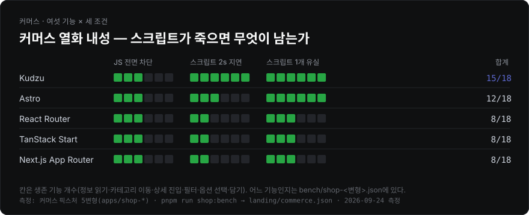
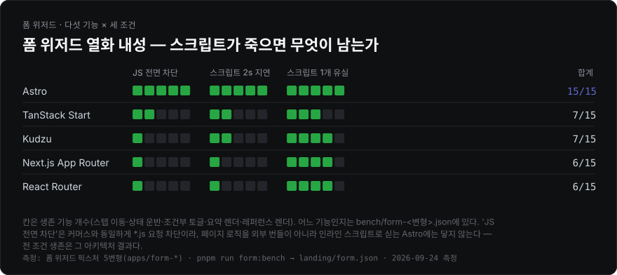

# kudzu-based-bench

[English](./README.en.md) · **한국어**

<!-- landing:start -->

같은 사이트를 여러 프레임워크로 정적 빌드해 **무엇이 실제로 달라지는지** 재는 pnpm 워크스페이스 모노레포입니다. 합성 조작(1,000행 reverse, ops/sec)은 재지 않습니다 — 실제 세션을 재생하고, 사용자가 관측할 수 있는 것만 판정 기준으로 씁니다.

픽스처는 네 종류입니다.

| 픽스처 | 변형 | 드러나는 것 | 빌드 · 측정 |
| --- | --- | --- | --- |
| [뉴스레터](#뉴스레터-빌드-벤치마크) | 10 | 빌드 비용, 출력 크기 | `build:variants` · `build:stats` |
| [커머스](#커머스-벤치마크) | 5 | 하이드레이션, 세션 상호작용, 열화 내성 | `build:shop` · `shop:bench` |
| [폼 위저드](#폼-위저드-벤치마크) | 5 | 점진적 향상, 스텝 간 상태 운반, 열화 내성 | `build:form` · `form:bench` |
| [문서 + 검색](#문서--검색-벤치마크) | 5 | 클라이언트 검색 지연, 인덱스 비용 | `build:docs` · `docs:bench` |

## 한눈에 보기

2026-09-24 측정(Apple M4 · Node 26.10.0) 기준 요약입니다. 숫자의 근거와 측정 방법은 각 절에 있습니다.

- **내용이 보이기까지는 동률, 조작 가능해지기까지는 최대 2.2배.** 커머스 다섯 변형은 전부 완성된 HTML을 보내 진입이 175–235 ms에 붙습니다. 차이는 컨트롤이 살아나는 시점에서 납니다 — 하이드레이션 프레임워크는 라우트당 69–135 KB(gzip) 런타임이 도착·실행돼야 하고(리스팅 첫 조작 2.4–3.5초, 첫 신뢰 클릭 +1.5–3.0초), Kudzu는 라우트가 쓰는 기능 모듈 3.4–9.1 KB만 보내 첫 페인트 +300 ms부터 클릭이 먹힙니다.
- **열화 내성은 픽스처마다 순위가 뒤집힙니다.** 커머스는 Kudzu 15/18이 1위, 폼 위저드는 Astro 15/15가 1위(Kudzu 7/15)입니다. 폼의 Astro는 페이지 로직을 인라인 스크립트로 실어 `*.js` 요청 차단이 닿지 않습니다.
- **빌드는 템플릿형 SSG가 1.6–8.0배 빠릅니다.** Eleventy 538 · Hugo 549 · Kudzu 746 ms 대 번들러를 도는 일곱 변형 1.2–4.3초. 캐시가 크게 일하는 건 Docusaurus(cold 4,295 → warm 1,339 ms)와 Next.js, 그리고 콘텐츠 레이어 저장소를 쓰는 Astro입니다.
- **LCP는 이미지가 LCP인 곳에서 프레임워크를 가르지 못합니다.** 커머스 LCP는 md5까지 같은 사진이 링크를 얼마나 기다리느냐이고(스크립트를 전부 막으면 1.4 MB 조건 다섯 변형이 7,084–7,108 ms로 붙음), 텍스트가 LCP인 문서 픽스처에서만 Eleventy 352 ms 대 VitePress 1,936 ms로 5.5배 갈립니다 — 차단 자원 체인과 하이드레이션 뒤 재렌더가 원인입니다.
- **검색 비용은 검색 도구의 속성입니다.** Pagefind를 쓰는 세 변형은 프레임워크와 무관하게 44.7 KB · 1.75초로 같고, 인덱스를 초기 JS에 묶는 Docusaurus search-local은 748 KB · 6.8초입니다.

2026-08-20 측정 대비 달라진 것: React 19.3으로 React 기반 커머스 번들이 7–8 KB대로 늘었고(Next.js는 자체 번들 React라 그대로), React Router 앱은 Vite 8 전환과 함께 빌드가 28–45% 빨라졌습니다. Kudzu 리스팅 첫 조작 450 → 1,601 ms는 런타임 회귀가 아니라 0.9.0에도 있던 모듈 발견 경쟁이고([커머스](#세션-재생-5세션-중앙값-4x-cpu--slow-4g)), Astro 뉴스레터 cold 5,081 → 1,494 ms는 빌드가 빨라진 게 아니라 Notion 네트워크를 측정에서 뺀 결과입니다([뉴스레터](#뉴스레터-빌드-벤치마크)). 측정 도중 나온 Astro 7.3.5는 네 Astro 앱의 HTML·JS·CSS를 `<meta name="generator">` 한 줄 말고는 바꾸지 않아(커머스·폼·문서 앱은 바이트 동일, 뉴스레터는 같은 Notion 응답으로 빌드해 비교) 뉴스레터 빌드 표만 7.3.5로 다시 쟀습니다.






열화 내성은 픽스처마다 따로 있습니다 — 커머스는 여섯 기능 만점 18점, 폼 위저드는 다섯 기능 만점 15점이고 순위가 뒤집힙니다(커머스 Kudzu 15/18 1위, 폼 위저드 Astro 15/15 1위 · Kudzu 7/15). 두 그림을 한 지표로 합치지 않습니다.

LCP는 [LCP](#lcp) 절에 두 조건으로 따로 있습니다. 전부 커밋된 측정치(`landing/benchmark.json`·`commerce.json`·`form.json`·`lcp.json`)에서 `pnpm run charts`가 생성하므로, 벤치를 다시 돌리지 않아도 같은 그림이 나옵니다. 각 그림 하단에는 어느 픽스처를 어느 명령으로 언제 측정했는지가 적혀 있습니다.

<details>
<summary>이름과 측정 철학</summary>

이름이 kudzu인 이유는 [kudzu](https://github.com/kudzujs/kudzu)에서 출발했기 때문이지, kudzu로 만들어서가 아닙니다. 벤치 대상은 25개 변형 전부이고, kudzu가 지는 축(카탈로그 스케일 빌드, 폼 상태 운반 등)도 그대로 싣습니다.

- **뉴스레터** — [Ones to Watch for FE](https://ones-to-watch.ethansup.net)의 Notion 콘텐츠. 상호작용이 없어 빌드 비용과 출력만 봅니다.
- **커머스** — Next.js Commerce 수준의 상점. 홈 · 검색(필터·정렬) · 컬렉션 · 상품 상세(옵션·담기) · 정책 · 결제 6라우트를 동일한 DOM·동작 계약으로 구현.
- **폼 위저드** — 3단계 워크숍 신청. 네이티브 GET 폼 체인 + 쿼리스트링 상태 운반. 스크립트가 늦거나 빠졌을 때 무엇이 살아남는지가 존재 이유.
- **문서 + 검색** — 결정론 코퍼스(기본 120페이지) 문서 사이트 + 클라이언트 검색. "정적 콘텐츠 위 검색 인덱스"의 실비용.

모든 데이터 패키지(`@otw/commerce-data`, `@otw/docs-data`)는 시드 고정 결정론 생성기라, 프레임워크 말고는 아무것도 변하지 않습니다.
</details>

## 뉴스레터 빌드 벤치마크

같은 Notion 콘텐츠, 10가지 빌드. 로컬에서 `pnpm run build:stats`를 돌리면 아래 표가 자동 갱신됩니다.

<!-- build-stats:start -->
| 변형 | 기반 | 특징 | cold(ms) | warm(ms) | 총 출력 크기 | JS 크기 | 파일 수 | 원본 대비 diff |
| --- | --- | --- | --- | --- | --- | --- | --- | --- |
| Eleventy 3.1.6 | Node (Nunjucks) | SSG 특화 | 538 | 543 | 2.6 MB | 15.0 KB | 142 | 0.400% |
| Hugo 0.163.0 | Go (templates) | SSG 특화 | 549 | 548 | 2.6 MB | 14.8 KB | 142 | 0.395% |
| Kudzu 0.16.40 | Kudzu (JSX, no vDOM) | SSG 특화 | 746 | 735 | 2.6 MB | 15.0 KB | 141 | 0.395% |
| React Router 8.4.0 | React | SSG 지원 | 1218 | 1271 | 6.8 MB | 354.3 KB | 285 | 0.405% |
| VitePress 1.6.4 | Vue | SSG 특화 | 1476 | 1470 | 8.5 MB | 4.6 MB | 416 | 0.402% |
| Astro 7.3.5 | Astro islands (vanilla) | SSG 특화 | 1494 | 1152 | 4.9 MB | 108.7 KB | 153 | 0.320% |
| Next.js Pages Router 16.3.6 | React | SSG 지원 | 3391 | 2380 | 6.4 MB | 560.5 KB | 304 | 0.403% |
| TanStack Start 1.168.58 | React | SSG 지원 | 4182 | 4512 | 6.5 MB | 352.1 KB | 146 | 0.399% |
| Next.js App Router 16.3.6 | React | SSG 지원 | 4243 | 2762 | 13.8 MB | 590.5 KB | 698 | 0.401% |
| Docusaurus 3.10.2 | React | SSG 특화 | 4295 | 1339 | 5.0 MB | 2.3 MB | 284 | 0.403% |

_로컬에서 `pnpm run build:stats`로 측정(수동 갱신). **cold**는 출력과 프레임워크 빌드 캐시를 모두 지운 상태(CI 캐시 미스), **warm**은 출력만 지우고 캐시는 남긴 상태(CI 캐시 히트, 또는 로컬 두 번째 빌드)입니다. 둘의 차이가 그 도구의 캐시가 실제로 벌어주는 시간입니다. 각각 워밍업 1회를 버리고 3회를 잰 중앙값이며, 회차별 원본값은 `landing/benchmark.json`의 `coldSamples`·`warmSamples`에 있습니다. cold 오름차순 정렬. Astro는 빌드 중에 Notion을 직접 조회하는 유일한 변형이라 워밍업 빌드가 기록한 Notion API 응답을 재생해 잽니다(나머지 아홉은 prefetch한 콘텐츠 파일을 읽음 — 둘 다 측정 빌드에서 네트워크를 뺀 조건). "총 출력 크기"·"파일 수"는 이미지 파일 제외(변형별 이미지 처리 방식 차이로 인한 불공정 비교 방지). "원본 대비 diff"는 `pnpm run origin:diff`가 만든 홈 화면 픽셀 diff(라이브 원본 대비, 이미지·분석 스크립트 차단 상태)이며 없으면 `-`. 측정 머신: Apple M4 · 10코어 · RAM 16 GB · darwin/arm64 · Node v26.10.0. 측정 시각: 2026-09-24T10:09:58.714Z_
<!-- build-stats:end -->

템플릿을 채워 HTML만 쓰는 셋(Eleventy 538 · Hugo 549 · Kudzu 746 ms)이 번들러를 도는 나머지 일곱(1,218–4,295 ms)보다 1.6–8.0배 빠르고, 출력 JS도 15 KB 안팎입니다 — 셋 다 페이지에 붙는 스크립트가 검색(`search.js` + `munja.js`) 하나뿐입니다. cold와 warm이 크게 갈리는 건 Docusaurus(4,295 → 1,339 ms — `.docusaurus` 생성 캐시가 대부분이라는 실측이 `scripts/lib/build-cache.mjs` 주석에 있습니다), Next.js(Pages 3,391 → 2,380 · App 4,243 → 2,762 ms), Astro(1,494 → 1,152 ms — 콘텐츠 레이어 저장소가 남아 있으면 로더가 `last_edited_time`이 그대로인 페이지를 다시 렌더하지 않습니다)이고, 나머지 여섯은 ±10% 안이라 캐시가 거의 일하지 않습니다. React Router는 Vite 7 → 8(Rolldown) 전환과 함께 cold 2,229 → 1,218 ms가 됐습니다. Astro의 cold는 지난 게시값 5,081 ms에서 1,494 ms로 내려갔는데, 빌드가 빨라진 게 아니라 측정을 고친 결과입니다. Astro는 빌드 중에 Notion을 직접 조회하는 유일한 변형이라 cold 세 번이 연달아 전 페이지를 다시 받았고, 이번 세션에서는 Notion의 rate limit에 걸려 cold 중앙값이 58초(재시도 대기)가 됐습니다. 지금은 워밍업 빌드가 받은 Notion 응답을 기록해 재생하므로(`packages/notion-loader/src/http-cache.ts`), 다른 아홉 변형이 prefetch 파일을 읽는 것과 같은 무네트워크 조건입니다 — 재생 없는 cold 5초 중 3초 남짓이 Notion 네트워크였습니다.

<details>
<summary>변형 → 디렉터리 매핑</summary>

| 앱 | 도구 | 배포 경로 |
| --- | --- | --- |
| `apps/web` | Astro (islands) | `/astro/` |
| `apps/react-router` | React Router v8 (framework mode, prerender) | `/react-router/` |
| `apps/tanstack-router` | TanStack Start (정적 prerender) | `/tanstack/` |
| `apps/kudzu` | [kudzu](https://github.com/kudzujs/kudzu) | `/kudzu/` |
| `apps/hugo` | Hugo (Go 바이너리, hugo-bin) | `/hugo/` |
| `apps/vitepress` | VitePress 커스텀 테마 | `/vitepress/` |
| `apps/docusaurus` | Docusaurus 커스텀 플러그인 | `/docusaurus/` |
| `apps/eleventy` | Eleventy (11ty) v3 | `/eleventy/` |
| `apps/next-app` | Next.js App Router (`output: "export"`) | `/next-app/` |
| `apps/next-pages` | Next.js Pages Router (`output: "export"`) | `/next-pages/` |

CI 자동 측정은 제거했습니다 — 공유 러너의 성능 편차로 수치 신뢰도가 낮고, 봇 커밋이 브랜치를 오염시키기 때문입니다.
</details>

## 커머스 벤치마크

같은 상점을 5가지로 빌드(`apps/shop-*`, 배포 경로 `/shop-*/`): Kudzu 0.16.40 · Astro 7 + React 아일랜드 · React Router v8 · TanStack Start · Next.js App Router. 전부 완성된 HTML을 내보내므로 "내용이 보이기까지"는 동률이고, 차이는 전부 **조작 가능해지기까지**에 몰려 있습니다.

```bash
pnpm run build:shop     # OTW_CATALOG_SIZE=100|1000|10000
pnpm run shop:bench     # 세션 재생 + 클릭 유실 + 뒤로가기 + 세션 전송 + 열화 내성
pnpm run shop:assets    # 라우트별 JS 무게 (브라우저 실측)
pnpm run shop:scale     # 카탈로그 크기별 빌드 시간
```

### 세션 재생 (5세션 중앙값, 4x CPU · Slow 4G)

| 변형 | 진입 contentReady | 리스팅 첫 조작 actReady | 정렬 stepLatency | 담기 stepLatency | 첫 신뢰 클릭 |
| --- | ---: | ---: | ---: | ---: | ---: |
| Kudzu | 175 ms | **1,601 ms** | 2.2 ms | 1.0 ms | **첫 페인트 +300 ms** |
| Astro (islands) | 235 ms | 2,376 ms | 10.7 ms | 2.0 ms | +1,500 ms |
| TanStack Start | 181 ms | 2,998 ms | 12.0 ms | 1.2 ms | +2,000 ms |
| React Router v8 | 182 ms | 3,109 ms | 28.5 ms | 1.5 ms | +2,000 ms |
| Next.js App Router | 177 ms | 3,549 ms | 31.7 ms | 1.8 ms | +3,000 ms |

진입은 다섯 변형이 175–235 ms로 붙습니다 — 전부 상품명·가격이 박힌 HTML을 보내기 때문입니다. 갈리는 건 그 HTML이 **조작을 받기 시작하는 시점**입니다. 하이드레이션 프레임워크 넷은 라우트당 69–135 KB(gzip)의 런타임이 도착·실행돼야 컨트롤이 살아나고, 그 전에 누른 "담기"는 유실됩니다(첫 신뢰 클릭 +1,500 ~ +3,000 ms). Kudzu는 라우트가 쓰는 기능 모듈만 3.4–9.1 KB로 보내 첫 페인트 +300 ms부터 클릭이 먹힙니다.

Kudzu의 리스팅 첫 조작은 게시값 450 ms에서 1,601 ms로 늘었습니다. 런타임 회귀인지 가리려고 0.9.0을 같은 날 다시 빌드해 같은 하네스로 쟀더니(A/B), 한 세션에서는 0.9.0 451 ms 대 0.16.40 1,351 ms였지만 리소스 타이밍을 붙인 재실행에서는 **0.9.0도 350 · 1,300 · 1,701 ms로 두 갈래**가 나왔습니다(0.16.40은 1,351 · 1,401 · 1,411 ms). 값을 가르는 건 버전이 아니라 모듈 발견 순서입니다. 검색 라우트의 `<link rel="modulepreload">`는 `<script type="module">` 엔트리 다섯 개만 덮고, `kudzu-list.js`가 정적으로 import하는 `kudzu-collection-selector.js`(2.4 KB)는 14 KB짜리 `kudzu-list.js`가 다 내려온 뒤(~525 ms)에야 요청됩니다. 그 전에 뷰포트의 lazy 타일(21 KB, 최대 12장)이 먼저 요청되면 이 모듈이 200 KB/s 링크에서 사진 뒤에 줄을 서 ~1.85초에 도착하고, ES 모듈 그래프는 import가 전부 도착해야 평가되므로 정렬 컨트롤도 그때까지 동작하지 않습니다. 타일 요청이 늦은 회차는 ~350–450 ms입니다. 두 버전 모두 같은 구조(엔트리만 preload)라 이 경쟁은 0.9.0에도 있었습니다 — [결함·제약](#리팩토링에서-발견한-실전-결함제약) 11번. 옵션 선택 actReady(300 ms)와 첫 신뢰 클릭(+300 ms)은 두 버전이 같습니다.

### 내비게이션 계약 — 클릭 전환 · 뒤로가기 · 세션 전송

세션이 앞으로만 가지 않습니다. 리스팅에서 상품을 **실제 앵커 클릭**으로 열고(라우터는 가로채고, 문서 사이트는 새 문서를 로드), 담은 뒤 **뒤로가기**로 그리드에 돌아옵니다. 시계는 문서 스왑을 견디는 벽시계(sessionStorage) 하나라 MPA/SPA가 같은 자로 측정됩니다.

| 변형 | 리스팅→상세 (클릭) | 뒤로가기 | 필터 생존 | 정렬 생존 | 세션 총 전송 | 그중 스크립트 |
| --- | ---: | ---: | ---: | ---: | ---: | ---: |
| Kudzu | 198 ms | 36 ms | 0/5 | 5/5 | **361.6 KB** | **42.6 KB** |
| Astro (islands) | 225 ms | 37 ms | 0/5 | 5/5 | 569.5 KB | 221.7 KB |
| React Router v8 | 189 ms | 17 ms | 0/5 | 0/5 | 647.5 KB | 352.9 KB |
| TanStack Start | **186 ms** | 14 ms | 0/5 | 0/5 | 642.5 KB | 343.4 KB |
| Next.js App Router | 360 ms | 48 ms | 0/5 | 5/5 | 793.9 KB | 456.9 KB |

클라이언트 전환은 SPA 라우터가 이기는 축입니다(TanStack 186 ms · React Router 189 ms). 다만 새 문서를 받는 Kudzu(198 ms)·Astro(225 ms)와의 차이는 12–39 ms뿐이고, Next.js만 360 ms로 떨어집니다. 대신 SPA 둘은 뒤로가기에서 정렬 상태를 버립니다 — 컴포넌트가 리마운트되며 select가 초기화되는 반면, 문서 내비게이션 쪽은 Chrome의 폼 복원이 살립니다. 세션 전송은 전 구간 CDP 실측이라 프리페치 낭비까지 포함하며, Kudzu와 Next 사이 스크립트 격차는 세션 전체 기준 10.7배입니다. Kudzu의 세션 총 전송은 0.9.0의 302.1 KB에서 361.6 KB로 늘었지만 스크립트는 47.3 → 42.6 KB로 줄었습니다(`kudzu-style.js` 런타임 모듈이 빠지고 바인딩 런타임이 5.6 → 4.6 KB) — 늘어난 59 KB는 스크립트 밖에서 왔습니다(요청 59 → 68개).

<details>
<summary>측정 세부: 지표 정의, cold/warm으로 쪼개지 않는 이유, 뒤로가기 각주</summary>

| 지표 | 정의 |
| --- | --- |
| contentReady | navigationStart → 그 단계의 핵심 텍스트(상품명·가격)가 DOM에 존재 |
| actReady | 컨트롤이 **실제로 동작하기까지**. 50 ms 간격 재시도로 측정, 프레임워크 내부 신호는 안 봄 |
| stepLatency | 성공한 dispatch → next paint. INP와 같은 정의 |
| nav (클릭·뒤로가기) | 제스처 → 대상 콘텐츠 표시. sessionStorage 벽시계로 문서 스왑·라우터 전환 동일 측정 |
| 클릭 유실률 | 첫 페인트 + Δ에 "담기"를 눌렀을 때 무시되는 비율 |
| 세션 전송 | 세션 전 구간 CDP `Network` 실측 바이트(로컬 서버는 무압축 서빙 — 전 변형 동일 조건) |
| LCP | 브라우저 정의 그대로 — `PerformanceObserver('largest-contentful-paint')`의 마지막 후보. 별도 하네스(`pnpm run lcp:bench`)로 재고 [LCP](#lcp) 절에 있습니다 |

사람은 "cold 방문"과 "warm 방문"을 하지 않습니다. 한 세션 안에서 첫 페이지는 빈 캐시로 열고, 이후 페이지는 그 캐시를 물려받습니다. 두 버킷으로 쪼개면 비용이 세션에 어떻게 분포하는지가 사라집니다. LCP를 이 표에 넣지 않는 이유는 따로입니다 — 이 픽스처에서 LCP 요소는 다섯 변형이 바이트 동일한 상품 사진이라 순위가 프레임워크를 가르지 못하고, 실측과 근거는 [LCP](#lcp) 절에 있습니다.

클릭 유실 측정은 저널리와 **별도 세션**입니다. Δ 격자를 5초까지 훑으면 모듈 캐시가 데워져 뒤따르는 저널리의 actReady가 실제보다 훨씬 좋게 나옵니다(실제로 Next가 3,768 ms → 0.1 ms로 붕괴한 적이 있습니다).

뒤로가기 상태는 도착 +300 ms 시점 샘플입니다. 필터(검색어 입력값 + 그리드 축소 상태)는 다섯 변형 모두 유실 — URL에 싣지 않는 컴포넌트 상태라서입니다. 스크롤 복원은 같은 창에서 다섯 변형 모두 미복원으로 측정되어 표에서 뺐습니다(CDP 스로틀링 하에서 복원 타이밍이 창 밖일 수 있어 변형 간 차이를 못 가르는 축).
</details>

### LCP

"번들 크기랑 LCP도 재봤냐"는 이 저장소가 가장 많이 받는 질문입니다. 번들은 처음부터 재고 있었고(위 표의 `JS 크기`, 아래 라우트별 초기 JS, 세션 총 전송), LCP는 **재지 않고 이유만 적어둔 상태**였습니다. 그래서 실제로 쟀습니다 — `pnpm run lcp:bench`.


LCP를 헤드라인에 안 뒀던 이유가 데이터로 확인됩니다. 기본 픽스처(21 KB 타일)에서 상품 상세 LCP는 320–608 ms(1.9배)에 몰려 있고, 같은 다섯 빌드의 "조작 가능해지기까지"는 1,601–3,549 ms입니다. 스프레드만 보면 1.9배와 2.2배로 비슷해도 **순서가 다릅니다** — LCP는 Astro 320 < Next.js·TanStack 360 < Kudzu 364 < React Router 608 ms, actReady는 Kudzu < Astro < TanStack < React Router < Next.js입니다. LCP가 재는 건 사진이 도착하는 시간이고, 그 사진은 다섯 변형이 md5까지 같은 파일(`9af37064`, 20,963 B)입니다.

그래서 사진을 실제 상점 무게(1.4 MB, md5 `584e3d7f`, 1,483,575 B)로 올려서 다시 쟀습니다(`OTW_IMAGE_WEIGHT=heavy`). LCP는 7.2–10.9초로 뛰지만 순서를 만드는 건 프레임워크의 렌더링이 아니라 **대역폭 경쟁**이고, 이건 추론이 아니라 두 가지로 실측했습니다.

첫째, 사진이 도착하는 시점은 그때까지 내려온 총 바이트를 링크 속도로 나눈 값입니다. `landing/lcp.json`의 `bytesBeforeLcp`로 검산됩니다 — Kudzu 1,465 KB / 7,160 ms, Astro 1,668 KB / 8,148 ms, TanStack 1,793 KB / 8,764 ms, React Router 1,802 KB / 8,804 ms는 전부 **205 KB/s**(서버 페이싱 예산 200 KB/s)로 떨어집니다. Next.js만 2,021 KB / 10,912 ms = 185 KB/s로 약 1초 선 위에 있습니다(스크립트 요청이 7개라 왕복이 더 붙지만, 이 1초의 원인은 따로 분리하지 않았습니다). 사진이 도착한 회차의 편차는 전부 CV 0%입니다 — 1.4 MB 한 장이 링크를 독차지하므로 도착 순서가 뒤집힐 여지가 없습니다. React Router 행의 5회 중 1회(620 ms)는 아래 (3)의 브라우저 증상으로 이미지 후보가 발행되지 않은 회차라, 범위와 CV에만 흔적이 남습니다.

둘째, 스크립트 요청을 전부 차단하면 다섯 변형이 **7,084–7,108 ms, 스프레드 1.00배**로 붙습니다(같은 빌드·같은 페이싱, `*.js` 경로 매칭으로 차단 — `pnpm run lcp:bench --block-scripts`가 `landing/lcp-blocked.json`에 따로 씁니다). 차단된 스크립트는 Kudzu 4개 · Astro 6개(Astro 7.2 + `@astrojs/react` 6에서는 13개) · React Router 8개 · TanStack 4개 · Next 7개입니다. 렌더링이 원인이라면 스크립트를 없앤다고 다섯이 24 ms 안으로 수렴하지 않습니다. 즉 LCP는 여기서 "JS를 얼마나 보내는가"를 우회적으로 재는 지표입니다 — 그걸 직접 재는 표가 이미 아래에 있습니다.

무거운 사진을 리스팅 그리드에는 적용하지 않았습니다. 측정해 보면 홈 한 번 로드에 사진 9장 12.7 MB, `load` 이벤트까지 **63.7초**가 걸립니다 — 실제 상점도 그리드에 원본을 올리지 않으므로 heavy 조건은 상품 상세 라우트만 잽니다.


LCP가 프레임워크를 실제로 가르는 곳은 **LCP 요소가 텍스트인 픽스처**입니다. 문서 딥링크에서 브라우저가 고른 건 본문 `p`(Eleventy만 `article.doc-body`)이고, Eleventy 352 ms 대 VitePress 1,936 ms로 5.5배 차이가 납니다. 여기서 갈리는 건 두 가지인데, 스크립트를 전부 차단해 분리했습니다(같은 빌드·같은 페이싱·같은 대역폭 모델, `--block-scripts`, 3회 중앙값).

첫째는 첫 페인트를 막는 자원 체인이 언제 끝나는가입니다. `renderBlockingStatus === "blocking"`인 자원만 세면 문서까지 포함해 Eleventy 3개(css 2)·Kudzu 2개(css 1)·Docusaurus 2개(css 1)·VitePress 3개(css 2)이고, 2026-08-19 세션에서 그 마지막 바이트가 각각 312 ms · 312 ms · 608 ms · 1,824 ms에 도착했습니다. LCP는 매번 그 뒤 40–85 ms에 붙습니다. 즉 요청 **개수**가 아니라 차단 자원이 200 KB/s 링크에서 자기 순서를 기다리는 시간이 값을 만듭니다. Kudzu 0.16.40도 차단 자원은 문서 + `style.css` 두 개 그대로이고(0.8.53부터 스타일시트는 라우트의 소스 그래프가 import한 곳에만 붙습니다 — `apps/docs-kudzu/src/components/Shell.tsx`), LCP는 372 ms입니다.

둘째는 스크립트입니다. 다섯 변형 모두 본문 텍스트는 정적 HTML에 있고 스크립트를 차단해도 그려지지만, 차단하면 LCP가 Astro 680 → 356 ms · Docusaurus 704 → 504 ms · VitePress 1,936 → 1,168 ms로 당겨집니다 — 하이드레이션 뒤 본문이 다시 그려져 LCP 후보가 뒤로 밀린 만큼입니다. Eleventy(352 → 360 ms)와 Kudzu(372 → 388 ms)는 거의 움직이지 않습니다. Astro는 차단 자원이 문서 하나뿐(CSS 인라인)인데도 680 ms인 이유가 여기 있습니다.

뉴스레터 픽스처는 이 벤치에서 뺐습니다. 홈의 최대 요소가 Notion 이미지이고 변형마다 이미지 파이프라인이 다르므로(sharp / unoptimized / 원본 복사) LCP가 프레임워크가 아니라 이미지 도구를 재게 됩니다. 그 픽스처의 Lighthouse LCP는 `pnpm run perf:bench`가 냅니다.

측정에서 걸린 함정 하나는 그대로 기록해 둡니다: **CDP `Network.emulateNetworkConditions`가 켜져 있는 동안 이 크로미움은 이미지 LCP 후보를 아예 보고하지 않습니다.** "늦게 온 이미지를 놓친다"가 아니라 전부입니다 — 50 Mbps · 지연 0으로 에뮬레이션을 켜 두면 20 ms에 끝난 이미지조차 후보에 없고, 후보는 첫 프레임의 제목뿐입니다. 에뮬레이션을 끄거나 같은 지연을 서버에서 만들면 `IMG`가 정상적으로 잡힙니다(headless_shell과 `channel: "chromium"` 둘 다 동일, Chromium 151). 그래서 이 벤치만 대역폭을 CDP가 아니라 서버(공유 토큰 버킷)로 모델링합니다 — 조건별 측정표는 `scripts/lcp-bench.mjs` 주석에 있습니다. 대신 이 벤치의 절대값은 CDP로 스로틀하는 형제 벤치들과 직접 비교할 수 없습니다.

같은 자리에서 하네스 결함 세 개가 더 나왔습니다. 셋 다 "중앙값 하나만 공개하면 보이지 않는" 종류라, 이 표는 이제 행마다 **회차 · 범위 · CV**를 같이 싣습니다.

**(1) 대역폭을 타이머 추첨으로 나눠줬습니다.** 토큰 버킷을 응답마다 각자 폴링하게 두면 먼저 깨어난 응답이 링크를 집어갑니다. 타일 여러 장과 클라이언트 번들이 동시에 뜨는 리스팅에서 이게 벤치의 노이즈 바닥이었습니다: 같은 빌드로 React Router 홈이 716–1900 ms(CV 40%)를 오갔고, 공개 중앙값이 두 세션 사이에 732 → 1680 ms로 뒤집혔습니다. 도착 순서대로 내주는 단일 큐(다음 청크는 앞 청크를 써넣은 뒤에 줄을 섬 — 직렬 링크가 하는 그대로)로 바꿔 CV 5%가 됐습니다.

**(2) 청크가 16 KB여서 링크가 버스트로 흘렀습니다.** 청크 크기는 링크의 양자화 단위입니다. Kudzu 홈이 80 ms 계단(508 · 548 · 612 · 688 ms)으로 나왔고, 80 ms는 200 KB/s에서 정확히 16 KB입니다. 즉 타일 하나가 버스트를 잡아 같이 나눠 써야 할 응답들보다 먼저 결승선을 넘던 것입니다. 같은 행 기준 16384 B → CV 12%, 4096 B → CV 17%, **1460 B(1 MTU) → CV 4%**. 여섯 전송이 200 KB/s를 나눠 쓰면 126 KB가 ~630 ms 전에 도착할 수 없으므로, 빠른 쪽 508 ms 샘플이 모델의 인공물이었습니다.

**(3) 프로브가 `load`에서 창을 닫아 히어로 이미지를 놓쳤습니다.** lazy 이미지는 `load`를 막지 않고 커머스 히어로는 다섯 변형 모두 lazy입니다. heavy 조건에서 `load`가 ~1초에 떨어지고 1.4 MB 사진은 아직 6초를 더 받아야 하는데, 정적 창(1.5초)이 그사이 만료돼 **제목(352 ms)이 그 변형의 LCP로 발행**됐습니다. 3회 중 1회만 그랬기 때문에 중앙값에는 흔적이 남지 않고 CV 80%로만 보였습니다. 지금은 소스를 선언한 이미지가 아직 완료되지 않았으면(시작 전이라 `currentSrc`가 비어 있어도) 창을 닫지 않습니다.

같은 증상이 heavy 행에서 다시 나옵니다. 이번엔 창이 아니라 브라우저입니다: 이미지가 창이 닫히기 1.5초 전에 완료됐는데도(`complete: true`, 800×800 표시, 640,000 px²) 그 회차에는 이미지 LCP 후보가 아예 발행되지 않고 텍스트 후보가 마지막입니다. 0.9.0 측정 때는 Kudzu에서 7회 중 3회, 이어진 세션에서 4회 중 0회였고, 2026-09-24 세션에서는 React Router 3회 중 2회 · TanStack 3회 중 1회로 나와 두 행을 `LCP_DIAG=1`로 5회씩 다시 쟀습니다(React Router 5회 중 1회, TanStack 0회). 회차별 증거는 `LCP_DIAG=1 pnpm run lcp:bench --fixture shop --routes product`가 찍습니다(후보 목록 · 창이 닫힌 시각 · `visibilityState` 전이 · 이미지 완료 여부). 발행된 두 행은 이 재측정이고, 나머지 셋은 증상이 한 번도 나오지 않은 3회입니다.

세 개를 고친 뒤 홈 라우트는 Kudzu 764 · Astro 944 · Next.js 1,092 · TanStack 1,112 · React Router 1,368 ms 순서이고, Astro를 뺀 넷은 LCP 전에 내려받은 바이트(`bytesBeforeLcp`) 순서 그대로입니다(32 · 68 · 71 · 79 KB). Astro는 22 KB만 받고도 944 ms인데, 이 차이의 원인은 분리하지 않았습니다. 픽스처 마크업은 한 줄도 고치지 않았습니다(첫 타일에 `fetchpriority="high"`를 주는 안도 재봤는데, 이기는 타일은 고정되지만 히어로가 CSS·JS보다 앞줄에 서면서 편차가 CV 13%로 되레 늘어 채택하지 않았습니다). 남은 편차는 Kudzu 검색 행(CV 18%, 528–808 ms)인데, 원인은 모델이 아니라 브라우저의 요청 순서입니다 — 같은 타일을 받고 총 바이트도 같은데 스크립트와 이미지 중 무엇을 먼저 요청하는지가 회차마다 뒤집힙니다. 위 세션 재생에서 Kudzu 리스팅의 actReady를 두 갈래로 만든 것과 같은 종류의 경쟁입니다.

<details>
<summary>전 픽스처 · 전 라우트 LCP 측정치</summary>


<!-- lcp:start -->
| 픽스처 | 라우트 | 이미지 | 변형 | FCP | LCP | 회차 · 범위 | LCP−FCP | LCP 요소 | LCP 자원 |
| --- | --- | --- | --- | ---: | ---: | ---: | ---: | --- | ---: |
| 커머스 | 홈 | 21 KB 타일 | Kudzu | 360 ms | 764 ms | 5회 · 684–784 ms · CV 5% | 404 ms | 이미지 `img` | 20.5 KB |
| 커머스 | 홈 | 21 KB 타일 | Astro | 220 ms | 944 ms | 5회 · 932–956 ms · CV 1% | 724 ms | 이미지 `img` | 20.5 KB |
| 커머스 | 홈 | 21 KB 타일 | Next.js | 360 ms | 1092 ms | 5회 · 1088–1100 ms · CV 0% | 732 ms | 이미지 `img` | 20.5 KB |
| 커머스 | 홈 | 21 KB 타일 | TanStack | 364 ms | 1112 ms | 5회 · 1104–1116 ms · CV 0% | 744 ms | 이미지 `img` | 20.5 KB |
| 커머스 | 홈 | 21 KB 타일 | React Router | 616 ms | 1368 ms | 5회 · 1244–1376 ms · CV 4% | 752 ms | 이미지 `img` | 21.3 KB |
| 커머스 | 상품 상세 | 21 KB 타일 | Astro | 212 ms | 320 ms | 5회 · 316–320 ms · CV 1% | 108 ms | 이미지 `img` | 20.5 KB |
| 커머스 | 상품 상세 | 21 KB 타일 | TanStack | 356 ms | 360 ms | 5회 · 356–364 ms · CV 1% | 0 ms | 이미지 `img` | 20.5 KB |
| 커머스 | 상품 상세 | 21 KB 타일 | Next.js | 360 ms | 360 ms | 5회 · 356–364 ms · CV 1% | 0 ms | 이미지 `img` | 20.5 KB |
| 커머스 | 상품 상세 | 21 KB 타일 | Kudzu | 360 ms | 364 ms | 5회 · 360–384 ms · CV 3% | 0 ms | 이미지 `img` | 20.5 KB |
| 커머스 | 상품 상세 | 21 KB 타일 | React Router | 608 ms | 608 ms | 5회 · 596–640 ms · CV 3% | 0 ms | 이미지 `img` | 20.5 KB |
| 커머스 | 검색 리스팅 | 21 KB 타일 | Kudzu | 360 ms | 784 ms | 5회 · 528–808 ms · CV 18% | 428 ms | 이미지 `img` | 22.0 KB |
| 커머스 | 검색 리스팅 | 21 KB 타일 | Astro | 220 ms | 920 ms | 5회 · 912–948 ms · CV 2% | 700 ms | 이미지 `img` | 20.5 KB |
| 커머스 | 검색 리스팅 | 21 KB 타일 | Next.js | 360 ms | 1096 ms | 5회 · 1096–1104 ms · CV 0% | 736 ms | 이미지 `img` | 21.7 KB |
| 커머스 | 검색 리스팅 | 21 KB 타일 | TanStack | 364 ms | 1132 ms | 5회 · 1112–1152 ms · CV 1% | 768 ms | 이미지 `img` | 20.5 KB |
| 커머스 | 검색 리스팅 | 21 KB 타일 | React Router | 616 ms | 1380 ms | 5회 · 1372–1392 ms · CV 1% | 768 ms | 이미지 `img` | 20.5 KB |
| 커머스 | 상품 상세 | 1.4 MB 사진 | Kudzu | 364 ms | 7160 ms | 3회 · 7160–7160 ms · CV 0% | 6796 ms | 이미지 `img` | 1448.8 KB |
| 커머스 | 상품 상세 | 1.4 MB 사진 | Astro | 212 ms | 8148 ms | 3회 · 8148–8148 ms · CV 0% | 7936 ms | 이미지 `img` | 1448.8 KB |
| 커머스 | 상품 상세 | 1.4 MB 사진 | TanStack | 356 ms | 8764 ms | 5회 · 8760–8772 ms · CV 0% | 8408 ms | 이미지 `img` | 1448.8 KB |
| 커머스 | 상품 상세 | 1.4 MB 사진 | React Router | 628 ms | 8804 ms | 5회 · 620–8804 ms · CV 51% | 8116 ms | 이미지 `img` | 1448.8 KB |
| 커머스 | 상품 상세 | 1.4 MB 사진 | Next.js | 352 ms | 10912 ms | 3회 · 10912–10912 ms · CV 0% | 10560 ms | 이미지 `img` | 1448.8 KB |
| 문서 | 문서 딥링크 | — | Eleventy | 352 ms | 352 ms | 5회 · 352–376 ms · CV 3% | 0 ms | 텍스트 `article.doc-body` | — |
| 문서 | 문서 딥링크 | — | Kudzu | 372 ms | 372 ms | 5회 · 372–376 ms · CV 1% | 0 ms | 텍스트 `p` | — |
| 문서 | 문서 딥링크 | — | Astro | 192 ms | 680 ms | 5회 · 676–700 ms · CV 1% | 488 ms | 텍스트 `p` | — |
| 문서 | 문서 딥링크 | — | Docusaurus | 704 ms | 704 ms | 5회 · 700–864 ms · CV 10% | 0 ms | 텍스트 `p` | — |
| 문서 | 문서 딥링크 | — | VitePress | 1932 ms | 1936 ms | 5회 · 1924–1960 ms · CV 1% | 0 ms | 텍스트 `p` | — |
| 폼 위저드 | 1단계 | — | Astro | 200 ms | 200 ms | 5회 · 196–216 ms · CV 4% | 0 ms | 텍스트 `h1` | — |
| 폼 위저드 | 1단계 | — | Kudzu | 348 ms | 348 ms | 5회 · 344–352 ms · CV 1% | 0 ms | 텍스트 `h1` | — |
| 폼 위저드 | 1단계 | — | React Router | 348 ms | 348 ms | 5회 · 348–372 ms · CV 3% | 0 ms | 텍스트 `h1` | — |
| 폼 위저드 | 1단계 | — | TanStack | 348 ms | 348 ms | 5회 · 344–364 ms · CV 3% | 0 ms | 텍스트 `h1` | — |
| 폼 위저드 | 1단계 | — | Next.js | 348 ms | 348 ms | 5회 · 344–352 ms · CV 1% | 0 ms | 텍스트 `h1` | — |

_`pnpm run lcp:bench`로 로컬 측정(수동 갱신). 각 행은 워밍업 1회를 버린 뒤 "회차 · 범위" 열의 회차만큼 재서 얻은 중앙값이며, 회차별 원본값은 `landing/lcp.json`의 `lcpSamples`, 회차별로 브라우저가 고른 요소는 `lcpSampleElements`에 있습니다. **범위와 CV를 중앙값과 함께 읽으십시오.** 커머스 홈·검색 라우트는 뷰포트에 같은 크기의 21 KB 타일이 여러 장 깔려 있어 LCP가 "가장 먼저 도착한 타일"이고, 그 승자는 회차마다 바뀝니다(`lcpSampleElements`). 2026-08-19까지 이 표가 세션마다 흔들린 원인은 픽스처가 아니라 하네스였습니다 — 토큰 버킷을 응답별로 폴링해서 대역폭이 "먼저 깨어난 응답"에게 갔고(React Router 홈 716–1900 ms, CV 40%, 공개 중앙값이 두 세션 사이 732 → 1680 ms), 청크가 16 KB여서 링크가 버스트로 흘렀고(Kudzu 홈이 16 KB=80 ms 계단으로 508·548·612·688 ms), 프로브가 `load`에서 창을 닫아 lazy 히어로를 놓쳤습니다(heavy 조건에서 3회 중 1회가 제목 352 ms로 발행). 도착 순서 단일 큐 + MTU(1460 B) 페이싱 + "받는 중인 이미지가 있으면 창을 열어 둔다"로 고친 뒤 같은 React Router 행이 1252–1368 ms(CV 4%)입니다. 지금 남은 두 자릿수 CV 행(Kudzu 커머스 홈·검색)은 브라우저의 요청 순서가 회차마다 뒤집혀서이며, 그래서 15회로 잽니다. LCP−FCP가 큰 행은 대역폭 경쟁을 읽는 자리입니다: 첫 타일이 도착하기 전에 자기 클라이언트 번들로 200 KB/s를 먼저 써버린 변형일수록 그만큼 늦게 그립니다(`bytesBeforeLcp`·`scriptBytesBeforeLcp` 참고). CPU가 아니라 링크가 병목이라, CDP 트레이스에서 LCP 항목은 매 회 승자 이미지의 `Network.loadingFinished` 뒤 ~10 ms에 붙고 그 앞에 롱태스크는 없습니다. 브라우저 정의 그대로 `PerformanceObserver('largest-contentful-paint')`의 **마지막 후보**를 씁니다 — 하이드레이션이 본문을 다시 그려 후보가 뒤로 밀리면 그 값이 잡힙니다. "LCP 요소"·"LCP 자원" 열은 중앙값을 만든 회차의 것입니다(마지막 회차가 아니라). 하네스는 페이지를 클릭·스크롤하지 않습니다(첫 입력이 LCP를 확정시키므로). "이미지" 열은 커머스 픽스처의 이미지 무게 조건입니다(`OTW_IMAGE_WEIGHT`) — 기본은 21 KB 타일, `heavy`는 1.4 MB 사진이고 두 조건 모두 다섯 변형이 md5까지 동일한 파일을 씁니다. 문서·폼 픽스처에는 이미지가 없습니다. 대역폭은 CDP가 아니라 서버에서 모델링합니다(`Network.emulateNetworkConditions`를 켜면 이 크로미움이 늦게 도착한 이미지를 LCP 후보로 보고하지 않습니다 — `scripts/lcp-bench.mjs` 주석에 측정표가 있습니다). 4x CPU · slow4g (server-paced) · 1280×900. 측정 머신: Apple M4 · 10코어 · RAM 16 GB · darwin/arm64 · Node v26.10.0. 측정 시각: 2026-09-24T09:29:12.715Z_
<!-- lcp:end -->

</details>

### 라우트별 초기 JavaScript (KB gzip)

브라우저가 실제로 내려받은 바이트입니다. import 그래프 정적 분석은 프레임워크마다 결과가 달라집니다 — Astro는 아일랜드 런타임을 인라인 부트스트랩 안의 동적 `import()`로 가져오기 때문에, 정적 크롤러로는 60 KB짜리를 1.8 KB로 잘못 셉니다.

| 변형 | 홈 | 검색 | 상품 | 결제 | 총 출력(이미지 제외) |
| --- | ---: | ---: | ---: | ---: | ---: |
| Kudzu | **3.4** | 9.1 | 4.2 | **3.4** | 1.06 MB |
| Astro | 68.9 | 69.4 | 69.5 | 68.9 | 1.75 MB |
| React Router | 111.4 | 111.4 | 111.8 | 111.1 | 1.12 MB |
| TanStack | 109.6 | 109.6 | 109.7 | 109.3 | 1.72 MB |
| Next.js | 134.6 | 135.3 | 134.2 | 133.4 | 4.25 MB |

Kudzu만 라우트에 따라 변합니다(검색 페이지의 keyed-list 런타임 +5.7 KB, 상품 상세의 native 핸들러 +0.8 KB). 0.9.0 → 0.16.40에서 홈·결제가 4.2 → 3.4 KB, 검색이 9.8 → 9.1 KB, 상품이 5.1 → 4.2 KB로 줄었습니다 — 라우트 패밀리마다 굽는 바인딩 런타임이 그 패밀리가 실제로 쓰는 속성만 남기면서(검색 패밀리는 `value` 하나, 0.9.0은 `class`·`disabled`·`value`·`checked`·`style` 다섯) 5.6 → 4.6 KB가 됐고, 스타일 직렬화 모듈(`kudzu-style.js`)이 빠졌습니다(100개 카탈로그 기준 JS 파일 29 → 26개). Astro의 아일랜드 분할은 실재하지만, 카트 배지가 전역 헤더에 있는 한 react-dom 런타임은 모든 라우트가 냅니다.

React 기반 셋은 이번에 같은 폭으로 늘었습니다 — Astro 60.6 → 68.9 KB, React Router 104.3 → 111.4 KB, TanStack 101.7 → 109.6 KB. 세 프레임워크의 공통 분모는 react/react-dom 19.2.8 → 19.3.0이고(react-dom 클라이언트 프로덕션 빌드 단독 gzip이 93.5 → 109.0 KB), Next.js만 134.1 → 134.6 KB로 거의 그대로입니다. Next는 자체 번들한 React(`19.3.0-canary-cbb046ab-20260731`)를 써서 앱의 react 업데이트가 닿지 않기 때문입니다.

### 열화 내성 (정보 읽기 · 카테고리 이동 · 상세 진입 · 필터 · 옵션 선택 · 담기)

여섯 기능이 세 조건에서 몇 개나 살아남는지. 광고 차단, 캡티브 포털, CDN 부분 장애, 지하철 터널이 실제로 만드는 상태입니다. 만점은 18점이며, [폼 위저드의 열화 내성](#열화-내성-스텝-이동--상태-운반--조건부-토글--요약-렌더--레퍼런스-렌더)은 기능 축이 달라 만점 15점의 **다른 표**입니다 — 두 표의 순위는 뒤집힙니다.

| 변형 | JS 전면 차단 | 스크립트 2s 지연 | 스크립트 1개 유실 | 합계 |
| --- | ---: | ---: | ---: | ---: |
| Kudzu | 3/6 | 6/6 | 6/6 | **15/18** |
| Astro | 3/6 | 3/6 | 6/6 | 12/18 |
| TanStack | 3/6 | 2/6 | 3/6 | 8/18 |
| Next.js | 3/6 | 2/6 | 3/6 | 8/18 |
| React Router | 3/6 | 2/6 | 3/6 | 8/18 |

TanStack의 "스크립트 1개 유실" 셀은 어떤 청크가 유실되느냐에 따라 실행 간 ±1 흔들립니다(3~4/6) — 청크 그래프가 콘텐츠 해시 순서에 민감해서입니다. 원본 JSON: `bench/shop-<변형>.json`, 발행본은 `landing/commerce.json`(그래프가 읽는 파일).

### 카탈로그 스케일 (cold / warm, 중앙값)

| 변형 | 100개 | 1,000개 | 페이지당(1,000개) |
| --- | ---: | ---: | ---: |
| Kudzu | **1,156 / 1,083 ms** | 2,307 / 2,257 ms | 2.31 ms |
| Astro | 1,241 / 1,233 ms | **1,690 / 1,740 ms** | 1.69 ms |
| React Router | 1,280 / 1,208 ms | 2,405 / 2,461 ms | 2.41 ms |
| TanStack | 1,333 / 1,330 ms | 1,994 / 2,259 ms | 1.99 ms |
| Next.js | 4,232 / 2,857 ms | 5,096 / 4,336 ms | 5.10 ms |

100개에서는 Kudzu가 가장 빠르고, 1,000개에서는 Astro(1,690 ms) · TanStack(1,994 ms) 다음 3위(2,307 ms)입니다. 100→1,000 기울기는 Next.js 1.20배 · Astro 1.36배 · TanStack 1.50배 · React Router 1.88배 · Kudzu 2.00배 — Next.js는 기울기가 가장 작지만 고정비(100개에서 4.2초)가 커서 절대값은 여전히 최하위입니다. 가장 크게 움직인 건 React Router입니다: 100개 1,919 → 1,280 ms, 1,000개 3,350 → 2,405 ms. 이번 업데이트에서 React Router 앱 셋이 Vite 7 → 8(Rolldown)로 올라간 것과 겹치고(TanStack도 8월에 Vite 8로 옮기며 같은 방향으로 빨라졌습니다), 뉴스레터 픽스처에서도 cold 2,229 → 1,218 ms입니다. Kudzu는 0.9.0에서 평탄해진 기울기(1.77배)가 2.00배로 조금 되돌아갔는데(1,000개 2,075 → 2,307 ms), 원인은 분리하지 않았습니다. Next 16.3은 커머스에서도 cold와 warm이 갈라지는 유일한 변형입니다 — 캐시가 크게 일하는 건 뉴스레터 픽스처의 Docusaurus·Next.js·Astro와 여기의 Next.js뿐입니다.

## 폼 위저드 벤치마크

같은 3단계 신청 위저드(`apps/form-*`, 배포 경로 `/form-*/`)를 다섯 프레임워크로. 참가자 정보 → 세션 선택 → 확인 → 완료, 상태는 **네이티브 GET 폼 체인**의 쿼리스트링으로 운반하고 hidden input 프리필만 JS입니다. 검증은 전부 HTML5 네이티브 속성. 완주 결과 레퍼런스 코드(FNV-1a)는 다섯 변형이 **바이트 동일**해야 하며, 실제로 5세션 × 5변형 전부 `REF-09D7A58B`로 일치했습니다.

```bash
pnpm run build:form
pnpm run form:bench     # 세션 재생 + ref 교차 검증 + 열화 내성
pnpm run form:report    # 측정치를 landing/form.json으로 발행(그래프가 읽는 파일)
```

### 세션 재생 (5세션 중앙값, 4x CPU · Slow 4G)

| 변형 | 진입 contentReady | 조건부 필드 토글 | 다음 스텝 도착 | 상태 운반 완료 | 요약 렌더 |
| --- | ---: | ---: | ---: | ---: | ---: |
| Astro (inline script) | 201 ms | 0.9 ms | **177 ms** | **199 ms** | 211 ms |
| TanStack Start | 174 ms | 2.7 ms | 190 ms | **198 ms** | **177 ms** |
| React Router v8 | 173 ms | 3.7 ms | 181 ms | 407 ms | 377 ms |
| Next.js App Router | 175 ms | 2.4 ms | 190 ms | 371 ms | 374 ms |
| Kudzu | 175 ms | 0.8 ms | **177 ms** | 703 ms | 519 ms |

**Kudzu가 지는 축입니다.** 상태 운반(제출 → 다음 스텝의 hidden input이 채워지기까지)은 페이지별 effect 모듈이 도착해야 돌기 시작하는데, Slow 4G에서 모듈 체인 왕복이 그대로 비용이 됩니다(703 ms — 최하위). 0.9.0과 0.16.40이 이 축에서는 같습니다(700 → 703 ms, 요약 502 → 519 ms). React Router·Next.js의 370–410 ms는 hidden input을 채우는 `useEffect`가 하이드레이션 뒤에야 돌기 때문이고, Astro는 같은 일을 문서 안의 인라인 스크립트가 파싱 직후 해서 199 ms입니다. TanStack은 커머스에서 하이드레이션에 3.0초를 내지만, 여기서는 라우터가 제출을 가로채 같은 문서 안에서 전환하므로 아키텍처가 유리하게 작동합니다(198 ms).

### 열화 내성 (스텝 이동 · 상태 운반 · 조건부 토글 · 요약 렌더 · 레퍼런스 렌더)

만점 15점입니다. [커머스의 열화 내성](#열화-내성-정보-읽기--카테고리-이동--상세-진입--필터--옵션-선택--담기)은 기능 축이 여섯 개라 만점 18점이고 순위도 뒤집힙니다(커머스는 Kudzu 15/18로 1위) — 두 표는 서로 대체하지 않습니다.

| 변형 | JS 전면 차단 | 스크립트 2s 지연 | 스크립트 1개 유실 | 합계 |
| --- | ---: | ---: | ---: | ---: |
| Astro | 5/5 | 5/5 | 5/5 | **15/15** |
| Kudzu | 1/5 | 2/5 | 4/5 | 7/15 |
| TanStack | 2/5 | 2/5 | 3/5 | 7/15 |
| React Router | 1/5 | 1/5 | 4/5 | 6/15 |
| Next.js | 1/5 | 1/5 | 4/5 | 6/15 |

조건("JS 전면 차단")은 커머스와 동일하게 `*.js` **요청** 차단입니다 — 광고 차단기·CDN 장애의 모델이지 `<script>` 실행 금지가 아닙니다. Astro 변형이 전 조건 생존인 이유가 정확히 이것: 페이지별 로직을 외부 번들이 아니라 **인라인 스크립트**로 싣기 때문에 요청 차단이 닿지 않습니다. 아키텍처가 만든 실제 속성이라 그대로 싣습니다. 스텝 이동(네이티브 GET 제출)은 다섯 변형 모두 JS 없이 살아남습니다 — 단, 쿼리스트링을 읽어야 하는 상태 운반·요약·ref는 정적 호스트에서 구조적으로 JS가 필요합니다.

<details>
<summary>측정 세부</summary>

- 도착 지표는 제출 직전 sessionStorage에 심은 벽시계 기준입니다. React Router·Next는 폼을 가로채지 않아 실제 문서 내비게이션이 일어나고, TanStack은 라우터가 가로챕니다 — navigationStart 기준으로 재면 두 경우가 비교 불능이라서입니다. URL 대기는 `commit` 기준(모듈 스크립트가 `load`를 수 초 늦추는 조건에서 성공한 내비게이션을 실패로 오판하지 않도록).
- diet 체크박스처럼 같은 키가 반복되는 쿼리는 `URLSearchParams#getAll` 의미론으로 통일. TanStack은 기본 JSON 서치 코덱이 반복 키를 덮어쓰므로 커스텀 `parseSearch`/`stringifySearch`를 씁니다.
- 원본 JSON: `bench/form-<variant>.json`. 발행본은 `landing/form.json`(`pnpm run form:report`가 쓰고, `pnpm run charts`가 읽는 파일 — `bench/`는 커밋되지 않으므로 그래프는 발행본만 봅니다).
</details>

## 문서 + 검색 벤치마크

결정론 코퍼스(`@otw/docs-data`, 기본 120페이지 · `OTW_DOCS_SIZE`로 조절)로 같은 문서 사이트를 다섯 SSG로 빌드(`apps/docs-*`, 배포 경로 `/docs-*/`). kudzu·astro·eleventy는 **Pagefind**, docusaurus는 `@easyops-cn/docusaurus-search-local`, vitepress는 내장 local search(minisearch)입니다.

```bash
pnpm run build:docs
pnpm run docs:bench     # 문서 도착 + 검색 첫 결과 + 인덱스 전송량
```

### 결과 (3회 중앙값, 4x CPU · Slow 4G, 검색어 "하이드레이션")

| 변형 | 문서 contentReady | 초기 JS | 검색 첫 결과 | 검색 중 전송 |
| --- | ---: | ---: | ---: | ---: |
| Kudzu + Pagefind | **242 ms** | 119.1 KB | **1,752 ms** | **44.7 KB** |
| Eleventy + Pagefind | 278 ms | 117.4 KB | 1,754 ms | **44.7 KB** |
| Astro + Pagefind | 991 ms | 117.4 KB | 1,753 ms | **44.7 KB** |
| Docusaurus + search-local | 1,216 ms | 747.9 KB | 6,820 ms | 190.7 KB |
| VitePress + local search | 2,209 ms | 166.4 KB | 2,508 ms | 402.4 KB |

검색 아키텍처가 그대로 드러납니다. Pagefind는 쿼리 시점에 필요한 인덱스 조각만 내려받아 세 변형이 정확히 같은 비용(44.7 KB, 1.75초)을 냅니다 — 프레임워크와 무관하게 검색은 Pagefind의 속성입니다. Docusaurus의 search-local은 전체 lunr 인덱스가 초기 JS에 묶여 오고(747.9 KB의 상당분 — React 19.3으로 719.6 KB에서 늘었습니다) 첫 결과까지 6.8초. VitePress는 검색을 열 때 minisearch 인덱스 전체를 내려받습니다(402.4 KB — 인덱스가 코퍼스 크기에 비례해 자랍니다). 문서 도착은 Kudzu·Eleventy가 242–278 ms로 가장 빠르고, Docusaurus·VitePress는 [LCP](#lcp) 절에서 본 차단 자원 체인만큼 늦습니다(같은 두 변형의 FCP가 704 · 1,932 ms). Astro(991 ms)가 LCP 벤치의 FCP(192 ms)와 크게 어긋나는 이유는 분리하지 않았습니다 — 두 벤치는 대역폭 모델부터 다릅니다(CDP 스로틀 대 서버 페이싱). Kudzu는 0.9.0 → 0.16.40에서도 이 픽스처가 그대로입니다(249 → 242 ms, 초기 JS 119.1 KB — 문서 라우트의 capability는 검색 스크립트 하나뿐이라 런타임 변경이 닿지 않습니다).

<details>
<summary>측정 세부</summary>

- 진입은 `/guide/routing/routing-01/` 딥링크. `contentReady`는 navigationStart → `.doc-title` 표시.
- "검색 첫 결과"는 검색 UI 활성화 → 타이핑 → 첫 결과 항목 렌더까지, 컨트롤이 아직 배선되지 않았으면 50 ms 재시도(커머스 actReady와 같은 정의).
- 검색어 "하이드레이션"은 코퍼스 생성기의 TERMS에 있어 결과 존재가 보장됩니다.
- 원본 JSON: `bench/docs-<variant>.json`.
</details>

## 리팩토링에서 발견한 실전 결함·제약

프레임워크 자체에 이슈로 올릴 만한(업스트림 버그이거나 문서화되지 않은 제약) 것만 추립니다. 우리 앱 설정/이력이나 프레임워크가 의도한 정상 제약은 제외했습니다.

1. **TanStack Start — 서브경로 배포에서 SPA 전환 무한 대기 (실버그)**
   `@tanstack/start-static-server-functions`가 프리렌더된 서버 함수 캐시를 origin 루트(`/__tsr/staticServerFnCache/...`) 절대 경로로 fetch합니다. GitHub Pages처럼 `/<repo>/` 서브경로에 배포하면 이 요청이 404가 나면서 라우트가 pending에 갇혀 클라이언트 전환이 영영 끝나지 않습니다(딥링크는 프리렌더 HTML이라 정상 → 로컬 dev에선 재현 안 됨). 이 레포에서는 해당 미들웨어를 base-aware로 벤더링해 우회했습니다(`apps/tanstack-router/src/lib/staticFunctionMiddleware.ts`, `import.meta.env.BASE_URL` 접두).
   **2026-08-08 재확인: 미수정** (`1.167.24` — `dist/`에 base 처리 문자열 전무). **2026-08-12 재확인 (`react-start 1.168.42` / `start-plugin-core 1.171.33` / `start-static-server-functions 1.167.26` = npm `latest`): 미수정.** 직전 기록의 "패키지가 제거되고 정적 폴백 메커니즘이 사라졌다"는 서술은 오독이라 철회합니다 — 이 패키지는 애초에 `react-start`의 의존성이 아니라 옵트인 패키지였고, 지금도 현재 버전에 맞춰 릴리스됩니다(deps `start-client-core 1.170.21`, peer `react-start ^1.168.42`, 경고 없이 설치됨). 벤더링 사본을 제거한 빌드에서 관측한 `_serverFn` 404는 정적 미들웨어를 아예 빼서 생긴 당연한 결과이지 새 업스트림 결함이 아닙니다. 실제 결함은 그대로입니다: **같은 클라이언트 번들 안에서** 라이브 RPC는 `TSS_SERVER_FN_BASE` define으로 `/kudzu-based-bench/tanstack/_serverFn/<id>`처럼 base가 정확한데, 정적 캐시만 `/__tsr/staticServerFnCache/<sha1>.json` 루트 절대 경로로 남아 404가 납니다(증상은 무한 pending에서 `Seroval Error` → 에러 바운더리로 바뀜). 업스트림 이슈 [#6152](https://github.com/TanStack/router/issues/6152)와 수정 PR [#5970](https://github.com/TanStack/router/pull/5970)이 열려 있고(미머지, `mergeable_state: clean`), `2.0.0-alpha.2`에도 미반영입니다. 최소 재현·검증: [SimYunSup/example-list@`tanstack-start/static-server-fn-basepath`](https://github.com/SimYunSup/example-list/tree/tanstack-start/static-server-fn-basepath) — fetch 경로에만 `process.env.TSS_ROUTER_BASEPATH`를 붙이면 200으로 복구됩니다(쓰기 경로는 `TSS_CLIENT_OUTPUT_DIR` 기준이라 같이 붙이면 한 겹 더 중첩).
2. **Next.js App Router — `output: "export"`에서 `generateStaticParams()`가 빈 배열이면 빌드 실패**
   Pages Router(`getStaticPaths` → `paths: []`, `fallback: false`)는 빈 컬렉션을 그대로 허용하지만, App Router는 정적 export에서 동적 라우트가 최소 1개 경로를 내놓지 못하면 빌드가 죽습니다. 이 레포는 빈 컬렉션일 때 sentinel 경로(`_none`) + `dynamicParams = false` + `notFound()` 조합으로 방어합니다(`apps/next-app/src/app/news/post/[id]/page.tsx`). 같은 프레임워크의 두 라우터가 같은 상황에서 다르게 동작하는 사례.
3. **VitePress — 동적 라우트는 디렉터리형 pretty URL을 만들 수 없음**
   `[page].md` 동적 라우트는 `cleanUrls` 설정과 무관하게 항상 평면 `<param>.html` 파일로만 출력됩니다(`/news/list/1/index.html` 형태 불가). GitHub Pages가 확장자 없는 요청을 `.html`로 서빙해 주기 때문에 `cleanUrls: true`로 다른 변형과 동등한 URL 계약을 맞췄지만, 트레일링 슬래시 유무는 다릅니다. 문서 픽스처(`apps/docs-vitepress`)도 같은 이유로 gen 스크립트가 실파일 `.md`를 생성하는 우회를 씁니다.
4. **Docusaurus — 커스텀 플러그인의 `addRoute` 경로는 baseUrl-프리픽스여야 함**
   `<BrowserRouter>`가 basename 없이 마운트돼(코어 `clientEntry.js`) 클라이언트는 baseUrl 포함 전체 URL로 매칭합니다. 플러그인이 언프리픽스 경로(`/`, `/news/list/1`)로 `addRoute`하면 SSG(StaticRouter 직접 구동)는 정상이지만 하이드레이션 시 아무 라우트도 안 맞아 catch-all `@theme/NotFound`로 폴백 → React #418. `normalizeUrl([baseUrl, path])` 프리픽스로 등록해야 합니다(코어 콘텐츠 플러그인·`useBaseUrl`과 동일).
5. **Docusaurus — 앱 package.json에 `"type": "module"`이 있으면 SSG가 `require.resolveWeak is not a function`으로 죽음**
   빌드는 Client/Server 컴파일까지 성공하고, SSR 번들 실행 단계에서 죽습니다. 서버 번들(웹팩 CJS, 라우트 레지스트리가 `require.resolveWeak` 사용)이 ESM 컨텍스트로 로드되면서 웹팩 require 셔임이 사라지기 때문입니다. 에러 메시지 어디에도 `type: "module"`이 원인이라는 단서가 없습니다(`apps/docs-docusaurus`에서 재현·확인). 앱 매니페스트에서 해당 필드를 빼는 것이 우회입니다.
6. **React Router v8 — `ssr: false` prerender가 basename 아래로 한 겹 더 중첩**
   basename은 배포 경로 전체여야 클라이언트 라우팅이 서빙 URL과 맞는데, prerender 플러그인이 그 basename을 출력 경로에도 적용해 실제 페이지가 `build/client/<basename>/<route>/index.html`로 들어갑니다. `build/client` 루트에는 SPA 폴백 셸이 대신 놓여서, 그 디렉터리를 문서 루트로 서빙하면 홈이 빈 셸이 됩니다. 후처리로 끌어올려 우회했습니다(`apps/shop-react-router/scripts/flatten-build.mjs`, `apps/form-react-router`도 동일).
7. **TanStack Start — 정적 출력이 `dist/client`에 들어감**
   기본 다중 환경 빌드가 `dist/client`(정적)와 `dist/server`(쓰지 않는 서버 번들)로 나눕니다. 정적 호스트에 그대로 올리면 한 단계 어긋납니다. `environments.client.build.outDir`로 고정했습니다(`apps/shop-tanstack/vite.config.ts`). 덤으로 `dist/server` 번들에는 빌드 머신의 절대 경로가 그대로 구워집니다.
8. **Kudzu 0.8.39 — 커머스·폼·문서를 컴파일하며 만난 문법 경계 7개**
   전부 `apps/shop-kudzu`·`apps/form-kudzu`·`apps/docs-kudzu` 소스에 주석으로 남겼습니다. 요약: (a) JSX 이벤트 핸들러 밖의 패키지 import 전면 거부 → 빌드 타임 데이터를 codegen으로 상대 모듈화해야 함, (b) imported 배열의 `.map()`은 JSX 밖에서도 keyed-list로 가로채여 거부 → `for` 루프, (c) 행 컴포넌트에 객체 prop 불가 → intrinsic 마크업 인라인, (d) 선택자 파이프라인(`filter`/`toSorted`)의 소스는 literal로 emit된 상대 import 배열만 가능, (e) `new CustomEvent` 거부로 컴포넌트 간 상태 통지 불가, (f) `navigation` 그룹이 멤버 라우트 전수 열거를 요구해 `getStaticPaths` 카탈로그에 적용 불가, (g) 핸들러·effect 안의 자유 식별자를 빌드 타임 캡처로 평가 — 지역 헬퍼 함수는 "not serializable"로, `instanceof HTMLElement` 같은 DOM 전역 참조는 빌드 렌더 중 `ReferenceError`로 거부. 핸들러 본문은 인라인 + 속성 조작(`setAttribute`)으로 내려가야 합니다.
9. **Astro — 아일랜드 스크립트 실패 시 쿼리스트링을 붙여 재요청(측정 하네스를 조용히 무력화)**
   아일랜드 로더는 실패한 스크립트를 `client.<hash>.js?astro-retry=<timestamp>`로 다시 요청합니다. 이 URL은 `.js`로 끝나지 않으므로 `page.route("**/*.js")`류의 글롭 차단을 그대로 통과하고, 광고 차단·CDN 장애를 모델링하는 조건에서 180 KB 아일랜드 런타임이 전부 도착합니다. 이 저장소의 `shop-bench.mjs`·`form-bench.mjs` 열화 내성 트랙이 이 글롭을 쓰고 있었고, 실측으로 확인한 뒤(차단 시도 후에도 스크립트 바이트 190 KB 도착) **경로(pathname) 매칭으로 고쳤습니다**. 다시 측정한 결과 점수 자체는 변하지 않았습니다(커머스 Astro 12/18, 폼 Astro 15/15, 대조군 폼 TanStack 7/15 — 전부 기존 게시값과 동일) — 재요청이 도착해도 1.5초 관측 창 안에서 기능이 되살아나지는 않았기 때문입니다. 프레임워크 버그는 아니지만, 요청 차단으로 열화를 모델링하는 어떤 측정에도 영향을 주는 문서화되지 않은 동작입니다.
10. **Kudzu 0.8.53+ — 스타일시트가 소스 그래프 의존이 되면서 CSS가 조용히 사라짐(0.8.39 → 0.9.0 업그레이드 실측)**
    0.8.39까지는 `src/` 아래 모든 CSS 파일이 모든 페이지에 경로 정렬 순으로 링크됐습니다. 0.8.53의 "route-aware CSS closure" 이후로는 **라우트의 도달 가능한 소스 그래프가 `import "./x.css"`로 그 파일을 가져와야** 링크됩니다(`framework/compiler/source-compiler.mjs`의 `orderSourceStyles`, 또는 `kudzu.config.styles`). 이 저장소의 네 Kudzu 앱은 전자에 의존하고 있었고, 0.9.0으로 올리자 빌드는 성공하고 페이지 수·라우트 계약도 그대로인데 **스타일시트가 단 한 장도 emit되지 않았습니다** — 에러도 경고도 없습니다. 무스타일 빌드는 벤치까지 조용히 오염시킵니다: 커머스 홈 LCP가 이미지 792 ms에서 텍스트 196 ms로 바뀌고(레이아웃이 없으니 최대 요소가 달라짐), 뉴스레터 산출물이 141 → 139 파일로 줄고, 문서 딥링크 LCP가 380 → 196 ms로 "개선"됩니다. 각 앱의 공유 컴포넌트에서 전역 시트를 import하고(`apps/*/src/components/Header.tsx`·`Shell.tsx`, 폼은 스텝 페이지 4개), 포스트 본문 시트는 그것을 쓰는 라우트에서만 import하도록 고쳤습니다(`apps/kudzu/src/pages/news/post/[slug].tsx`). 프레임워크 버그는 아니지만, 마이너 업그레이드에서 정적 출력이 조용히 달라지는 종류의 계약 변경입니다.
11. **Kudzu 0.9.0–0.16.40 — `modulepreload`가 라우트의 엔트리 모듈만 덮어, 전이 import가 lazy 이미지 뒤에 줄을 섬**
    라우트 HTML은 `<script type="module">` 엔트리마다 `<link rel="modulepreload">`를 붙이지만, 엔트리가 정적으로 import하는 런타임 조각(커머스 검색 라우트 기준 `kudzu-collection-selector.js`·`kudzu-serialization.js`·`kudzu-native.js`·`kudzu-effect.js`와 핸들러 모듈 둘)은 preload 목록에 없습니다. 브라우저는 엔트리를 다 받고 파싱한 뒤에야 이들을 발견하는데, 그 사이 뷰포트의 lazy 이미지가 먼저 요청되면 좁은 링크에서 이미지 뒤에 줄을 서고, ES 모듈 그래프는 import가 전부 도착해야 평가되므로 그 라우트의 기능 전체가 함께 늦어집니다. 커머스 리스팅에서 리소스 타이밍으로 재면 2.4 KB짜리 `kudzu-collection-selector.js`가 ~525 ms에 요청돼 ~1.85초에 도착하고, 정렬 컨트롤의 actReady가 ~350–450 ms와 ~1.3–1.7초 두 갈래로 나뉩니다(Slow 4G · 4x CPU, 0.9.0과 0.16.40 모두). 엔트리의 정적 import 폐포 전체를 preload하면(Vite가 엔트리 청크에 하는 방식) 발견 지연 자체가 사라집니다. 버그라기보다 출력의 누락이지만, 요청이 적고 작다는 이 프레임워크의 장점을 느린 링크에서 상쇄하는 종류라 적어 둡니다.

<!-- landing:end -->

## 검증 도구 (로컬 전용)

- `pnpm run build:stats` — 뉴스레터 클린 빌드 시간·산출물 크기 → README 표 갱신.
- `pnpm run perf:bench` — Lighthouse desktop + 라우팅 전환 측정 → `bench/report.md`.
- `pnpm run origin:diff` / `pnpm run visual:diff` — 픽셀 diff(라이브 원본 대비 / 변형 간).
- `pnpm run test:e2e` — Playwright e2e(뉴스레터 변형 × 5 시나리오).
- `pnpm run shop:bench --variant shop-kudzu` — 커머스 세션 재생 → `bench/<variant>.json`.
- `pnpm run shop:assets` / `pnpm run shop:scale --sizes 100,1000,10000` — 라우트 JS · 스케일 빌드.
- `pnpm run form:bench --variant form-kudzu` — 폼 위저드 → `bench/form-<variant>.json`.
- `pnpm run docs:bench --variant docs-kudzu` — 문서 검색 → `bench/docs-<variant>.json`.
- `pnpm run shop:report` — 커머스 측정치를 `landing/commerce.json`으로 병합.
- `pnpm run form:report` — 폼 위저드 측정치를 `landing/form.json`으로 발행(`bench/`는 커밋되지 않으므로 그래프는 이 파일을 읽는다).
- `pnpm run lcp:bench` — 커머스·문서·폼 진입 라우트의 FCP/LCP + 브라우저가 고른 LCP 요소 → `landing/lcp.json`, README `LCP` 표 갱신. `--routes product --runs 3`으로 라우트를 좁히고, `OTW_IMAGE_WEIGHT=heavy`로 빌드하면 1.4 MB 사진 조건을 잰다. `--block-scripts`는 `*.js` 요청을 전부 차단한 대조군을 재서 `landing/lcp-blocked.json`에 따로 쓰고(발행 표는 건드리지 않는다), `LCP_DIAG=1`은 회차마다 후보 목록·창이 닫힌 시각·`visibilityState` 전이·이미지 완료 여부를 찍는다. `--readme-only`는 재측정 없이 표만 다시 렌더.
- `pnpm run charts` — 커밋된 측정치에서 README용 SVG 막대 그래프 재생성 → `assets/charts/{ko,en}/`. 각 그림에는 픽스처·측정 명령·읽은 파일·측정 날짜가 하단에 박힌다.
- `pnpm run landing` — 이 README의 `landing:start` / `landing:end` 주석 사이 구간을 랜딩 페이지로 렌더 → `landing/index.html`(한국어), `README.en.md`는 `landing/en/index.html`(영어). 그래프는 `site/charts/`로 함께 배포되고, 배포 때마다 자동으로 다시 렌더됩니다.

플래그는 `--` 없이 그대로 넘깁니다 — pnpm 10은 `--`를 스크립트에 그대로 전달하고, 벤치 스크립트는 모르는 플래그를 거부합니다.

## 개발

Node.js(fnm 권장, `.nvmrc` 참고)가 필요합니다. Hugo 바이너리는 `hugo-bin`이 설치 시 자동으로 받습니다.

```bash
npm install -g corepack && corepack enable   # pnpm이 없다면 (Node 25+는 corepack을 번들하지 않음)
pnpm install
pnpm dev          # apps/web
```

`pnpm build:variants`는 뉴스레터 9개 변형, `pnpm build:all`은 열 개 전부, `build:shop`·`build:form`·`build:docs`는 각 픽스처를 빌드합니다.

## 배포

CI 배포 워크플로는 제거했습니다 — 배포는 로컬에서 합니다.

```bash
pnpm run deploy:pages              # prefetch → build:all → 랜딩 렌더 → site/ 조립 → gh-pages 푸시
pnpm run deploy:pages --skip-build     # 이미 빌드된 산출물로 조립·푸시만
```

`scripts/deploy-pages.mjs`가 전 변형을 빌드하고, README에서 랜딩 페이지(한국어·영어)를 렌더한 뒤, `assembleSite()` 레이아웃으로 `site/`를 조립해 orphan 커밋으로 `gh-pages`에 강제 푸시합니다. 커머스·폼·문서 픽스처는 빌드돼 있으면 자동 포함, 없으면 건너뜁니다.

## 컨텐츠

콘텐츠 로딩에는 `NOTION_TOKEN`, `NOTION_DATABASE_ID` 환경 변수(로컬 `.env`)가 필요합니다. 값이 없으면 빈 컬렉션으로 정상 빌드됩니다. 직접적인 컨텐츠 기여는 [심윤섭](https://github.com/SimYunSup)이나 이슈로 제안주시면 감사하겠습니다!

## License

MIT License
